# 01 — MASTER IMPLEMENTATION PLAN

## COGENT ENGINE — Next-Generation Game Engine

**Version**: 1.0.0  
**Classification**: Internal — Engineering Bible  
**Last Updated**: 2026-07-30  
**Document Owner**: Engine Architecture Team  

---

## Table of Contents

1. [Tujuan (Purpose)](#1-tujuan-purpose)
2. [Scope](#2-scope)
3. [Dependency](#3-dependency)
4. [Requirement](#4-requirement)
5. [Architecture Overview](#5-architecture-overview)
6. [Phase 0 — Foundation Layer](#6-phase-0--foundation-layer)
7. [Phase 1 — Rendering Core](#7-phase-1--rendering-core)
8. [Phase 2 — Visibility System (NVS)](#8-phase-2--visibility-system-nvs)
9. [Phase 3 — Automation Optimizer (AOS)](#9-phase-3--automation-optimizer-aos)
10. [Phase 4 — Performance Layer (NDR / NSR)](#10-phase-4--performance-layer-ndr--nsr)
11. [Phase 5 — Ray Tracing (NRT)](#11-phase-5--ray-tracing-nrt)
12. [Phase 6 — AI Runtime (NAI)](#12-phase-6--ai-runtime-nai)
13. [Phase 7 — Frame Generation (NFG)](#13-phase-7--frame-generation-nfg)
14. [Phase 8 — Visual Scripting (NVS Studio)](#14-phase-8--visual-scripting-nvs-studio)
15. [Phase 9 — Telemetry (NX Insight)](#15-phase-9--telemetry-nx-insight)
16. [Phase 10 — NX Compare](#16-phase-10--nx-compare)
17. [Phase 11 — Hardware Awareness (HAS)](#17-phase-11--hardware-awareness-has)
18. [Cross-Phase Dependency Graph](#18-cross-phase-dependency-graph)
19. [Risk Summary](#19-risk-summary)
20. [Future Improvement](#20-future-improvement)

---

## 1. Tujuan (Purpose)

This document serves as the **Single Source of Truth** for the entire COGENT ENGINE development lifecycle. It defines the complete implementation plan across all 12 development phases (Phase 0 through Phase 11), specifying for each phase:

- Strategic objectives and measurable goals
- Hardware and software requirements
- High-level and detailed architecture
- Module breakdown with class structures
- Data structures and pipeline definitions
- Execution order, threading, and memory models
- GPU and CPU synchronization strategies
- Error handling, logging, profiling, and debugging approaches
- Testing strategies with acceptance criteria
- Milestones, deliverables, and KPIs

**Every implementation decision MUST reference this document. Deviations require formal review.**

---

## 2. Scope

| Dimension | Coverage |
|-----------|----------|
| Platforms | Windows 10/11 (primary), Linux (future) |
| Graphics API | Vulkan 1.3+ |
| Language | C++17 (migrating to C++20 modules in future) |
| GPU Targets | NVIDIA RTX 2000+, AMD RDNA2+, Intel Arc |
| AI Runtime | ONNX Runtime, TensorRT |
| Editor | ImGui + ImGuizmo |
| Build System | CMake 3.15+ |

### In Scope
- All 12 phases (Phase 0–11) as defined in the roadmap
- All named subsystems: NMM, CTS, NX Render, NX Graph, NVS, AOS, NDR, NSR, NRT, NAI, NFG, NVS Studio, NX Insight, NX Compare, HAS
- Desktop GPU rendering pipeline
- AI-assisted optimization
- Visual scripting runtime

### Out of Scope
- Console platform ports (PlayStation, Xbox, Switch)
- Mobile rendering (iOS, Android)
- Cloud rendering infrastructure (deferred to Future Roadmap)
- Networking / Multiplayer systems

---

## 3. Dependency

### External Libraries

| Library | Version | Purpose | Phase |
|---------|---------|---------|-------|
| Vulkan SDK | 1.3+ | Graphics API | 0+ |
| GLFW | 3.4 | Window Management | 0 |
| GLM | 1.0 | Mathematics | 0 |
| VMA | 3.0+ | GPU Memory Allocation | 0 |
| Dear ImGui | 1.89+ | Editor UI | 0 |
| ImGuizmo | Latest | Transform Gizmos | 0 |
| tinyobjloader | Latest | OBJ Model Loading | 0 |
| stb_image | Latest | Texture Loading | 0 |
| ONNX Runtime | 1.15+ | AI Inference | 6 |
| TensorRT | 8.6+ | Optimized Inference | 6 |

### Internal Dependencies

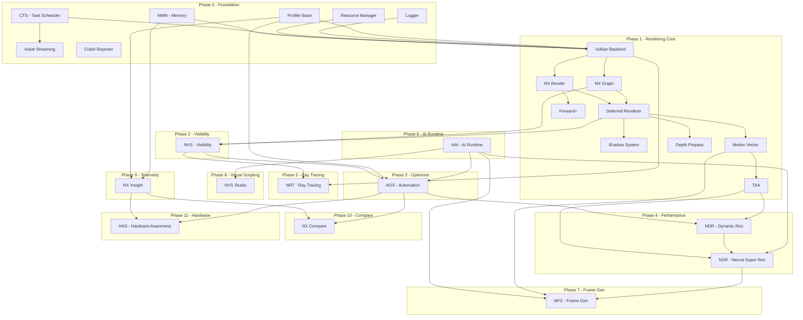
```mermaid
graph TD
    subgraph "Phase 0 - Foundation"
        NMM[NMM - Memory]
        CTS[CTS - Task Scheduler]
        RM[Resource Manager]
        AS[Asset Streaming]
        LOG[Logger]
        CR[Crash Reporter]
        PROF[Profiler Base]
    end

    subgraph "Phase 1 - Rendering Core"
        VK[Vulkan Backend]
        NXR[NX Render]
        NXG[NX Graph]
        DEF[Deferred Renderer]
        FWD[Forward+]
        SHADOW[Shadow System]
        MV[Motion Vector]
        DP[Depth Prepass]
        TAA[TAA]
    end

    subgraph "Phase 2 - Visibility"
        NVS[NVS - Visibility]
    end

    subgraph "Phase 3 - Optimizer"
        AOS[AOS - Automation]
    end

    subgraph "Phase 4 - Performance"
        NDR[NDR - Dynamic Res]
        NSR[NSR - Neural Super Res]
    end

    subgraph "Phase 5 - Ray Tracing"
        NRT[NRT - Ray Tracing]
    end

    subgraph "Phase 6 - AI Runtime"
        NAI[NAI - AI Runtime]
    end

    subgraph "Phase 7 - Frame Gen"
        NFG[NFG - Frame Gen]
    end

    subgraph "Phase 8 - Visual Scripting"
        NVSS[NVS Studio]
    end

    subgraph "Phase 9 - Telemetry"
        NXI[NX Insight]
    end

    subgraph "Phase 10 - Compare"
        NXC[NX Compare]
    end

    subgraph "Phase 11 - Hardware"
        HAS[HAS - Hardware Awareness]
    end

    NMM --> VK
    CTS --> VK
    CTS --> AS
    RM --> VK
    LOG --> VK
    PROF --> VK

    VK --> NXR
    VK --> NXG
    NXR --> DEF
    NXR --> FWD
    NXG --> DEF
    DEF --> SHADOW
    DEF --> MV
    DEF --> DP
    MV --> TAA

    NXG --> NVS
    DEF --> NVS

    TAA --> NSR
    NVS --> AOS
    PROF --> AOS

    AOS --> NDR
    TAA --> NDR
    NDR --> NSR

    VK --> NRT
    NVS --> NRT

    NAI --> NSR
    NAI --> NFG
    NAI --> AOS

    MV --> NFG
    NSR --> NFG

    NAI --> NVSS

    PROF --> NXI
    NMM --> NXI

    NXI --> NXC
    AOS --> NXC

    NXI --> HAS
    AOS --> HAS
```

---

## 4. Requirement

### Hardware Requirements

| Component | Minimum | Recommended |
|-----------|---------|-------------|
| CPU | 4 cores / 8 threads | 8 cores / 16 threads |
| RAM | 16 GB | 32 GB |
| GPU | Vulkan 1.3, 4 GB VRAM | RTX 3070+ / RX 6800+, 8 GB VRAM |
| Storage | SSD 256 GB | NVMe SSD 512 GB |
| OS | Windows 10 21H2 | Windows 11 23H2 |

### Software Requirements

| Software | Version | Purpose |
|----------|---------|---------|
| Visual Studio | 2022 (17.0+) | C++ Compiler (MSVC) |
| CMake | 3.15+ | Build System |
| Vulkan SDK | 1.3.250+ | Graphics SDK |
| Python | 3.10+ | Shader embedding script |
| glslc / glslangValidator | Latest | SPIR-V Shader Compiler |

---

## 5. Architecture Overview

### Engine Layer Architecture

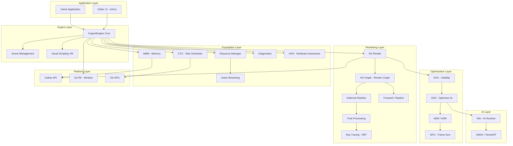
```mermaid
graph TB
    subgraph "Application Layer"
        APP[Game Application]
        EDITOR[Editor UI - ImGui]
    end

    subgraph "Engine Layer"
        ENGINE[CogentEngine Core]
        SCENE[Scene Management]
        SCRIPT[Visual Scripting VM]
    end

    subgraph "Rendering Layer"
        RENDERER[NX Render]
        GRAPH[NX Graph - Render Graph]
        DEFERRED[Deferred Pipeline]
        FORWARD[Forward+ Pipeline]
        POST[Post Processing]
        RT[Ray Tracing - NRT]
    end

    subgraph "Optimization Layer"
        VIS[NVS - Visibility]
        OPT[AOS - Optimizer AI]
        PERF[NDR / NSR]
        FGEN[NFG - Frame Gen]
    end

    subgraph "AI Layer"
        AI[NAI - AI Runtime]
        ONNX[ONNX / TensorRT]
    end

    subgraph "Foundation Layer"
        MEM[NMM - Memory]
        TASK[CTS - Task Scheduler]
        RES[Resource Manager]
        STREAM[Asset Streaming]
        DIAG[Diagnostics]
        HW[HAS - Hardware Awareness]
    end

    subgraph "Platform Layer"
        VULKAN[Vulkan API]
        GLFW_L[GLFW - Window]
        OS_L[OS APIs]
    end

    APP --> ENGINE
    EDITOR --> ENGINE
    ENGINE --> SCENE
    ENGINE --> SCRIPT
    ENGINE --> RENDERER

    RENDERER --> GRAPH
    GRAPH --> DEFERRED
    GRAPH --> FORWARD
    DEFERRED --> POST
    POST --> RT

    RENDERER --> VIS
    VIS --> OPT
    OPT --> PERF
    PERF --> FGEN

    OPT --> AI
    AI --> ONNX

    ENGINE --> MEM
    ENGINE --> TASK
    ENGINE --> RES
    RES --> STREAM
    ENGINE --> DIAG
    ENGINE --> HW

    MEM --> VULKAN
    TASK --> OS_L
    RENDERER --> VULKAN
    ENGINE --> GLFW_L
```

### Core Design Principles

1. **Modularity**: Every subsystem is an independent module with clean interfaces
2. **Data-Driven**: Render Graph drives rendering decisions, not hardcoded passes
3. **Zero-Overhead Abstraction**: Thin Vulkan wrappers, no unnecessary indirection
4. **Cache-Friendly**: SoA (Structure of Arrays) layouts where applicable
5. **GPU-First**: Compute shaders for all post-processing and culling operations
6. **AI-Assisted**: Machine learning models for quality/performance optimization

---

## 6. Phase 0 — Foundation Layer

### 6.1 Objective

Establish the core infrastructure upon which all subsequent systems are built. This includes memory management, task scheduling, resource lifecycle management, asset streaming, logging, crash reporting, and profiling.

### 6.2 Goals

- Custom memory allocator system (NMM) with Linear, Pool, and Stack allocators
- Lock-free job system (CTS) utilizing all available CPU cores
- Asynchronous resource loading pipeline with streaming support
- Thread-safe logging with file output and crash dump generation
- CPU and GPU profiling instrumentation

### 6.3 Requirement

| Category | Details |
|----------|---------|
| Hardware | Multi-core CPU (4+ cores), 16 GB RAM minimum |
| Software | C++17, Vulkan SDK 1.3, GLFW 3.4, GLM |
| SDK | Vulkan SDK, Windows SDK (for crash dumps) |
| Library | VMA, stb_image, tinyobjloader |
| Dependency | None (foundation layer) |

### 6.4 High Level Architecture

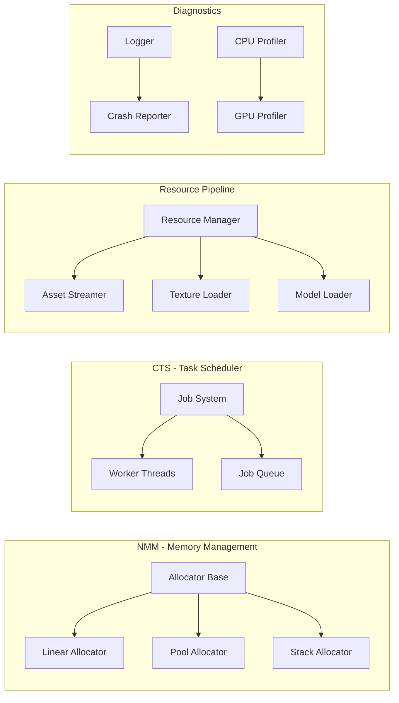
```mermaid
graph LR
    subgraph "NMM - Memory Management"
        ALLOC_BASE[Allocator Base]
        LINEAR[Linear Allocator]
        POOL[Pool Allocator]
        STACK[Stack Allocator]
    end

    subgraph "CTS - Task Scheduler"
        JOBS[Job System]
        WORKERS[Worker Threads]
        QUEUE[Job Queue]
    end

    subgraph "Resource Pipeline"
        RESMGR[Resource Manager]
        STREAMER[Asset Streamer]
        TEXLOADER[Texture Loader]
        MODELLOADER[Model Loader]
    end

    subgraph "Diagnostics"
        LOGGER[Logger]
        CRASH[Crash Reporter]
        PROFILER_CPU[CPU Profiler]
        PROFILER_GPU[GPU Profiler]
    end

    ALLOC_BASE --> LINEAR
    ALLOC_BASE --> POOL
    ALLOC_BASE --> STACK

    JOBS --> WORKERS
    JOBS --> QUEUE

    RESMGR --> STREAMER
    RESMGR --> TEXLOADER
    RESMGR --> MODELLOADER

    LOGGER --> CRASH
    PROFILER_CPU --> PROFILER_GPU
```

### 6.5 Detailed Architecture

#### 6.5.1 NMM — COGENT Memory Manager

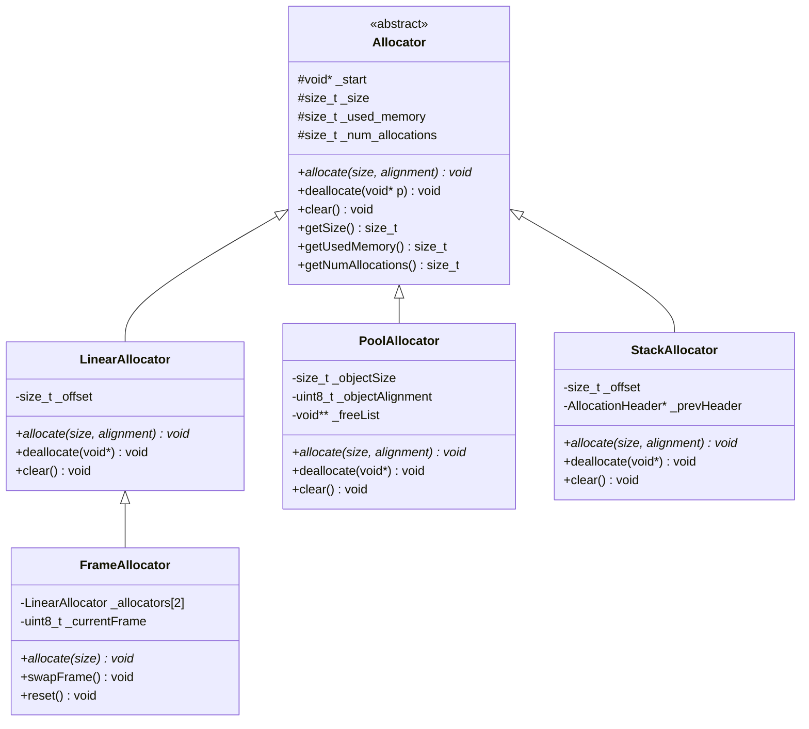
```mermaid
classDiagram
    class Allocator {
        <<abstract>>
        #void* _start
        #size_t _size
        #size_t _used_memory
        #size_t _num_allocations
        +allocate(size, alignment) void*
        +deallocate(void* p) void
        +clear() void
        +getSize() size_t
        +getUsedMemory() size_t
        +getNumAllocations() size_t
    }

    class LinearAllocator {
        -size_t _offset
        +allocate(size, alignment) void*
        +deallocate(void*) void
        +clear() void
    }

    class PoolAllocator {
        -size_t _objectSize
        -uint8_t _objectAlignment
        -void** _freeList
        +allocate(size, alignment) void*
        +deallocate(void*) void
        +clear() void
    }

    class StackAllocator {
        -size_t _offset
        -AllocationHeader* _prevHeader
        +allocate(size, alignment) void*
        +deallocate(void*) void
        +clear() void
    }

    class FrameAllocator {
        -LinearAllocator _allocators[2]
        -uint8_t _currentFrame
        +allocate(size) void*
        +swapFrame() void
        +reset() void
    }

    Allocator <|-- LinearAllocator
    Allocator <|-- PoolAllocator
    Allocator <|-- StackAllocator
    LinearAllocator <|-- FrameAllocator
```

**Pseudocode — LinearAllocator::allocate**:

```
function allocate(size, alignment):
    aligned_address = alignForward(_start + _offset, alignment)
    padding = aligned_address - (_start + _offset)
    
    if _offset + padding + size > _size:
        LOG_ERROR("LinearAllocator: Out of memory")
        return nullptr
    
    _offset += padding + size
    _used_memory += padding + size
    _num_allocations++
    
    return aligned_address
```

#### 6.5.2 CTS — COGENT Task Scheduler

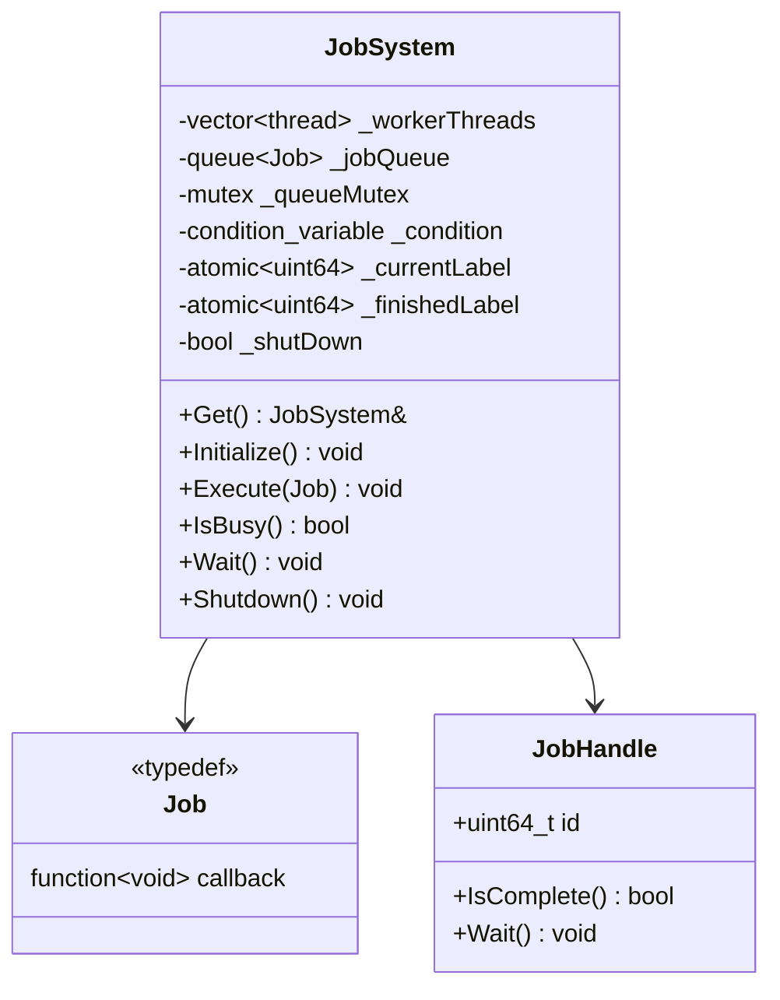
```mermaid
classDiagram
    class JobSystem {
        -vector~thread~ _workerThreads
        -queue~Job~ _jobQueue
        -mutex _queueMutex
        -condition_variable _condition
        -atomic~uint64~ _currentLabel
        -atomic~uint64~ _finishedLabel
        -bool _shutDown
        +Get() JobSystem&
        +Initialize() void
        +Execute(Job) void
        +IsBusy() bool
        +Wait() void
        +Shutdown() void
    }

    class Job {
        <<typedef>>
        function~void~ callback
    }

    class JobHandle {
        +uint64_t id
        +IsComplete() bool
        +Wait() void
    }

    JobSystem --> Job
    JobSystem --> JobHandle
```

**Sequence Diagram — Job Execution**:

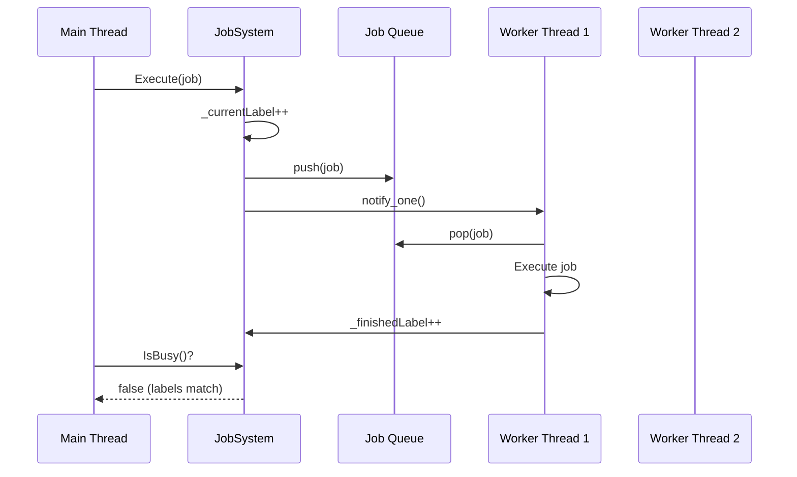
```mermaid
sequenceDiagram
    participant Main as Main Thread
    participant JS as JobSystem
    participant Queue as Job Queue
    participant W1 as Worker Thread 1
    participant W2 as Worker Thread 2

    Main->>JS: Execute(job)
    JS->>JS: _currentLabel++
    JS->>Queue: push(job)
    JS->>W1: notify_one()
    
    W1->>Queue: pop(job)
    W1->>W1: Execute job
    W1->>JS: _finishedLabel++

    Main->>JS: IsBusy()?
    JS-->>Main: false (labels match)
```

#### 6.5.3 Resource Manager

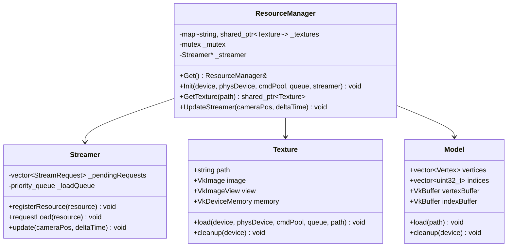
```mermaid
classDiagram
    class ResourceManager {
        -map~string, shared_ptr~Texture~~ _textures
        -mutex _mutex
        -Streamer* _streamer
        +Get() ResourceManager&
        +Init(device, physDevice, cmdPool, queue, streamer) void
        +GetTexture(path) shared_ptr~Texture~
        +UpdateStreamer(cameraPos, deltaTime) void
    }

    class Streamer {
        -vector~StreamRequest~ _pendingRequests
        -priority_queue _loadQueue
        +registerResource(resource) void
        +requestLoad(resource) void
        +update(cameraPos, deltaTime) void
    }

    class Texture {
        +string path
        +VkImage image
        +VkImageView view
        +VkDeviceMemory memory
        +load(device, physDevice, cmdPool, queue, path) void
        +cleanup(device) void
    }

    class Model {
        +vector~Vertex~ vertices
        +vector~uint32_t~ indices
        +VkBuffer vertexBuffer
        +VkBuffer indexBuffer
        +load(path) void
        +cleanup(device) void
    }

    ResourceManager --> Streamer
    ResourceManager --> Texture
    ResourceManager --> Model
```

#### 6.5.4 Logger & Crash Reporter

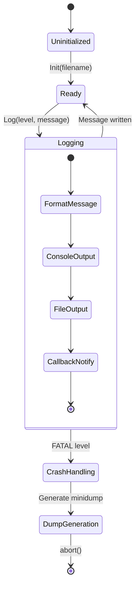
```mermaid
stateDiagram-v2
    [*] --> Uninitialized
    Uninitialized --> Ready: Init(filename)
    Ready --> Logging: Log(level, message)
    Logging --> Ready: Message written
    Logging --> CrashHandling: FATAL level
    CrashHandling --> DumpGeneration: Generate minidump
    DumpGeneration --> [*]: abort()

    state Logging {
        [*] --> FormatMessage
        FormatMessage --> ConsoleOutput
        ConsoleOutput --> FileOutput
        FileOutput --> CallbackNotify
        CallbackNotify --> [*]
    }
```

### 6.6 Module Breakdown

| Module | Files | Responsibility |
|--------|-------|---------------|
| NMM | `Core/Memory/Allocator.hpp`, `LinearAllocator.hpp`, `PoolAllocator.hpp` | Memory allocation strategies |
| CTS | `Core/Threading/JobSystem.hpp` | Multi-threaded job dispatch |
| Resource Manager | `Resources/ResourceManager.hpp` | Asset lifecycle management |
| Streamer | `Resources/Streaming/Streamer.hpp/.cpp` | Priority-based async loading |
| Texture | `Resources/Texture.hpp/.cpp` | GPU texture creation |
| Model | `Resources/Model.hpp/.cpp` | Mesh data loading (OBJ) |
| Logger | `Core/Logger.hpp` | Thread-safe logging + crash dumps |
| Profiler | `Core/Diagnostics/Profiler.hpp`, `GpuProfiler.hpp/.cpp` | CPU/GPU timing |

### 6.7 Folder Structure

```
Core/
├── Memory/
│   ├── Allocator.hpp           # Abstract base allocator
│   ├── LinearAllocator.hpp     # Frame/scratch allocator
│   ├── PoolAllocator.hpp       # Fixed-size object pools
│   └── StackAllocator.hpp      # LIFO allocator (future)
├── Threading/
│   └── JobSystem.hpp           # Work-stealing thread pool
├── Diagnostics/
│   ├── Profiler.hpp            # CPU profiling (scoped timers)
│   ├── GpuProfiler.hpp         # GPU timestamp queries
│   └── GpuProfiler.cpp
├── Logger.hpp                  # Logging + crash handler
├── Types.hpp                   # Core data types (Vertex, UBO, etc.)
├── Camera.hpp                  # FPS camera
├── VulkanUtils.hpp/.cpp        # Vulkan helper functions
└── Math/
    └── Frustum.hpp             # Frustum math for culling

Resources/
├── ResourceManager.hpp         # Centralized asset manager
├── Texture.hpp/.cpp            # Texture loading & GPU upload
├── Model.hpp/.cpp              # OBJ model loading
└── Streaming/
    ├── Streamer.hpp            # Async streaming scheduler
    └── Streamer.cpp
```

### 6.8 Class Structure

See §6.5 UML diagrams above for complete class hierarchies.

### 6.9 Data Structure

```cpp
// Core allocation header for StackAllocator
struct AllocationHeader {
    size_t adjustment;      // Alignment padding
    size_t allocationSize;  // Total allocated bytes
};

// Stream request priority
struct StreamRequest {
    std::shared_ptr<IStreamable> resource;
    float priority;         // Distance-based priority
    StreamState state;      // PENDING, LOADING, LOADED, UNLOADING
};

// Profile result
struct ProfileResult {
    std::string name;
    long long duration;     // Microseconds
};
```

### 6.10 Pipeline

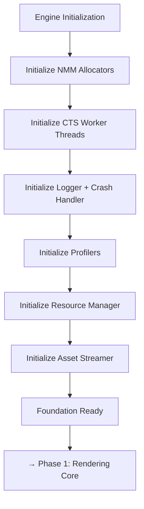
```mermaid
flowchart TD
    INIT[Engine Initialization] --> MEM[Initialize NMM Allocators]
    MEM --> THREAD[Initialize CTS Worker Threads]
    THREAD --> LOG_INIT[Initialize Logger + Crash Handler]
    LOG_INIT --> PROF_INIT[Initialize Profilers]
    PROF_INIT --> RES_INIT[Initialize Resource Manager]
    RES_INIT --> STREAM_INIT[Initialize Asset Streamer]
    STREAM_INIT --> READY[Foundation Ready]
    READY --> PHASE1[→ Phase 1: Rendering Core]
```

### 6.11 Execution Order

1. `Allocator` base class constructed
2. `LinearAllocator` created for frame scratch memory (4 MB)
3. `PoolAllocator` created for fixed-size objects (game objects, components)
4. `JobSystem::Initialize()` — spawns `hardware_concurrency - 1` worker threads
5. `Logger::Init("cogent_log.txt")` — opens log file, installs crash handler
6. `Profiler::BeginSession()` — starts profiling session
7. `GpuProfiler::init()` — creates GPU timestamp query pool
8. `ResourceManager::Init()` — binds to Vulkan device and streamer
9. `Streamer` initialized with priority queue

### 6.12 Thread Model

| Thread | Responsibility | Affinity |
|--------|---------------|----------|
| Main Thread | Engine loop, input, Vulkan submission | Core 0 |
| Worker Thread 1..N | Job execution (culling, loading, etc.) | Core 1..N |
| Streamer Thread | Async I/O for asset loading | Worker pool |

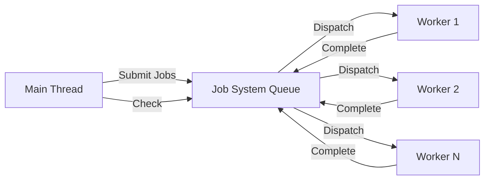
```mermaid
flowchart LR
    MAIN[Main Thread] -->|Submit Jobs| JS[Job System Queue]
    JS -->|Dispatch| W1[Worker 1]
    JS -->|Dispatch| W2[Worker 2]
    JS -->|Dispatch| WN[Worker N]
    W1 -->|Complete| JS
    W2 -->|Complete| JS
    WN -->|Complete| JS
    MAIN -->|Check| JS
```

### 6.13 Memory Model

| Allocator | Size | Lifetime | Usage |
|-----------|------|----------|-------|
| Frame Linear | 4 MB × 2 | Per frame (double buffered) | Temporary render data |
| Pool (64B) | 1 MB | Application | Game objects |
| Pool (256B) | 2 MB | Application | Components |
| System malloc | Unlimited | Various | STL containers, third-party |

### 6.14 Resource Lifetime

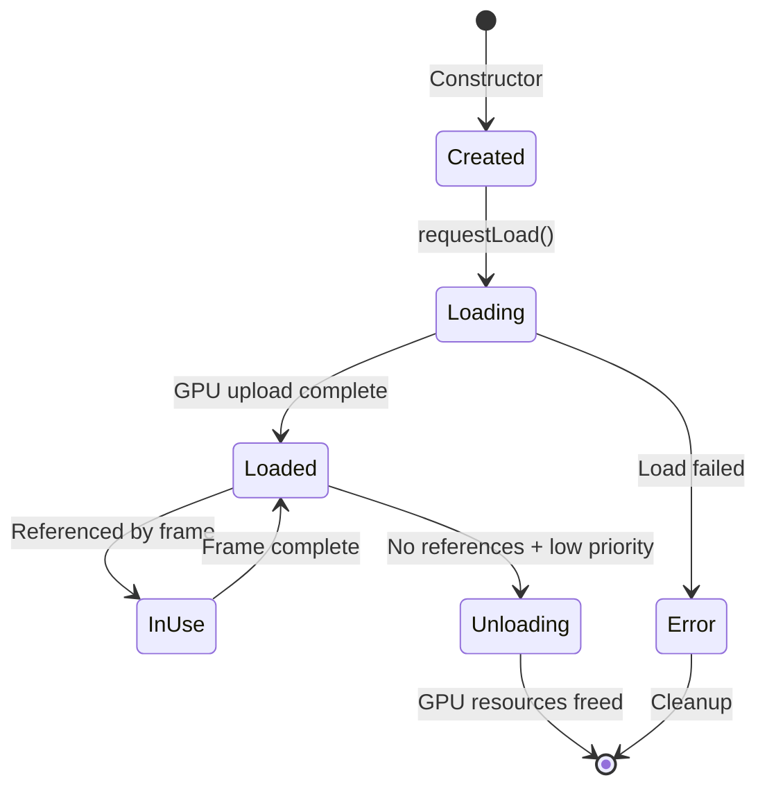
```mermaid
stateDiagram-v2
    [*] --> Created: Constructor
    Created --> Loading: requestLoad()
    Loading --> Loaded: GPU upload complete
    Loaded --> InUse: Referenced by frame
    InUse --> Loaded: Frame complete
    Loaded --> Unloading: No references + low priority
    Unloading --> [*]: GPU resources freed
    
    Loading --> Error: Load failed
    Error --> [*]: Cleanup
```

### 6.15 GPU Synchronization

Phase 0 establishes basic Vulkan synchronization primitives:

| Primitive | Usage | Count |
|-----------|-------|-------|
| `VkSemaphore` | Image available signal | 1 per frame-in-flight |
| `VkSemaphore` | Render finished signal | 1 per frame-in-flight |
| `VkFence` | CPU-GPU frame sync | 1 per frame-in-flight |
| `VkCommandPool` | Command buffer allocation | 1 per thread |

### 6.16 CPU Synchronization

| Mechanism | Usage |
|-----------|-------|
| `std::mutex` | Logger thread safety, resource map access |
| `std::condition_variable` | Job system wake/sleep |
| `std::atomic<uint64_t>` | Job completion counter (lock-free) |
| `std::lock_guard` | RAII mutex locking |

### 6.17 Error Handling

```
Strategy: Defensive Programming + Fail-Fast for Critical Errors

Level 1 (WARNING): Log and continue — non-critical resource load failures
Level 2 (ERROR): Log, attempt recovery — GPU resource creation failure → retry
Level 3 (FATAL): Log, generate crash dump, abort — Vulkan device lost, out of memory
```

### 6.18 Logging

- **Format**: `[YYYY-MM-DD HH:MM:SS] [LEVEL] message`
- **Output**: Console (stdout/stderr) + File (`cogent_log.txt`)
- **Callbacks**: EditorUI console receives all log messages
- **Macros**: `LOG_INFO(...)`, `LOG_WARN(...)`, `LOG_ERROR(...)`, `LOG_FATAL(...)`

### 6.19 Profiling

- **CPU**: `PROFILE_SCOPE("name")` — scoped timer using `high_resolution_clock`
- **GPU**: `GpuProfiler` — Vulkan timestamp queries per render pass
- **Output**: Internal results map, displayed in EditorUI profiler panel

### 6.20 Debugging

- Vulkan Validation Layers enabled in debug builds
- Logger prints to both console and file
- Crash dumps (`.dmp`) via `MiniDumpWriteDump` on Windows
- GPU profiler timestamps visible in editor

### 6.21 Testing Strategy

| Test Type | Target | Method |
|-----------|--------|--------|
| Unit Test | Allocators | Allocate/deallocate cycles, boundary conditions |
| Unit Test | Job System | Single/multi job execution, completion detection |
| Stress Test | Allocator | 10K allocations/frame, memory exhaustion |
| Stress Test | Job System | 100K jobs, contention testing |
| Memory Leak | All | Track `_num_allocations` across frames |
| Integration | Resource + Streamer | Async texture load + GPU upload |

### 6.22 Milestone

| ID | Milestone | Deliverable | Duration |
|----|-----------|-------------|----------|
| M0.1 | NMM Complete | Linear, Pool, Stack allocators passing all tests | 2 weeks |
| M0.2 | CTS Complete | Job system with worker threads, stress tested | 1 week |
| M0.3 | Resource Pipeline | Async load textures and models | 2 weeks |
| M0.4 | Diagnostics | Logger, crash reporter, CPU/GPU profiler | 1 week |
| M0.5 | Integration | All Phase 0 systems working together | 1 week |

### 6.23 Deliverable

- [x] `Core/Memory/Allocator.hpp` — Abstract allocator base
- [x] `Core/Memory/LinearAllocator.hpp` — Frame allocator
- [x] `Core/Memory/PoolAllocator.hpp` — Object pool
- [ ] `Core/Memory/StackAllocator.hpp` — LIFO allocator
- [x] `Core/Threading/JobSystem.hpp` — Thread pool
- [x] `Resources/ResourceManager.hpp` — Centralized loader
- [x] `Resources/Streaming/Streamer.hpp/.cpp` — Async streaming
- [x] `Core/Logger.hpp` — Logger + crash reporter
- [x] `Core/Diagnostics/Profiler.hpp` — CPU profiler
- [x] `Core/Diagnostics/GpuProfiler.hpp/.cpp` — GPU profiler

### 6.24 Acceptance Criteria

- [ ] Linear allocator handles 10,000 allocations per frame without leak
- [ ] Pool allocator correctly recycles freed objects
- [ ] Job system utilizes all available cores (N-1 workers)
- [ ] Async resource loading does not block main thread
- [ ] Logger writes to file and console simultaneously
- [ ] Crash reporter generates valid `.dmp` file on FATAL
- [ ] GPU profiler reports per-pass timing within 0.1ms accuracy

### 6.25 KPI

| Metric | Target | Measurement |
|--------|--------|-------------|
| Frame allocation time | < 0.01 ms | Profiler |
| Job dispatch latency | < 0.005 ms | Profiler |
| Resource load (async) | < 50 ms (texture) | Profiler |
| Logger throughput | > 100K msgs/sec | Stress test |
| Memory overhead | < 1% of total allocation | Allocator stats |

---

## 7. Phase 1 — Rendering Core

### 7.1 Objective

Implement the complete rendering backbone of COGENT ENGINE: a modern Vulkan-based deferred rendering pipeline with render graph, forward+ support, cascaded shadow maps, motion vectors, depth prepass, and temporal anti-aliasing.

### 7.2 Goals

- Vulkan backend abstraction (GraphicsDevice, Swapchain, DescriptorManager, PipelineCache)
- NX Render — Main rendering coordinator
- NX Graph — Data-driven render graph with automatic barrier insertion
- Deferred rendering pipeline with 6-attachment GBuffer
- Forward+ rendering path for transparent objects
- Cascaded Shadow Maps (CSM) with 3 cascades
- Motion vector generation for TAA and temporal effects
- Depth prepass for early-Z optimization
- Temporal Anti-Aliasing (TAA) with history reprojection

### 7.3 Requirement

| Category | Details |
|----------|---------|
| Hardware | Vulkan 1.3 GPU, 4+ GB VRAM |
| Software | Phase 0 complete |
| SDK | Vulkan SDK, glslc (SPIR-V compiler) |
| Library | VMA for GPU memory |
| Dependency | Phase 0 (NMM, CTS, Resource Manager, Logger, Profiler) |

### 7.4 High Level Architecture

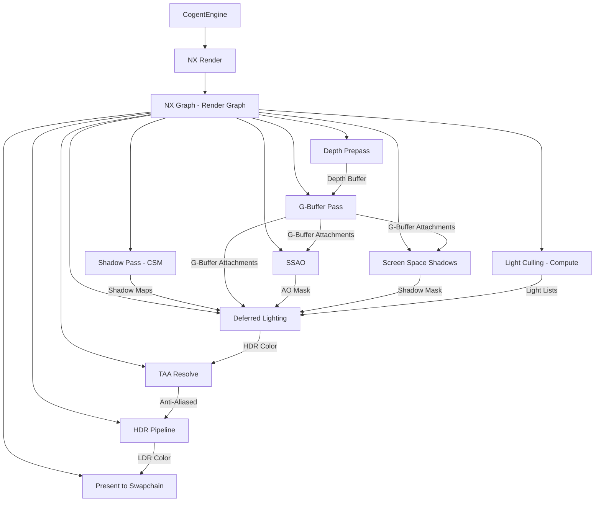
```mermaid
flowchart TD
    ENGINE[CogentEngine] --> RENDERER[NX Render]
    RENDERER --> GRAPH[NX Graph - Render Graph]
    
    GRAPH --> DEPTH[Depth Prepass]
    GRAPH --> SHADOW_PASS[Shadow Pass - CSM]
    GRAPH --> GBUF[G-Buffer Pass]
    GRAPH --> SSAO_PASS[SSAO]
    GRAPH --> SSS[Screen Space Shadows]
    GRAPH --> LIGHT_CULL[Light Culling - Compute]
    GRAPH --> DEFERRED_LIGHT[Deferred Lighting]
    GRAPH --> TAA_PASS[TAA Resolve]
    GRAPH --> HDR_PASS[HDR Pipeline]
    GRAPH --> PRESENT[Present to Swapchain]

    DEPTH -->|Depth Buffer| GBUF
    SHADOW_PASS -->|Shadow Maps| DEFERRED_LIGHT
    GBUF -->|G-Buffer Attachments| SSAO_PASS
    GBUF -->|G-Buffer Attachments| SSS
    GBUF -->|G-Buffer Attachments| DEFERRED_LIGHT
    SSAO_PASS -->|AO Mask| DEFERRED_LIGHT
    SSS -->|Shadow Mask| DEFERRED_LIGHT
    LIGHT_CULL -->|Light Lists| DEFERRED_LIGHT
    DEFERRED_LIGHT -->|HDR Color| TAA_PASS
    TAA_PASS -->|Anti-Aliased| HDR_PASS
    HDR_PASS -->|LDR Color| PRESENT
```

### 7.5 Detailed Architecture

#### 7.5.1 Vulkan Backend

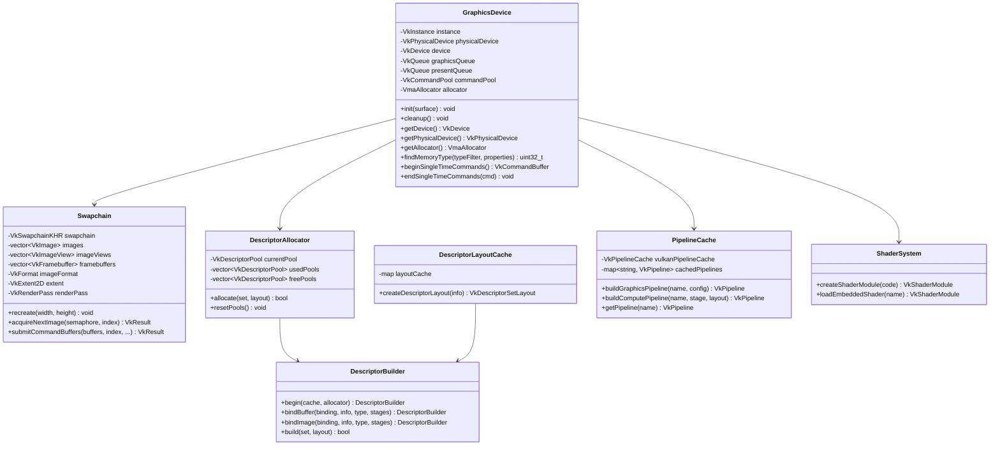
```mermaid
classDiagram
    class GraphicsDevice {
        -VkInstance instance
        -VkPhysicalDevice physicalDevice
        -VkDevice device
        -VkQueue graphicsQueue
        -VkQueue presentQueue
        -VkCommandPool commandPool
        -VmaAllocator allocator
        +init(surface) void
        +cleanup() void
        +getDevice() VkDevice
        +getPhysicalDevice() VkPhysicalDevice
        +getAllocator() VmaAllocator
        +findMemoryType(typeFilter, properties) uint32_t
        +beginSingleTimeCommands() VkCommandBuffer
        +endSingleTimeCommands(cmd) void
    }

    class Swapchain {
        -VkSwapchainKHR swapchain
        -vector~VkImage~ images
        -vector~VkImageView~ imageViews
        -vector~VkFramebuffer~ framebuffers
        -VkFormat imageFormat
        -VkExtent2D extent
        -VkRenderPass renderPass
        +recreate(width, height) void
        +acquireNextImage(semaphore, index) VkResult
        +submitCommandBuffers(buffers, index, ...) VkResult
    }

    class DescriptorAllocator {
        -VkDescriptorPool currentPool
        -vector~VkDescriptorPool~ usedPools
        -vector~VkDescriptorPool~ freePools
        +allocate(set, layout) bool
        +resetPools() void
    }

    class DescriptorLayoutCache {
        -map layoutCache
        +createDescriptorLayout(info) VkDescriptorSetLayout
    }

    class DescriptorBuilder {
        +begin(cache, allocator) DescriptorBuilder
        +bindBuffer(binding, info, type, stages) DescriptorBuilder
        +bindImage(binding, info, type, stages) DescriptorBuilder
        +build(set, layout) bool
    }

    class PipelineCache {
        -VkPipelineCache vulkanPipelineCache
        -map~string, VkPipeline~ cachedPipelines
        +buildGraphicsPipeline(name, config) VkPipeline
        +buildComputePipeline(name, stage, layout) VkPipeline
        +getPipeline(name) VkPipeline
    }

    class ShaderSystem {
        +createShaderModule(code) VkShaderModule
        +loadEmbeddedShader(name) VkShaderModule
    }

    GraphicsDevice --> Swapchain
    GraphicsDevice --> DescriptorAllocator
    DescriptorAllocator --> DescriptorBuilder
    DescriptorLayoutCache --> DescriptorBuilder
    GraphicsDevice --> PipelineCache
    GraphicsDevice --> ShaderSystem
```

#### 7.5.2 NX Graph — Render Graph

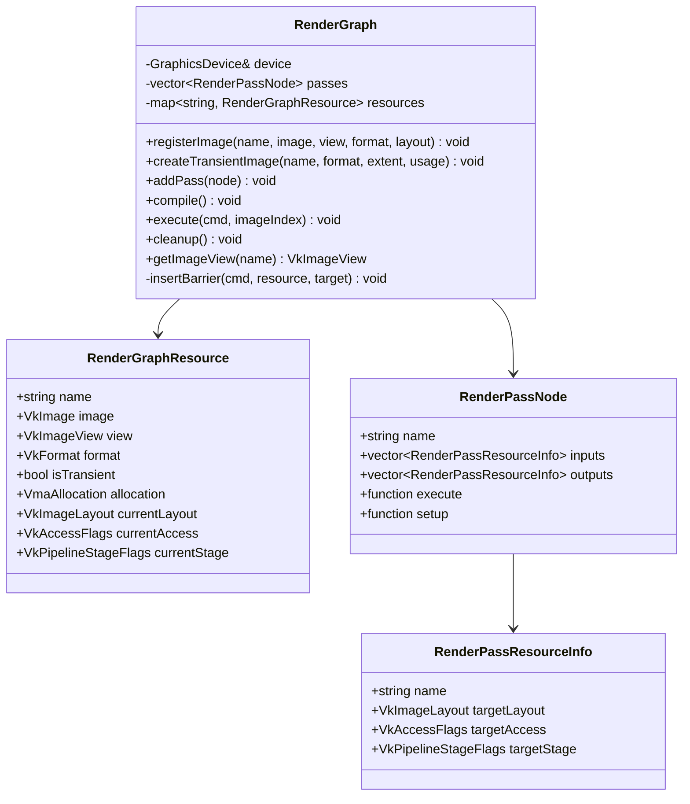
```mermaid
classDiagram
    class RenderGraph {
        -GraphicsDevice& device
        -vector~RenderPassNode~ passes
        -map~string, RenderGraphResource~ resources
        +registerImage(name, image, view, format, layout) void
        +createTransientImage(name, format, extent, usage) void
        +addPass(node) void
        +compile() void
        +execute(cmd, imageIndex) void
        +cleanup() void
        +getImageView(name) VkImageView
        -insertBarrier(cmd, resource, target) void
    }

    class RenderGraphResource {
        +string name
        +VkImage image
        +VkImageView view
        +VkFormat format
        +bool isTransient
        +VmaAllocation allocation
        +VkImageLayout currentLayout
        +VkAccessFlags currentAccess
        +VkPipelineStageFlags currentStage
    }

    class RenderPassNode {
        +string name
        +vector~RenderPassResourceInfo~ inputs
        +vector~RenderPassResourceInfo~ outputs
        +function execute
        +function setup
    }

    class RenderPassResourceInfo {
        +string name
        +VkImageLayout targetLayout
        +VkAccessFlags targetAccess
        +VkPipelineStageFlags targetStage
    }

    RenderGraph --> RenderPassNode
    RenderGraph --> RenderGraphResource
    RenderPassNode --> RenderPassResourceInfo
```

**Render Graph Execution Flowchart**:

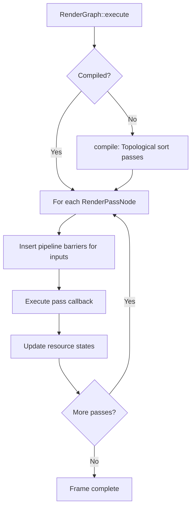
```mermaid
flowchart TD
    START[RenderGraph::execute] --> COMPILE{Compiled?}
    COMPILE -->|No| DO_COMPILE[compile: Topological sort passes]
    COMPILE -->|Yes| ITERATE
    DO_COMPILE --> ITERATE

    ITERATE[For each RenderPassNode] --> BARRIERS[Insert pipeline barriers for inputs]
    BARRIERS --> EXEC[Execute pass callback]
    EXEC --> UPDATE[Update resource states]
    UPDATE --> NEXT{More passes?}
    NEXT -->|Yes| ITERATE
    NEXT -->|No| DONE[Frame complete]
```

**Pseudocode — Barrier Insertion**:

```
function insertBarrier(cmd, resource, target):
    barrier = VkImageMemoryBarrier {
        srcAccessMask = resource.currentAccess
        dstAccessMask = target.targetAccess
        oldLayout = resource.currentLayout
        newLayout = target.targetLayout
        image = resource.image
        subresourceRange = { COLOR_BIT, 0, 1, 0, 1 }
    }
    
    vkCmdPipelineBarrier(
        cmd,
        resource.currentStage,    // srcStageMask
        target.targetStage,       // dstStageMask
        0,                        // flags
        0, nullptr,               // memory barriers
        0, nullptr,               // buffer barriers
        1, &barrier               // image barriers
    )
    
    resource.currentLayout = target.targetLayout
    resource.currentAccess = target.targetAccess
    resource.currentStage = target.targetStage
```

#### 7.5.3 Deferred Rendering Pipeline

**G-Buffer Layout**:

| Attachment | Format | Content | Size |
|------------|--------|---------|------|
| RT0 | R16G16B16A16_SFLOAT | World Position (XYZ) + Reserved | 8 bytes/pixel |
| RT1 | R16G16B16A16_SFLOAT | World Normal (XYZ) + Reserved | 8 bytes/pixel |
| RT2 | R8G8B8A8_UNORM | Albedo (RGB) + Alpha | 4 bytes/pixel |
| RT3 | R8G8B8A8_UNORM | Metallic, Roughness, AO, Emissive | 4 bytes/pixel |
| RT4 | R16G16_SFLOAT | Motion Vector (XY) | 4 bytes/pixel |
| Depth | D32_SFLOAT | Depth Buffer | 4 bytes/pixel |

**Total G-Buffer**: ~32 bytes/pixel = ~63 MB at 1920×1080

**Deferred Pipeline Flow**:

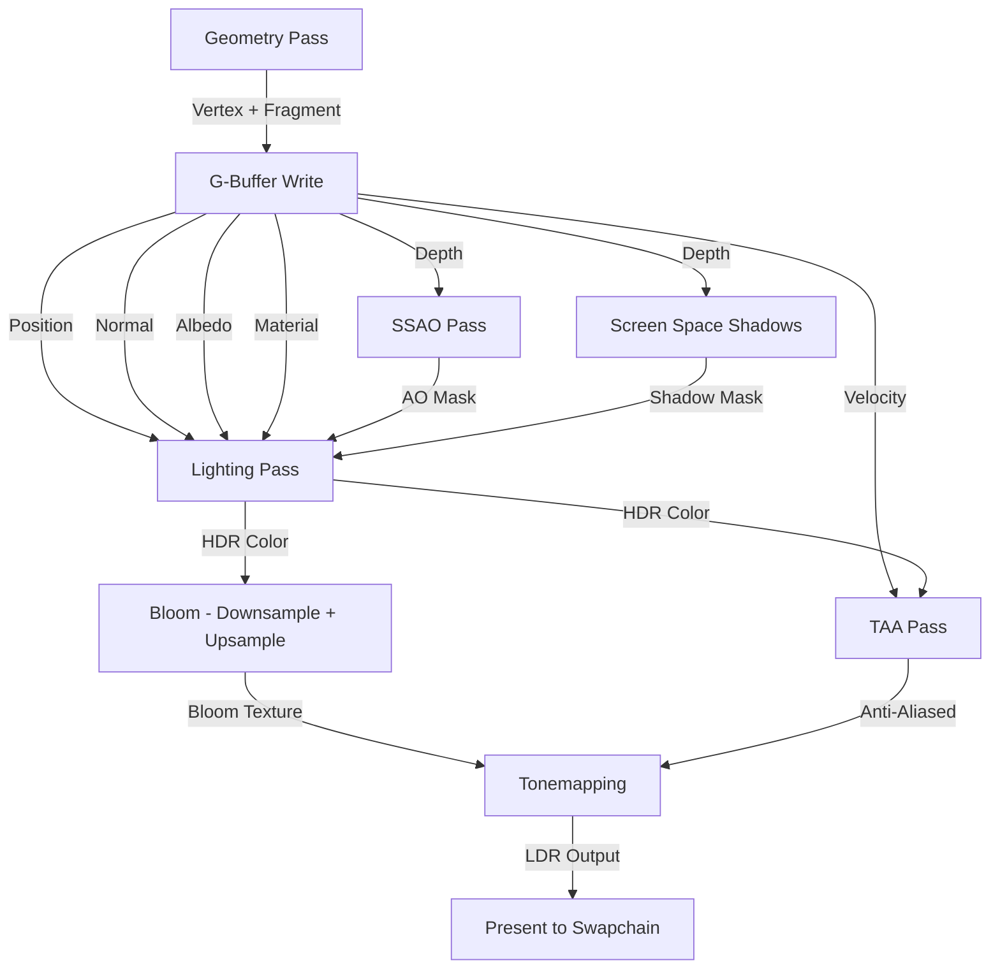
```mermaid
flowchart TD
    GEOM[Geometry Pass] -->|Vertex + Fragment| GBUF[G-Buffer Write]
    GBUF -->|Position| LIGHT[Lighting Pass]
    GBUF -->|Normal| LIGHT
    GBUF -->|Albedo| LIGHT
    GBUF -->|Material| LIGHT
    GBUF -->|Velocity| TAA_P[TAA Pass]
    GBUF -->|Depth| SSAO_P[SSAO Pass]
    GBUF -->|Depth| SSS_P[Screen Space Shadows]

    SSAO_P -->|AO Mask| LIGHT
    SSS_P -->|Shadow Mask| LIGHT
    
    LIGHT -->|HDR Color| BLOOM[Bloom - Downsample + Upsample]
    BLOOM -->|Bloom Texture| TONEMAP[Tonemapping]
    
    LIGHT -->|HDR Color| TAA_P
    TAA_P -->|Anti-Aliased| TONEMAP
    
    TONEMAP -->|LDR Output| PRESENT[Present to Swapchain]
```

**Sequence Diagram — Frame Rendering**:

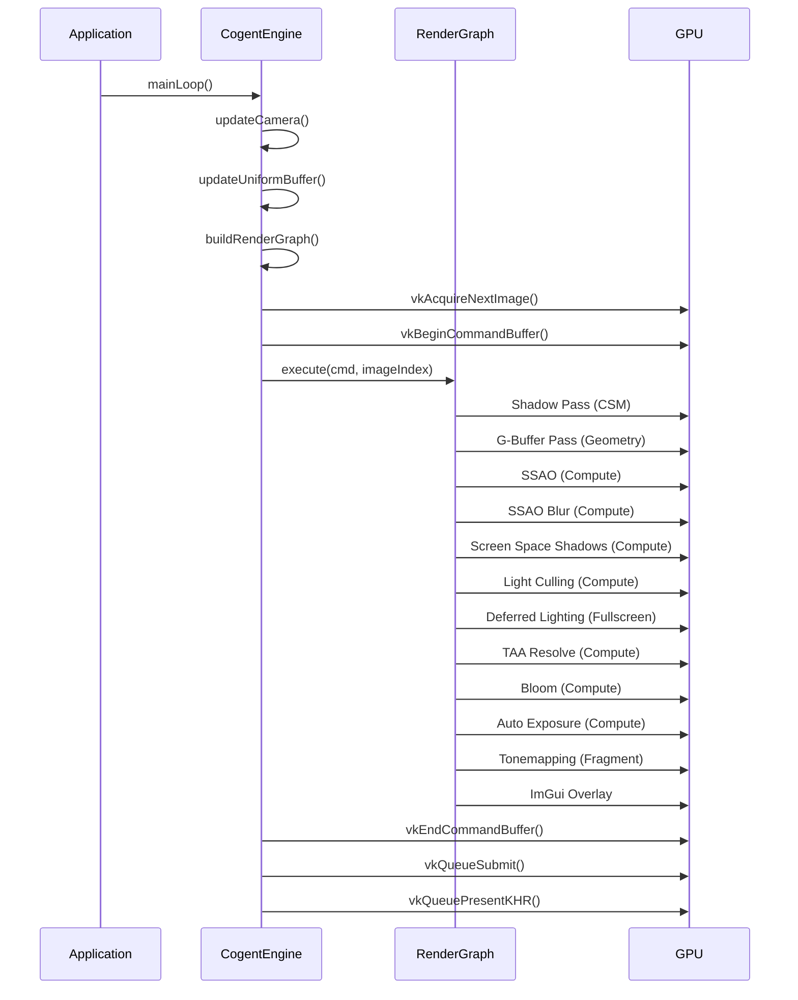
```mermaid
sequenceDiagram
    participant App as Application
    participant Engine as CogentEngine
    participant RG as RenderGraph
    participant GPU as GPU

    App->>Engine: mainLoop()
    Engine->>Engine: updateCamera()
    Engine->>Engine: updateUniformBuffer()
    Engine->>Engine: buildRenderGraph()
    
    Engine->>GPU: vkAcquireNextImage()
    Engine->>GPU: vkBeginCommandBuffer()
    
    Engine->>RG: execute(cmd, imageIndex)
    RG->>GPU: Shadow Pass (CSM)
    RG->>GPU: G-Buffer Pass (Geometry)
    RG->>GPU: SSAO (Compute)
    RG->>GPU: SSAO Blur (Compute)
    RG->>GPU: Screen Space Shadows (Compute)
    RG->>GPU: Light Culling (Compute)
    RG->>GPU: Deferred Lighting (Fullscreen)
    RG->>GPU: TAA Resolve (Compute)
    RG->>GPU: Bloom (Compute)
    RG->>GPU: Auto Exposure (Compute)
    RG->>GPU: Tonemapping (Fragment)
    RG->>GPU: ImGui Overlay
    
    Engine->>GPU: vkEndCommandBuffer()
    Engine->>GPU: vkQueueSubmit()
    Engine->>GPU: vkQueuePresentKHR()
```

#### 7.5.4 TAA — Temporal Anti-Aliasing

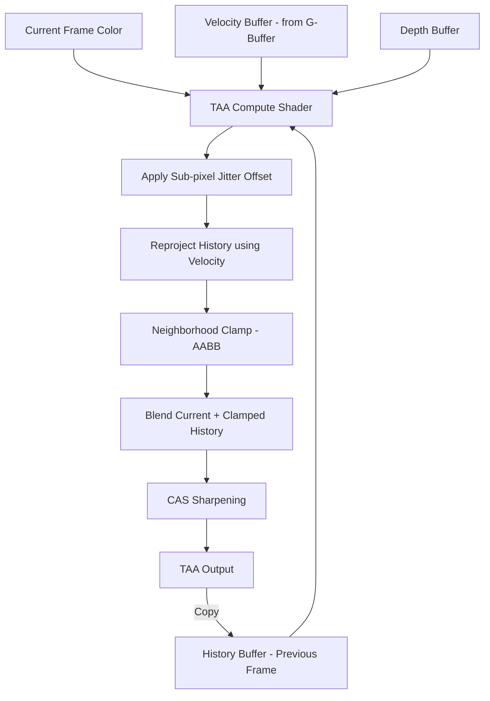
```mermaid
flowchart TD
    INPUT_COLOR[Current Frame Color] --> TAA[TAA Compute Shader]
    VELOCITY[Velocity Buffer - from G-Buffer] --> TAA
    DEPTH[Depth Buffer] --> TAA
    HISTORY[History Buffer - Previous Frame] --> TAA
    
    TAA --> JITTER[Apply Sub-pixel Jitter Offset]
    JITTER --> REPROJECT[Reproject History using Velocity]
    REPROJECT --> NEIGHBORHOOD[Neighborhood Clamp - AABB]
    NEIGHBORHOOD --> BLEND[Blend Current + Clamped History]
    BLEND --> SHARPEN_P[CAS Sharpening]
    SHARPEN_P --> OUTPUT[TAA Output]
    OUTPUT -->|Copy| HISTORY
```

**TAA Detail — History Buffer Management**:

| Component | Description |
|-----------|-------------|
| History Buffer | Ping-pong between 2 R16G16B16A16_SFLOAT images |
| Velocity Buffer | R16G16_SFLOAT from G-Buffer (screen-space motion) |
| Reprojection | `historyUV = currentUV - velocity` |
| Jitter Pattern | Halton(2,3) sequence, 8 samples |
| Neighborhood Clamp | 3×3 min/max AABB in YCoCg color space |
| Blend Factor | 0.05 (current) / 0.95 (history) — adapts on disocclusion |
| Ghosting Mitigation | Velocity rejection + luminance-weighted clamp |
| Sharpening | Contrast Adaptive Sharpening (CAS) post-TAA |

**TAA → NSR Relationship**:
TAA output serves as the primary input for NSR (Neural Super Resolution) in Phase 4. TAA operates at render resolution (potentially lower than display), and NSR upscales to display resolution. The velocity buffer is shared between both systems.

### 7.6 Module Breakdown

| Module | Files | Responsibility |
|--------|-------|---------------|
| GraphicsDevice | `Core/Graphics/GraphicsDevice.hpp/.cpp` | Vulkan instance, device, queues |
| Swapchain | `Core/Graphics/Swapchain.hpp/.cpp` | Presentation surface management |
| ShaderSystem | `Core/Graphics/ShaderSystem.hpp/.cpp` | Shader module creation |
| PipelineCache | `Core/Graphics/PipelineCache.hpp/.cpp` | Named pipeline caching |
| DescriptorManager | `Core/Graphics/DescriptorManager.hpp/.cpp` | Descriptor allocation |
| RenderGraph | `Renderer/Graph/RenderGraph.hpp/.cpp` | Automatic pass scheduling |
| GBuffer | `Renderer/GBuffer.hpp/.cpp` | Multi-RT geometry output |
| ShadowPass | `Renderer/ShadowPass.hpp/.cpp` | CSM shadow mapping |
| DeferredLighting | `Renderer/DeferredLightingPass.hpp/.cpp` | Fullscreen lighting |
| LightCulling | `Renderer/Lighting/LightCulling.hpp/.cpp` | Clustered light assignment |
| SSAO | `Renderer/SSAO.hpp/.cpp` | Ambient occlusion |
| ScreenSpaceShadows | `Renderer/ScreenSpaceShadows.hpp/.cpp` | Contact shadows |
| TAAPass | `Renderer/TAAPass.hpp/.cpp` | Temporal anti-aliasing |
| HDRPipeline | `Renderer/HDRPipeline.hpp/.cpp` | Bloom + tonemapping |
| AutoExposure | `Renderer/PostProcess/AutoExposurePass.hpp/.cpp` | Eye adaptation |
| RenderPipeline | `Renderer/RenderPipeline.hpp/.cpp` | G-Buffer pipeline state |

### 7.7 Folder Structure

```
Core/Graphics/
├── GraphicsDevice.hpp/.cpp      # Vulkan instance + device
├── Swapchain.hpp/.cpp           # Presentation
├── ShaderSystem.hpp/.cpp        # SPIR-V loading
├── PipelineCache.hpp/.cpp       # Pipeline caching
└── DescriptorManager.hpp/.cpp   # Descriptor pool management

Renderer/
├── Graph/
│   ├── RenderGraph.hpp/.cpp     # Pass scheduling + barriers
│   └── FrameGraph.hpp           # Frame resource aliasing (future)
├── GBuffer.hpp/.cpp             # G-Buffer attachments
├── RenderPipeline.hpp/.cpp      # G-Buffer render pipeline
├── DeferredLightingPass.hpp/.cpp
├── ShadowPass.hpp/.cpp          # Cascaded Shadow Maps
├── ScreenSpaceShadows.hpp/.cpp
├── SSAO.hpp/.cpp                # Screen Space AO
├── TAAPass.hpp/.cpp             # Temporal AA
├── HDRPipeline.hpp/.cpp         # Bloom + Tonemap
├── InstanceBuffer.hpp/.cpp      # GPU instancing
├── Lighting/
│   └── LightCulling.hpp/.cpp    # Clustered light assignment
├── PostProcess/
│   └── AutoExposurePass.hpp/.cpp
└── Visibility/
    └── VisibilitySystem.hpp/.cpp

Shaders/
├── gbuffer.vert/.frag           # G-Buffer geometry
├── lighting.vert/.frag          # Deferred lighting
├── taa.comp                     # TAA compute
├── ssao.comp                    # SSAO compute
├── ssao_blur.comp               # SSAO blur
├── sss.comp                     # Screen space shadows
├── light_culling.comp           # Clustered light culling
├── bloom_downsample.comp        # Bloom downsampling
├── bloom_upsample.comp          # Bloom upsampling
├── AutoExposure.comp            # Eye adaptation
├── tonemap.frag                 # HDR → LDR tonemapping
├── fullscreen.vert              # Fullscreen triangle
├── grid.vert/.frag              # Editor grid
└── raytrace.comp                # Compute ray tracing
```

### 7.8 Execution Order

```
1. Shadow Pass (CSM) — 3 cascade renders
2. Depth Prepass (optional)
3. G-Buffer Pass — Geometry → 6 render targets
4. SSAO Pass (Compute) → AO mask
5. SSAO Blur (Compute) → Blurred AO
6. Screen Space Shadows (Compute) → Contact shadow mask
7. Light Culling (Compute) → Cluster-light assignment
8. Deferred Lighting Pass (Fragment) → HDR color buffer
9. TAA Resolve (Compute) → Anti-aliased HDR
10. Bloom Downsample (Compute) → Mip chain
11. Bloom Upsample (Compute) → Combined bloom
12. Auto Exposure (Compute) → Luminance adaptation
13. Tonemapping (Fragment) → LDR output
14. Editor UI (ImGui) → Overlay
15. Present to Swapchain
```

### 7.9 Thread Model

| Thread | Tasks |
|--------|-------|
| Main Thread | Command buffer recording, Vulkan submission, ImGui |
| Worker Threads | Frustum culling, sort draw calls, resource loading |

### 7.10 Memory Model

| Resource | Allocation | Lifetime |
|----------|-----------|----------|
| G-Buffer images | VMA (GPU-only) | Swapchain lifetime |
| Shadow maps | VMA (GPU-only) | Swapchain lifetime |
| Uniform buffers | VMA (CPU-visible) | Per-frame |
| Command buffers | Command pool | Per-frame (reset) |
| Descriptor sets | Descriptor pool | Per-frame (reset) or persistent |

### 7.11 GPU Synchronization

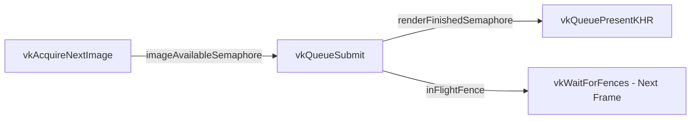
```mermaid
flowchart LR
    ACQ[vkAcquireNextImage] -->|imageAvailableSemaphore| SUBMIT[vkQueueSubmit]
    SUBMIT -->|renderFinishedSemaphore| PRESENT[vkQueuePresentKHR]
    SUBMIT -->|inFlightFence| WAIT[vkWaitForFences - Next Frame]
```

| Barrier | Source | Destination |
|---------|--------|-------------|
| G-Buffer → Lighting | COLOR_ATTACHMENT_OUTPUT | FRAGMENT_SHADER |
| G-Buffer → SSAO | COLOR_ATTACHMENT_OUTPUT | COMPUTE_SHADER |
| SSAO → Lighting | COMPUTE_SHADER | FRAGMENT_SHADER |
| Lighting → TAA | COLOR_ATTACHMENT_OUTPUT | COMPUTE_SHADER |
| TAA → Tonemap | COMPUTE_SHADER | FRAGMENT_SHADER |

### 7.12 Testing Strategy

| Test Type | Target |
|-----------|--------|
| Unit Test | Shader compilation, pipeline creation |
| Integration Test | Full frame render without crash |
| GPU Test | Render correctness (visual regression) |
| Performance Test | Target 16.6ms frame time at 1080p |
| Memory Leak | VMA statistics check per frame |

### 7.13 Milestone

| ID | Milestone | Duration |
|----|-----------|----------|
| M1.1 | Vulkan Backend (Device, Swapchain, Descriptors, Pipelines) | 2 weeks |
| M1.2 | G-Buffer + Deferred Lighting | 2 weeks |
| M1.3 | Shadow System (CSM) + SSAO + Screen Space Shadows | 2 weeks |
| M1.4 | Render Graph integration | 1 week |
| M1.5 | TAA + HDR Pipeline (Bloom, Tonemap, AutoExposure) | 2 weeks |
| M1.6 | Forward+ path for transparents | 1 week |
| M1.7 | Integration and polish | 1 week |

### 7.14 KPI

| Metric | Target |
|--------|--------|
| Frame time (1080p, 100 objects) | < 8 ms GPU |
| G-Buffer fill rate | < 2 ms |
| Shadow pass (3 cascades) | < 1.5 ms |
| SSAO + blur | < 1 ms |
| TAA resolve | < 0.5 ms |
| Bloom (full chain) | < 0.8 ms |
| Draw calls | < 500 per frame |

---

## 8. Phase 2 — Visibility System (NVS)

### 8.1 Objective

Implement a comprehensive visibility determination system that aggressively reduces the number of draw calls submitted to the GPU, enabling high scene complexity at high performance.

### 8.2 Goals

- Frustum culling (CPU)
- Backface culling (GPU)
- Distance culling with configurable ranges
- Portal-based occlusion (indoor scenes)
- Hierarchical Z-Buffer (HZB) occlusion culling
- GPU occlusion queries
- Visibility buffer rendering
- LOD (Level of Detail) system
- Meshlet / Cluster-based geometry
- Virtual geometry pipeline
- GPU instancing and draw call batching
- Texture streaming priority from visibility

### 8.3 Requirement

| Category | Details |
|----------|---------|
| Dependency | Phase 0 (NMM, CTS), Phase 1 (Vulkan Backend, Render Graph, G-Buffer) |
| Hardware | Compute shader support, indirect draw support |

### 8.4 High Level Architecture

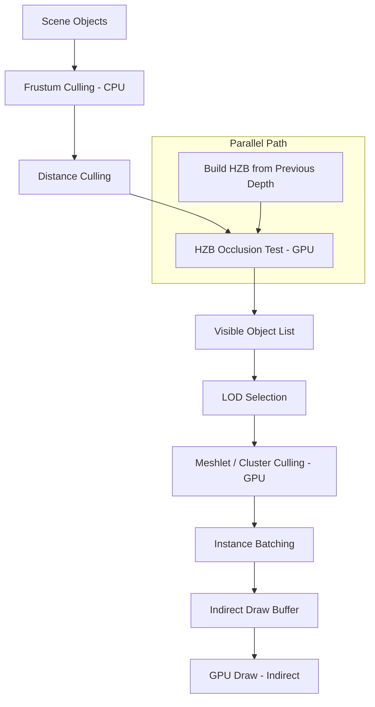
```mermaid
flowchart TD
    SCENE[Scene Objects] --> FRUSTUM[Frustum Culling - CPU]
    FRUSTUM --> DISTANCE[Distance Culling]
    DISTANCE --> HZB_CULL[HZB Occlusion Test - GPU]
    HZB_CULL --> VISIBLE[Visible Object List]
    
    VISIBLE --> LOD_SELECT[LOD Selection]
    LOD_SELECT --> MESHLET_CULL[Meshlet / Cluster Culling - GPU]
    MESHLET_CULL --> INSTANCE[Instance Batching]
    INSTANCE --> INDIRECT[Indirect Draw Buffer]
    INDIRECT --> DRAW[GPU Draw - Indirect]
    
    subgraph "Parallel Path"
        HZB_BUILD[Build HZB from Previous Depth] --> HZB_CULL
    end
```

### 8.5 Detailed Architecture

```mermaid
classDiagram
    class VisibilitySystem {
        -Frustum _frustum
        +update(viewProj) void
        +cull(allObjects, visibleObjects) void
        +getFrustum() Frustum
    }

    class Frustum {
        +Plane planes[6]
        +extractPlanes(viewProj) void
        +testAABB(min, max) bool
        +testSphere(center, radius) bool
    }

    class HZBSystem {
        -VkImage hzbImage
        -vector~VkImageView~ hzbMipViews
        -VkPipeline buildPipeline
        -VkPipeline testPipeline
        +buildHZB(cmd, depthBuffer) void
        +testVisibility(cmd, aabbBuffer, resultBuffer) void
    }

    class LODSystem {
        -vector~LODLevel~ levels
        +selectLOD(distance, screenSize) uint32_t
        +getTriangleBudget() uint32_t
    }

    class MeshletSystem {
        +build(indices, positions) vector~Meshlet~
        +cullMeshlets(cmd, frustum, meshlets) void
    }

    class IndirectDrawBuilder {
        -VkBuffer drawCommandBuffer
        -VkBuffer countBuffer
        +buildCommands(visibleObjects) void
        +executeIndirect(cmd) void
    }

    VisibilitySystem --> Frustum
    VisibilitySystem --> HZBSystem
    VisibilitySystem --> LODSystem
    VisibilitySystem --> MeshletSystem
    VisibilitySystem --> IndirectDrawBuilder
```

**Pseudocode — Frustum Culling**:

```
function cull(allObjects, visibleObjects):
    visibleObjects.clear()
    
    for each object in allObjects:
        if frustum.testAABB(object.aabbMin, object.aabbMax):
            visibleObjects.push_back(&object)
    
    // Sort by material for batching
    sort(visibleObjects, by material/pipeline)
```

**Pseudocode — HZB Occlusion Test (GPU Compute)**:

```
// Compute shader — per object
function testHZB(objectAABB, hzbTexture):
    screenRect = projectAABB(objectAABB, viewProj)
    mipLevel = ceil(log2(max(screenRect.width, screenRect.height)))
    
    depth = sampleHZB(hzbTexture, mipLevel, screenRect.center)
    objectDepth = projectDepth(objectAABB.nearestPoint)
    
    if objectDepth > depth:
        return OCCLUDED
    else:
        return VISIBLE
```

### 8.6 Milestone

| ID | Milestone | Duration |
|----|-----------|----------|
| M2.1 | CPU Frustum + Distance Culling | 1 week |
| M2.2 | HZB Construction + GPU Occlusion | 2 weeks |
| M2.3 | LOD System | 1 week |
| M2.4 | Meshlet/Cluster Culling (GPU) | 2 weeks |
| M2.5 | Indirect Draw + Instancing | 1 week |
| M2.6 | Visibility Buffer (optional) | 2 weeks |
| M2.7 | Integration with Render Graph | 1 week |

### 8.7 KPI

| Metric | Target |
|--------|--------|
| Culling efficiency | > 70% objects culled in typical scene |
| HZB build time | < 0.3 ms |
| Frustum cull (10K objects) | < 0.1 ms (CPU) |
| Draw call reduction | > 50% via instancing |

---

## 9. Phase 3 — Automation Optimizer (AOS)

### 9.1 Objective

Create an AI-driven optimization system that automatically analyzes rendering performance and adjusts quality settings in real-time to maintain target frame rates.

### 9.2 Goals

- Scene complexity analysis
- Performance prediction model
- Automatic quality adjustment (render scale, shadow quality, LOD bias, TAA samples)
- Validation of applied settings
- Continuous monitoring with hysteresis

### 9.3 High Level Architecture

```mermaid
flowchart TD
    ANALYZE[Analyzer - Scene Stats] --> PREDICT[Prediction - Target Frame Time]
    PREDICT --> OPTIMIZE[Optimization - Adjust Settings]
    OPTIMIZE --> VALIDATE[Validation - Check Constraints]
    VALIDATE --> APPLY[Apply - Update Render Settings]
    APPLY --> MONITOR[Monitor - Observe Results]
    MONITOR -->|Feedback Loop| ANALYZE
```

### 9.4 Detailed Architecture

```mermaid
classDiagram
    class OptimizerAI {
        -PerformanceMode mode
        -RenderSettings currentSettings
        -float timer
        -float checkInterval
        +update(deltaTime) void
        +setMode(mode) void
        +getSettings() RenderSettings
        -analyze() void
        -reduceQuality() void
        -increaseQuality() void
        -applyPreset(mode) void
    }

    class SceneAnalyzer {
        -SceneStats stats
        +Get() SceneAnalyzer&
        +analyze(scene) void
        +getStats() SceneStats
    }

    class RenderSettings {
        +float renderScale
        +int shadowQuality
        +float lodBias
        +int taaSamples
    }

    class PerformanceMode {
        <<enumeration>>
        RAW
        BALANCED
        PERFORMANCE
        LOW_POWER
    }

    OptimizerAI --> SceneAnalyzer
    OptimizerAI --> RenderSettings
    OptimizerAI --> PerformanceMode
```

**Pseudocode — Optimization Loop**:

```
function analyze():
    stats = SceneAnalyzer.getStats()
    targetFrameTime = getTargetForMode(mode)
    
    // Hysteresis: only adjust if significantly off target
    if stats.frameTime > targetFrameTime * 1.1:
        reduceQuality()   // Drop render scale, shadow quality
    elif stats.frameTime < targetFrameTime * 0.8:
        increaseQuality() // Slowly restore quality
```

### 9.5 Milestone

| ID | Milestone | Duration |
|----|-----------|----------|
| M3.1 | Scene Analyzer (stats collection) | 1 week |
| M3.2 | Heuristic optimizer (rule-based) | 2 weeks |
| M3.3 | ML prediction model (future: NAI) | 3 weeks |
| M3.4 | Integration with NDR/NSR | 1 week |

### 9.6 KPI

| Metric | Target |
|--------|--------|
| Frame time stability | ±2 ms of target |
| Quality adjustment latency | < 500 ms reaction time |
| Visual quality loss at 60 FPS | < 5% PSNR degradation |

---

## 10. Phase 4 — Performance Layer (NDR / NSR)

### 10.1 Objective

Implement dynamic resolution scaling (NDR) and neural super resolution (NSR) to maintain high visual quality at high frame rates, along with frame pacing, latency management, and priority-based optimization.

### 10.2 Goals

- NDR — Dynamic Resolution Scaling with smooth transitions
- NSR (ANSR) — AI-based upscaling from lower render resolution
- Sharpening pass (CAS — Contrast Adaptive Sharpening)
- Frame pacing for consistent frame delivery
- Latency Priority mode (minimize input-to-display latency)
- Visual Priority mode (maximize visual quality)
- FPS Priority mode (maximize frame rate)

### 10.3 High Level Architecture

```mermaid
flowchart TD
    AOS_IN[AOS Feedback] --> NDR[NDR - Resolution Selector]
    NDR -->|Render Resolution| RENDER[Render at Lower Res]
    RENDER --> TAA_R[TAA at Render Res]
    TAA_R --> NSR[NSR / ANSR - Neural Upscale]
    NSR --> SHARPEN[CAS Sharpening]
    SHARPEN --> PACING[Frame Pacing]
    PACING --> PRESENT_R[Present at Display Res]

    subgraph "Priority Modes"
        LATENCY[Latency Priority] --> PACING
        VISUAL[Visual Priority] --> NDR
        FPS_P[FPS Priority] --> NDR
    end
```

### 10.4 Detailed Architecture — ANSR Pass

```mermaid
classDiagram
    class ANSRPass {
        -GraphicsDevice& device
        -VkExtent2D renderExtent
        -VkExtent2D displayExtent
        -VkImage displayImage
        -VkImage historyImage
        -VkPipeline pipeline
        -bool firstFrame
        +resize(renderExtent, displayExtent) void
        +execute(cmd, inputColor, inputMotion, inputDepth) void
        +getOutputImage() VkImage
        +getOutputView() VkImageView
    }
```

### 10.5 Milestone

| ID | Milestone | Duration |
|----|-----------|----------|
| M4.1 | NDR — Dynamic resolution with smooth scaling | 2 weeks |
| M4.2 | NSR (ANSR) — Compute-based upscaling | 3 weeks |
| M4.3 | CAS Sharpening | 1 week |
| M4.4 | Frame Pacing + Priority Modes | 2 weeks |
| M4.5 | Integration with AOS | 1 week |

### 10.6 KPI

| Metric | Target |
|--------|--------|
| Upscale quality (PSNR) | > 32 dB at 67% render scale |
| NSR compute time | < 1.5 ms at 1080p→4K |
| Frame pacing jitter | < 1 ms variance |

---

## 11. Phase 5 — Ray Tracing (NRT)

### 11.1 Objective

Add hardware-accelerated and hybrid ray tracing support for physically accurate lighting effects including reflections, global illumination, ambient occlusion, and shadows.

### 11.2 Goals

- BVH (Bounding Volume Hierarchy) management
- TLAS / BLAS construction and updates
- Hybrid Renderer (rasterization + ray tracing)
- RT Reflections (screen-space fallback for non-RT hardware)
- RT Global Illumination (probe-based + ray traced)
- RT Ambient Occlusion
- RT Shadows (ray traced shadow maps)
- Adaptive sampling (concentrate rays on important areas)
- Ray budget system (limit rays per frame)
- Temporal reuse (reuse ray results across frames)

### 11.3 High Level Architecture

```mermaid
flowchart TD
    SCENE_RT[Scene Geometry] --> BLAS[Build BLAS - per mesh]
    BLAS --> TLAS[Build TLAS - per frame]
    
    TLAS --> RT_REFLECT[RT Reflections]
    TLAS --> RT_GI[RT Global Illumination]
    TLAS --> RT_AO[RT Ambient Occlusion]
    TLAS --> RT_SHADOW[RT Shadows]
    
    RT_REFLECT --> DENOISE[Temporal Denoising]
    RT_GI --> DENOISE
    RT_AO --> DENOISE
    RT_SHADOW --> DENOISE
    
    DENOISE --> COMPOSE[Compose with Rasterized Frame]
    COMPOSE --> OUTPUT_RT[Final HDR Output]
    
    subgraph "Budget Control"
        BUDGET[Ray Budget Manager] --> RT_REFLECT
        BUDGET --> RT_GI
        BUDGET --> RT_AO
        BUDGET --> RT_SHADOW
        ADAPTIVE[Adaptive Sampling] --> BUDGET
    end
```

### 11.4 Detailed Architecture

```mermaid
classDiagram
    class RayTracer {
        -VkDevice device
        -VkExtent2D extent
        -VkPipeline pipeline
        -VkPipelineLayout pipelineLayout
        -VkImage storageImage
        -VkBuffer uniformBuffer
        -VkBuffer sphereBuffer
        +init(device, physDevice, cmdPool, queue, extent) void
        +cleanup(device) void
        +render(cmd, targetDescriptor, camera, time) void
        +getOutputDescriptorSet() VkDescriptorSet
    }

    class BVHManager {
        -vector~VkAccelerationStructureKHR~ blasList
        -VkAccelerationStructureKHR tlas
        +buildBLAS(meshes) void
        +buildTLAS(instances) void
        +update(instances) void
    }

    class RayBudget {
        -uint32_t maxRaysPerFrame
        -float reflectionBudget
        -float giBudget
        -float aoBudget
        -float shadowBudget
        +allocate(effectType) uint32_t
        +adjustBudget(frameTime) void
    }

    RayTracer --> BVHManager
    RayTracer --> RayBudget
```

### 11.5 Milestone

| ID | Milestone | Duration |
|----|-----------|----------|
| M5.1 | Compute-based ray tracing (existing) | Completed |
| M5.2 | BVH / TLAS / BLAS with VK_KHR_acceleration_structure | 3 weeks |
| M5.3 | RT Reflections + RT Shadows | 3 weeks |
| M5.4 | RT GI (probe grid + trace) | 4 weeks |
| M5.5 | Adaptive sampling + ray budget | 2 weeks |
| M5.6 | Temporal reuse + denoising | 3 weeks |
| M5.7 | Hybrid renderer integration | 2 weeks |

### 11.6 KPI

| Metric | Target |
|--------|--------|
| BLAS build time | < 5 ms for 100K triangles |
| TLAS update time | < 0.5 ms for 1K instances |
| RT Reflections (1080p) | < 3 ms with 1 ray/pixel |
| RT Shadows | < 1.5 ms with 1 ray/pixel |

---

## 12. Phase 6 — AI Runtime (NAI)

### 12.1 Objective

Integrate machine learning inference capabilities into the engine for neural rendering, optimization, and future AI-driven features.

### 12.2 Goals

- ONNX Runtime integration for cross-platform inference
- TensorRT integration for NVIDIA-optimized inference
- Inference scheduler (batch, async)
- Model streaming (load/unload models on demand)
- FP16 / INT8 quantization support
- Integration with NSR and AOS

### 12.3 High Level Architecture

```mermaid
flowchart TD
    MODEL_LOAD[Load ONNX Model] --> OPTIMIZE_M[TensorRT Optimization]
    OPTIMIZE_M --> SCHEDULER[Inference Scheduler]
    
    SCHEDULER --> BATCH[Batch Requests]
    BATCH --> INFER[Execute Inference]
    INFER --> OUTPUT_AI[Output Tensors]
    
    OUTPUT_AI --> NSR_AI[Feed to NSR]
    OUTPUT_AI --> AOS_AI[Feed to AOS]
    OUTPUT_AI --> NFG_AI[Feed to NFG]

    subgraph "Quantization"
        FP32[FP32 Model] --> FP16_Q[FP16 Conversion]
        FP16_Q --> INT8_Q[INT8 Calibration]
    end
```

### 12.4 Milestone

| ID | Milestone | Duration |
|----|-----------|----------|
| M6.1 | ONNX Runtime integration | 2 weeks |
| M6.2 | TensorRT optimization | 2 weeks |
| M6.3 | Inference scheduler + streaming | 2 weeks |
| M6.4 | FP16/INT8 quantization pipeline | 1 week |
| M6.5 | Integration with NSR/AOS | 1 week |

---

## 13. Phase 7 — Frame Generation (NFG)

### 13.1 Objective

Implement AI-driven frame interpolation to generate intermediate frames, effectively doubling perceived frame rate with minimal latency impact.

### 13.2 Goals

- Optical flow estimation (compute shader)
- Motion vector utilization from render pipeline
- Depth-aware interpolation
- Artifact detection and mitigation
- Latency reduction techniques (async presentation)

### 13.3 High Level Architecture

```mermaid
flowchart TD
    FRAME_N[Frame N] --> OPTICAL[Optical Flow Estimation]
    FRAME_N_MINUS_1[Frame N-1] --> OPTICAL
    MV_FG[Motion Vectors] --> OPTICAL
    DEPTH_FG[Depth Buffer] --> OPTICAL
    
    OPTICAL --> WARP[Forward Warp Frame N-1]
    WARP --> BLEND_FG[Blend with Frame N Prediction]
    BLEND_FG --> ARTIFACT[Artifact Detection]
    ARTIFACT --> FIX[Hole Filling / Inpainting]
    FIX --> GEN_FRAME[Generated Frame N-0.5]
    
    GEN_FRAME --> PRESENT_SEQ[Present Sequence]
    FRAME_N --> PRESENT_SEQ
    
    PRESENT_SEQ -->|Frame N-0.5| DISPLAY1[Display]
    PRESENT_SEQ -->|Frame N| DISPLAY2[Display]
```

### 13.4 Milestone

| ID | Milestone | Duration |
|----|-----------|----------|
| M7.1 | Optical flow estimation (compute) | 3 weeks |
| M7.2 | Motion-vector-based interpolation | 2 weeks |
| M7.3 | Artifact detection + hole filling | 2 weeks |
| M7.4 | Latency-optimized presentation | 2 weeks |
| M7.5 | Integration with render pipeline | 1 week |

---

## 14. Phase 8 — Visual Scripting (NVS Studio)

### 14.1 Objective

Provide a visual scripting system that allows non-programmers to create gameplay logic through a node-based editor, compiled to efficient bytecode and executed by a custom VM.

### 14.2 Goals

- Node graph editor (ImGui-based)
- Node compiler (graph → optimized IR)
- Bytecode generation
- Stack-based Runtime VM
- Integration with engine systems (input, physics, scene, rendering)

### 14.3 High Level Architecture

```mermaid
flowchart TD
    NODES[Node Graph Editor] --> AST[Parse to AST]
    AST --> IR[Generate IR]
    IR --> OPT_IR[Optimize IR - Dead code, constant fold]
    OPT_IR --> BYTECODE[Emit Bytecode]
    BYTECODE --> VM[Runtime VM Execution]
    
    VM --> ENGINE_API[Engine API Bindings]
    ENGINE_API --> SCENE_API[Scene Management]
    ENGINE_API --> INPUT_API[Input System]
    ENGINE_API --> RENDER_API[Render Settings]
```

### 14.4 Milestone

| ID | Milestone | Duration |
|----|-----------|----------|
| M8.1 | Node editor (ImGui) | 3 weeks |
| M8.2 | Compiler (graph → bytecode) | 4 weeks |
| M8.3 | Runtime VM | 3 weeks |
| M8.4 | Engine API bindings | 2 weeks |
| M8.5 | Debugging tools | 1 week |

---

## 15. Phase 9 — Telemetry (NX Insight)

### 15.1 Objective

Real-time monitoring of all engine performance metrics for development and runtime optimization feedback.

### 15.2 Goals

- RAM / VRAM usage tracking
- Frame timing breakdown
- CPU / GPU utilization per subsystem
- Bandwidth monitoring
- Temperature monitoring
- Integrated profiler with timeline view

### 15.3 High Level Architecture

```mermaid
flowchart TD
    COLLECTORS[Data Collectors] --> AGGREGATOR[Aggregator]
    AGGREGATOR --> STORAGE[Ring Buffer Storage]
    STORAGE --> DISPLAY[UI Dashboard]
    STORAGE --> EXPORT[Export to File]
    
    subgraph "Collectors"
        RAM_C[RAM Monitor]
        VRAM_C[VRAM Monitor]
        CPU_C[CPU Timer]
        GPU_C[GPU Timer]
        BW_C[Bandwidth]
        TEMP_C[Temperature]
    end
```

### 15.4 Milestone

| ID | Milestone | Duration |
|----|-----------|----------|
| M9.1 | RAM/VRAM/Frame collectors | 1 week |
| M9.2 | CPU/GPU per-pass timing | 1 week |
| M9.3 | Dashboard UI (ImGui) | 2 weeks |
| M9.4 | Export and historical analysis | 1 week |

---

## 16. Phase 10 — NX Compare

### 16.1 Objective

Compare raw vs. optimized rendering output to validate that optimization does not degrade visual quality beyond acceptable thresholds.

### 16.2 Goals

- Side-by-side rendering comparison
- Automated quality metrics (PSNR, SSIM)
- Recommendation engine for optimal settings
- Auto-apply validated improvements

### 16.3 High Level Architecture

```mermaid
flowchart TD
    RAW[Raw Render - Full Quality] --> COMPARE[Comparison Engine]
    OPTIMIZED[Optimized Render - AOS Applied] --> COMPARE
    COMPARE --> METRICS[Quality Metrics - PSNR, SSIM]
    METRICS --> RECOMMEND[Recommendation Engine]
    RECOMMEND --> AUTO_APPLY[Auto Apply if Within Threshold]
    AUTO_APPLY --> MONITOR_C[Continuous Monitoring]
```

### 16.4 Milestone

| ID | Milestone | Duration |
|----|-----------|----------|
| M10.1 | Dual render path (raw + optimized) | 2 weeks |
| M10.2 | PSNR/SSIM computation (compute shader) | 1 week |
| M10.3 | Recommendation engine + auto-apply | 2 weeks |

---

## 17. Phase 11 — Hardware Awareness (HAS)

### 17.1 Objective

Detect and adapt to the specific hardware capabilities of the user's system, automatically selecting optimal presets and monitoring thermal/battery state.

### 17.2 Goals

- GPU detection (vendor, model, VRAM, features)
- CPU detection (cores, frequency, cache, instruction sets)
- Thermal monitoring and throttling response
- Battery awareness (laptop power management)
- Auto preset selection based on hardware tier

### 17.3 High Level Architecture

```mermaid
flowchart TD
    DETECT[Hardware Detection] --> GPU_INFO[GPU Capabilities]
    DETECT --> CPU_INFO[CPU Capabilities]
    DETECT --> THERMAL[Thermal State]
    DETECT --> BATTERY[Battery State]
    
    GPU_INFO --> TIER[Hardware Tier Classification]
    CPU_INFO --> TIER
    TIER --> PRESET[Auto Preset Selection]
    
    THERMAL --> THROTTLE[Thermal Throttling Response]
    BATTERY --> POWER[Power Management]
    
    THROTTLE --> AOS_FEED[Feed to AOS]
    POWER --> AOS_FEED
    PRESET --> AOS_FEED
```

### 17.4 Milestone

| ID | Milestone | Duration |
|----|-----------|----------|
| M11.1 | GPU/CPU detection + capabilities query | 1 week |
| M11.2 | Hardware tier classification | 1 week |
| M11.3 | Auto preset selection | 1 week |
| M11.4 | Thermal/Battery monitoring | 2 weeks |
| M11.5 | Integration with AOS | 1 week |

---

## 18. Cross-Phase Dependency Graph

```mermaid
graph TD
    P0[Phase 0: Foundation] --> P1[Phase 1: Rendering Core]
    P1 --> P2[Phase 2: Visibility - NVS]
    P1 --> P3[Phase 3: Optimizer - AOS]
    P2 --> P3
    P1 --> P4[Phase 4: Performance - NDR/NSR]
    P3 --> P4
    P1 --> P5[Phase 5: Ray Tracing - NRT]
    P2 --> P5
    P4 --> P6[Phase 6: AI Runtime - NAI]
    P6 --> P4
    P6 --> P7[Phase 7: Frame Gen - NFG]
    P4 --> P7
    P1 --> P8[Phase 8: Visual Scripting]
    P0 --> P9[Phase 9: Telemetry - NX Insight]
    P1 --> P9
    P9 --> P10[Phase 10: NX Compare]
    P3 --> P10
    P9 --> P11[Phase 11: Hardware - HAS]
    P3 --> P11
```

---

## 19. Risk Summary

| Phase | Primary Risk | Severity | Mitigation |
|-------|-------------|----------|------------|
| 0 | Memory fragmentation | Medium | Pool allocators, frame linear reset |
| 1 | Vulkan complexity / driver bugs | High | Validation layers, GPU vendor testing |
| 2 | Occlusion culling false negatives | Medium | Conservative HZB, temporal stability |
| 3 | Optimizer oscillation | Medium | Hysteresis, exponential moving average |
| 4 | NSR quality degradation | High | PSNR validation, fallback to bilinear |
| 5 | RT performance on non-RTX | High | Hybrid renderer, software fallback |
| 6 | AI model size / inference latency | High | INT8 quantization, async inference |
| 7 | Frame generation artifacts | High | Artifact detection, disable on fast motion |
| 8 | VM performance overhead | Medium | JIT compilation (future), bytecode opt |
| 9 | Telemetry overhead | Low | Minimal sampling, ring buffers |
| 10 | Dual render path cost | Medium | Periodic sampling, not every frame |
| 11 | Hardware diversity | Medium | Tier system, conservative defaults |

---

## 20. Future Improvement

The following enhancements are outside the current Phase 0–11 roadmap and are deferred to future development cycles:

- **Cloud Rendering** — Offload heavy rendering to cloud GPUs
- **Distributed Rendering** — Multi-node rendering for cinematic quality
- **Mesh Shader Pipeline** — Replace vertex/geometry shaders with mesh shaders
- **Work Graphs** — GPU-driven work scheduling (DirectX 12 / Vulkan equivalent)
- **Neural Materials** — AI-generated PBR material models
- **Mega Texture** — Virtual texturing for unlimited texture resolution
- **Procedural World AI** — AI-driven terrain/asset generation
- **AI NPC** — Neural network-driven NPC behavior
- **Editor AI Assistant** — Copilot for visual scripting and scene setup
- **Cloud Asset Build** — Distributed asset compilation
- **Multi-GPU** — SLI/CrossFire support for multi-GPU rendering
- **Realtime Collaboration** — Multi-user scene editing
- **C++20 Modules** — Replace header-based includes
- **Bindless Resources** — Descriptor indexing for unlimited textures
- **Variable Rate Shading (VRS)** — Reduce fragment shading cost

---

*End of Document — 01_MASTER_IMPLEMENTATION_PLAN.md*
*COGENT ENGINE © 2026 — All Rights Reserved*
