# 02 — ARCHITECTURE DOCUMENT

## COGENT ENGINE — System Architecture Specification

**Version**: 1.0.0  
**Classification**: Internal — Engineering Bible  
**Last Updated**: 2026-07-30  
**Document Owner**: Engine Architecture Team  

---

## Table of Contents

1. [Tujuan (Purpose)](#1-tujuan-purpose)
2. [Scope](#2-scope)
3. [Dependency](#3-dependency)
4. [Requirement](#4-requirement)
5. [Architecture Philosophy](#5-architecture-philosophy)
6. [Layered Architecture](#6-layered-architecture)
7. [Module Architecture](#7-module-architecture)
8. [Data Flow](#8-data-flow)
9. [Module Flow](#9-module-flow)
10. [UML — Complete Class Hierarchy](#10-uml--complete-class-hierarchy)
11. [Flowchart — Engine Lifecycle](#11-flowchart--engine-lifecycle)
12. [Sequence Diagram — Frame Pipeline](#12-sequence-diagram--frame-pipeline)
13. [State Diagram — Engine States](#13-state-diagram--engine-states)
14. [Interface Design](#14-interface-design)
15. [Folder Structure](#15-folder-structure)
16. [Pseudocode — Core Algorithms](#16-pseudocode--core-algorithms)
17. [API Contract](#17-api-contract)
18. [Dependency Graph](#18-dependency-graph)
19. [Advantages and Disadvantages](#19-advantages-and-disadvantages)
20. [Risk](#20-risk)
21. [Mitigation](#21-mitigation)
22. [Future Improvement](#22-future-improvement)

---

## 1. Tujuan (Purpose)

This document defines the complete software architecture of COGENT ENGINE. It serves as the authoritative reference for:

- How the engine is structured at macro and micro levels
- How subsystems communicate and depend on each other
- Design patterns and principles governing all implementations
- Module boundaries and interface contracts

All engineering decisions MUST align with the architecture defined here.

---

## 2. Scope

This document covers the architectural design of all systems across Phase 0–11:

| Layer | Systems |
|-------|---------|
| Foundation | NMM, CTS, Resource Manager, Asset Streaming, Logger, Crash Reporter, Profiler |
| Rendering | Vulkan Backend, NX Render, NX Graph, Deferred Pipeline, Forward+, Shadows, TAA, HDR |
| Optimization | NVS (Visibility), AOS (Optimizer), NDR, NSR, NRT, NFG |
| AI | NAI (ONNX, TensorRT, Inference Scheduler) |
| Scripting | NVS Studio (Nodes, Compiler, VM) |
| Telemetry | NX Insight, NX Compare, HAS |
| Editor | EditorUI (ImGui, ImGuizmo) |

---

## 3. Dependency

### Third-Party Dependency Map

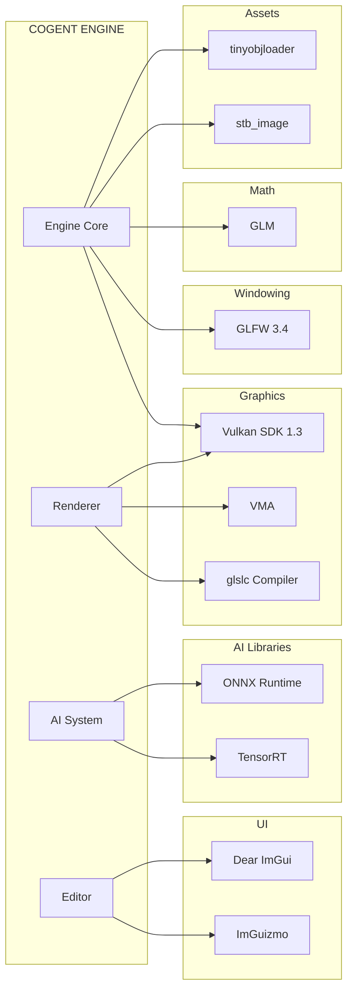

---

## 4. Requirement

| Requirement | Specification |
|------------|---------------|
| Language Standard | C++17 (C++20 future migration) |
| Build System | CMake 3.15+ |
| Graphics API | Vulkan 1.3+ |
| Target OS | Windows 10/11 (Linux future) |
| Compiler | MSVC 2022 (17.0+) |
| GPU | Vulkan 1.3 capable, 4+ GB VRAM |
| Memory | 16 GB RAM minimum |

---

## 5. Architecture Philosophy

### 5.1 Core Principles

| Principle | Description | Application |
|-----------|-------------|-------------|
| **Single Responsibility** | Each class/module has one reason to change | `GBuffer` only manages render targets, `DeferredLightingPass` only does lighting |
| **Dependency Inversion** | High-level modules don't depend on low-level details | `Renderer` depends on `GraphicsDevice` interface, not Vulkan calls directly |
| **Interface Segregation** | No client should depend on methods it doesn't use | Separate `Allocator` base from specific allocator types |
| **Open/Closed** | Open for extension, closed for modification | Render passes added via `RenderGraph::addPass()`, not by modifying graph internals |
| **Composition over Inheritance** | Prefer composition and aggregation | `CogentEngine` composes `GBuffer`, `RenderGraph`, `TAAPass` etc. as `unique_ptr` members |

### 5.2 Design Patterns Used

| Pattern | Where Used | Rationale |
|---------|-----------|-----------|
| **Singleton** | `Logger`, `Profiler`, `JobSystem`, `ResourceManager` | Global access to engine-wide services |
| **Factory** | `PipelineCache::buildGraphicsPipeline` | Named pipeline creation with caching |
| **Builder** | `DescriptorBuilder` | Fluent API for descriptor set construction |
| **Observer** | `Logger::AddCallback` | EditorUI subscribes to log messages |
| **Strategy** | `Allocator` hierarchy | Swap allocation strategy (Linear/Pool/Stack) |
| **Command** | `RenderPassNode::execute` | Deferred execution of render commands |
| **State** | `AppState` enum | Engine lifecycle state management |
| **Object Pool** | `PoolAllocator`, `DescriptorAllocator` | Recycled fixed-size objects / descriptors |
| **Frame Graph** | `RenderGraph` | Data-driven render pass scheduling |

### 5.3 Architectural Constraints

1. **No raw `new`/`delete`**: All allocations through NMM allocators or `std::unique_ptr`/`std::shared_ptr`
2. **No blocking on main thread**: All heavy work dispatched to CTS worker threads
3. **No hardcoded render passes**: All passes registered through RenderGraph
4. **GPU resources owned by creating module**: Module that creates a `VkImage` is responsible for destroying it
5. **Thread safety via design**: Minimize shared state; where unavoidable, use `std::mutex` or atomics

---

## 6. Layered Architecture

### 6.1 Layer Diagram

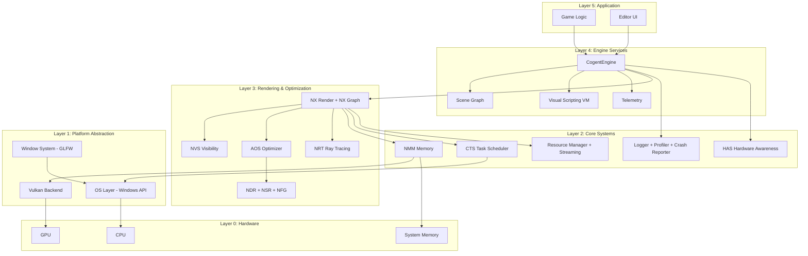

### 6.2 Layer Communication Rules

| Rule | Description |
|------|-------------|
| **Downward Only** | Layer N may only depend on Layer N-1 or lower |
| **No Upward Calls** | Lower layers never call higher layers directly |
| **Callback Exception** | Lower layers may invoke callbacks registered by higher layers (e.g., Logger callbacks) |
| **Horizontal Allowed** | Modules within the same layer may communicate |
| **Interface Boundary** | Cross-layer communication through defined interfaces only |

---

## 7. Module Architecture

### 7.1 Module Decomposition

```mermaid
graph TD
    subgraph "CogentEngine Module"
        CE[CogentEngine Class]
    end

    subgraph "Graphics Module"
        GD[GraphicsDevice]
        SC[Swapchain]
        DM[DescriptorManager]
        PC[PipelineCache]
        SS[ShaderSystem]
    end

    subgraph "Renderer Module"
        NXR_M[NX Render Coordinator]
        RG_M[RenderGraph]
        GB_M[GBuffer]
        SP_M[ShadowPass]
        DLP_M[DeferredLightingPass]
        SSAO_M[SSAO]
        SSS_M[ScreenSpaceShadows]
        TAA_M[TAAPass]
        HDR_M[HDRPipeline]
        LC_M[LightCulling]
        AE_M[AutoExposure]
    end

    subgraph "Visibility Module"
        VS_M[VisibilitySystem]
        FR_M[Frustum]
        HZB_M[HZB System]
        ML_M[MeshletBuilder]
    end

    subgraph "Optimization Module"
        OPT_M[OptimizerAI]
        SA_M[SceneAnalyzer]
        ANSR_M[ANSRPass]
    end

    subgraph "AI Module"
        NAI_M[AI Runtime]
        ONNX_M[ONNX Backend]
        TRT_M[TensorRT Backend]
    end

    subgraph "Resource Module"
        RM_M[ResourceManager]
        STR_M[Streamer]
        TEX_M[Texture]
        MDL_M[Model]
    end

    subgraph "Memory Module"
        ALLOC_M[Allocator Base]
        LIN_M[LinearAllocator]
        POOL_M[PoolAllocator]
    end

    subgraph "Threading Module"
        JOB_M[JobSystem]
    end

    subgraph "Diagnostics Module"
        LOG_M[Logger]
        PROF_M[Profiler]
        GPROF_M[GpuProfiler]
    end

    CE --> GD
    CE --> RG_M
    CE --> GB_M
    CE --> OPT_M
    CE --> VS_M

    GD --> SC
    GD --> DM
    GD --> PC
    GD --> SS

    RG_M --> GB_M
    RG_M --> SP_M
    RG_M --> DLP_M
    RG_M --> SSAO_M
    RG_M --> TAA_M
    RG_M --> HDR_M
    RG_M --> LC_M

    VS_M --> FR_M
    VS_M --> ML_M

    OPT_M --> SA_M
    OPT_M --> ANSR_M
```

### 7.2 Module Ownership

| Module | Owner Scope | Creates | Destroys |
|--------|------------|---------|----------|
| `GraphicsDevice` | VkInstance, VkDevice, VkQueue, VmaAllocator | On `init()` | On `cleanup()` |
| `Swapchain` | VkSwapchainKHR, VkImageView[], VkFramebuffer[] | On construct/`recreate()` | On destruct |
| `GBuffer` | 6 VkImage + VkImageView + VkDeviceMemory | On `init()` / `resize()` | On `cleanup()` / destruct |
| `ShadowPass` | Shadow VkImage array, VkFramebuffer per cascade | On `init()` | On destruct |
| `TAAPass` | 2 ping-pong VkImage, VkPipeline | On `init()` / `resize()` | On destruct |
| `HDRPipeline` | HDR target, Bloom mip chain, Tonemap target | On `init()` / `resize()` | On destruct |
| `SSAO` | Raw + Blur targets, Noise texture, Kernel buffer | On `init()` / `resize()` | On destruct |
| `ANSRPass` | Display + History VkImage | On construct / `resize()` | On destruct |
| `RayTracer` | Storage image, Uniform + Sphere buffers | On `init()` | On `cleanup()` |

---

## 8. Data Flow

### 8.1 Main Engine Data Flow

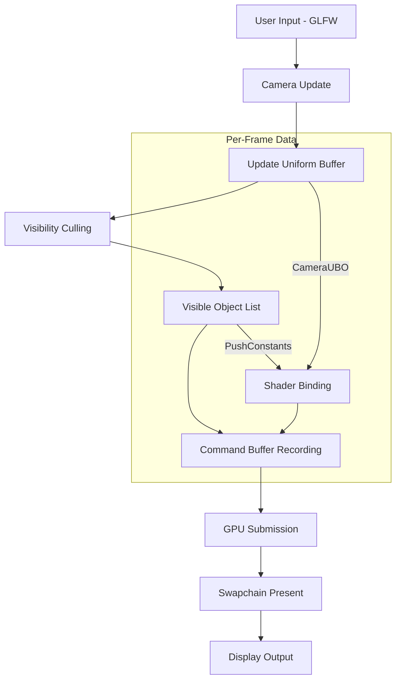

### 8.2 Resource Data Flow

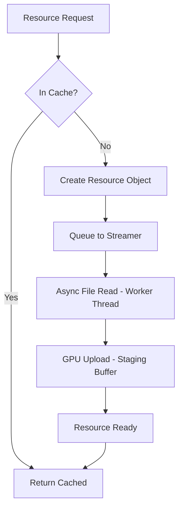

### 8.3 Rendering Data Flow

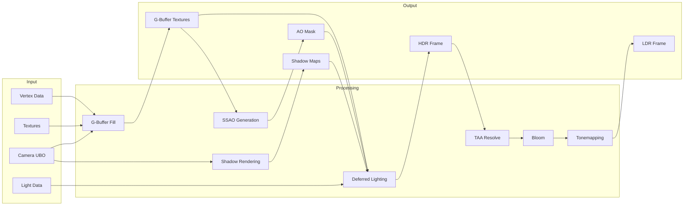

---

## 9. Module Flow

### 9.1 Engine Initialization Flow

```mermaid
flowchart TD
    START[main()] --> CREATE_ENGINE[Create CogentEngine]
    CREATE_ENGINE --> INIT_WINDOW[initWindow - GLFW]
    INIT_WINDOW --> INIT_VULKAN[initVulkan]
    
    INIT_VULKAN --> CREATE_SURFACE[createSurface]
    CREATE_SURFACE --> INIT_DEVICE[GraphicsDevice::init]
    INIT_DEVICE --> CREATE_SWAP[createSwapchain]
    CREATE_SWAP --> CREATE_VIEWS[createSwapchainImageViews]
    CREATE_VIEWS --> CREATE_CMD[createCommandBuffer]
    CREATE_CMD --> CREATE_SYNC[createSyncObjects]
    CREATE_SYNC --> INIT_SUBSYS[Initialize Subsystems]

    INIT_SUBSYS --> INIT_SHADER[ShaderSystem::init]
    INIT_SHADER --> INIT_PIPE[PipelineCache::init]
    INIT_PIPE --> INIT_GBUF[GBuffer::init]
    INIT_GBUF --> INIT_SHADOW[ShadowPass::init]
    INIT_SHADOW --> INIT_SSAO[SSAO::init]
    INIT_SSAO --> INIT_HDR[HDRPipeline::init]
    INIT_HDR --> INIT_TAA[TAAPass::init]
    INIT_TAA --> INIT_DEFERRED[DeferredLightingPass::init]
    INIT_DEFERRED --> INIT_LC[LightCulling::init]
    INIT_LC --> INIT_RES[initResources]

    INIT_RES --> INIT_IMGUI[ImGui::Init]
    INIT_IMGUI --> READY[Engine Ready → mainLoop]
```

### 9.2 Frame Execution Flow

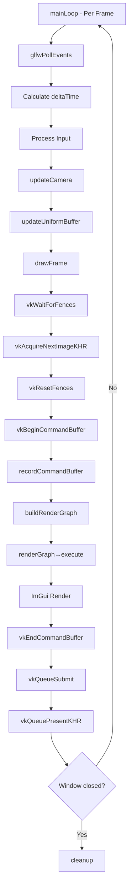

---

## 10. UML — Complete Class Hierarchy

### 10.1 Core Systems UML

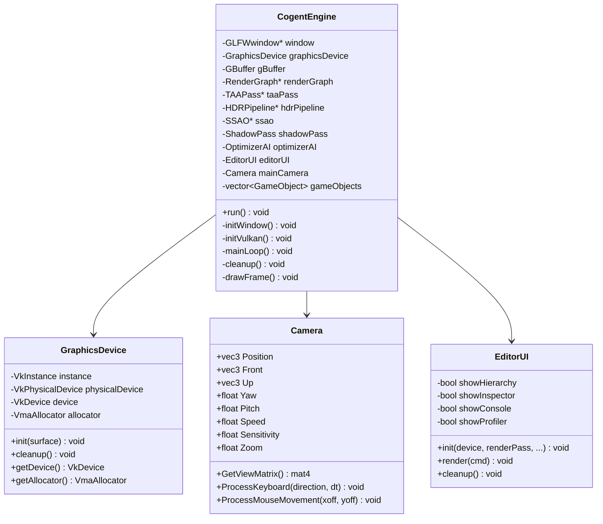

### 10.2 Memory System UML

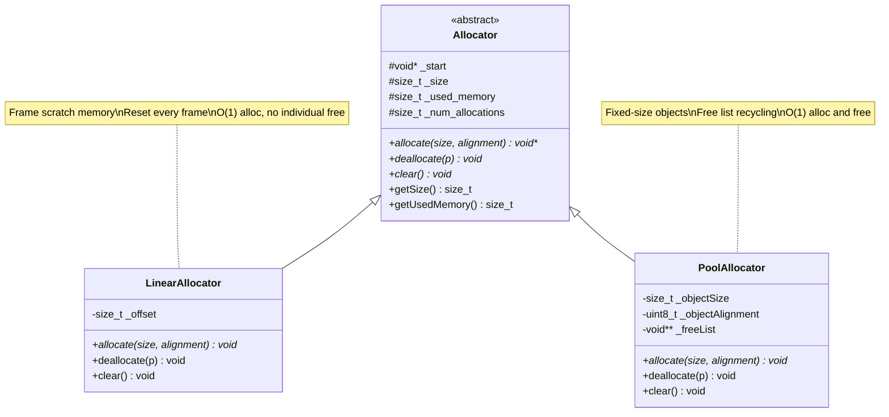

### 10.3 Rendering System UML

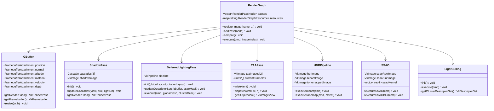

### 10.4 Resource System UML

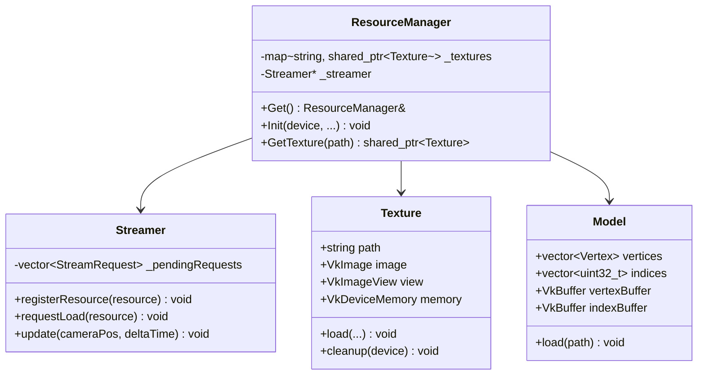

---

## 11. Flowchart — Engine Lifecycle

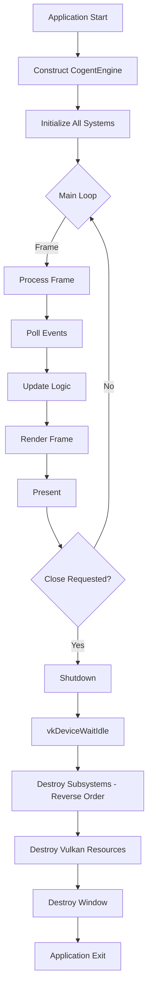

---

## 12. Sequence Diagram — Frame Pipeline

### 12.1 Complete Frame Sequence

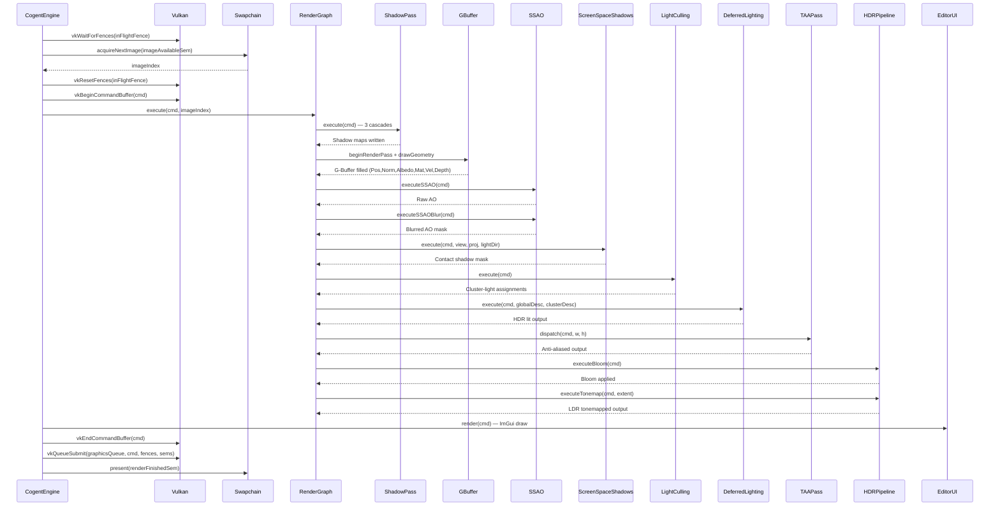

---

## 13. State Diagram — Engine States

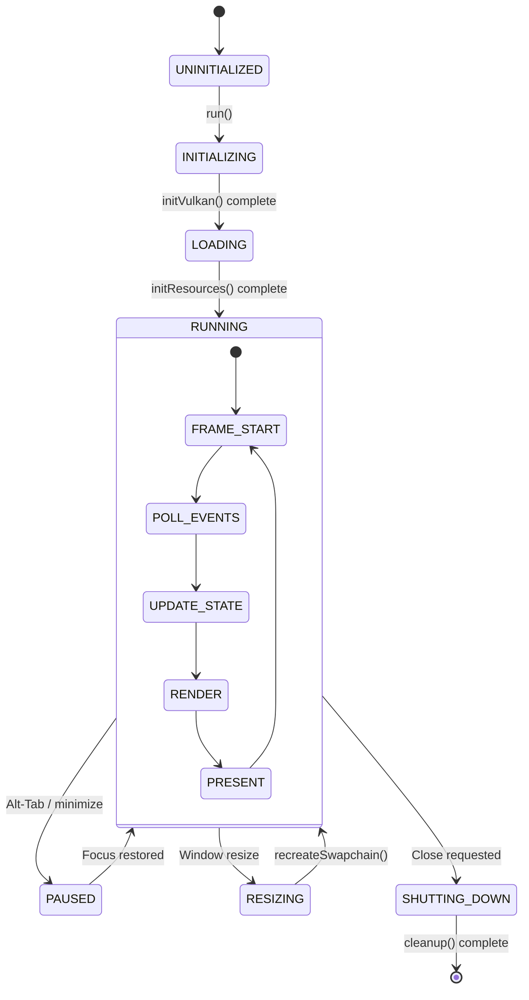

---

## 14. Interface Design

### 14.1 Core Interfaces

```cpp
// === IAllocator === (Abstract interface for all allocators)
class IAllocator {
public:
    virtual void* allocate(size_t size, uint8_t alignment = 8) = 0;
    virtual void deallocate(void* p) = 0;
    virtual void clear() = 0;
    virtual size_t getUsedMemory() const = 0;
    virtual ~IAllocator() = default;
};

// === IRenderPass === (Interface for render graph passes)
struct IRenderPass {
    std::string name;
    std::vector<RenderPassResourceInfo> inputs;
    std::vector<RenderPassResourceInfo> outputs;
    std::function<void(VkCommandBuffer, uint32_t)> execute;
};

// === IStreamable === (Interface for streamable resources)
class IStreamable {
public:
    virtual void load() = 0;
    virtual void unload() = 0;
    virtual float getPriority(const glm::vec3& cameraPos) const = 0;
    virtual bool isLoaded() const = 0;
    virtual ~IStreamable() = default;
};
```

### 14.2 Subsystem Communication

| Source | Target | Mechanism | Data |
|--------|--------|-----------|------|
| `CogentEngine` | `GraphicsDevice` | Direct member | Vulkan handles |
| `CogentEngine` | `RenderGraph` | `unique_ptr` | Pass nodes |
| `RenderGraph` | Render passes | `std::function` callback | VkCommandBuffer |
| `Logger` | `EditorUI` | Callback registration | Log string |
| `ResourceManager` | `Streamer` | Pointer | Load requests |
| `OptimizerAI` | `SceneAnalyzer` | Singleton access | Scene stats |
| `VisibilitySystem` | `Frustum` | Composition | Culling results |

---

## 15. Folder Structure

```
COGENT_ENGINE/
├── Core/                           # Foundation Layer
│   ├── Memory/                     # NMM — Memory Allocators
│   │   ├── Allocator.hpp           # Abstract base
│   │   ├── LinearAllocator.hpp     # Frame scratch
│   │   └── PoolAllocator.hpp       # Object pool
│   ├── Threading/                  # CTS — Task Scheduler
│   │   └── JobSystem.hpp           # Thread pool
│   ├── Graphics/                   # Vulkan Backend
│   │   ├── GraphicsDevice.hpp/cpp  # Instance, Device, Queues
│   │   ├── Swapchain.hpp/cpp       # Presentation
│   │   ├── ShaderSystem.hpp/cpp    # SPIR-V loading
│   │   ├── PipelineCache.hpp/cpp   # Pipeline management
│   │   └── DescriptorManager.hpp/cpp # Descriptor allocation
│   ├── Diagnostics/                # Profiling & Debugging
│   │   ├── Profiler.hpp            # CPU scoped timers
│   │   ├── GpuProfiler.hpp/cpp     # GPU timestamp queries
│   │   └── CrashReporter.hpp       # Minidump generation
│   ├── Math/                       # Math Utilities
│   │   └── Frustum.hpp             # Frustum planes + tests
│   ├── Logger.hpp                  # Thread-safe logging
│   ├── Camera.hpp                  # FPS camera
│   ├── Types.hpp                   # Vertex, UBO, GameObject
│   └── VulkanUtils.hpp/cpp         # Helper functions
│
├── Renderer/                       # Rendering Layer
│   ├── Graph/                      # NX Graph
│   │   └── RenderGraph.hpp/cpp     # Pass scheduling + barriers
│   ├── GBuffer.hpp/cpp             # G-Buffer (6 attachments)
│   ├── RenderPipeline.hpp/cpp      # G-Buffer fill pipeline
│   ├── ShadowPass.hpp/cpp          # CSM (3 cascades)
│   ├── DeferredLightingPass.hpp/cpp
│   ├── SSAO.hpp/cpp                # Screen Space AO
│   ├── ScreenSpaceShadows.hpp/cpp  # Contact shadows
│   ├── TAAPass.hpp/cpp             # Temporal AA
│   ├── HDRPipeline.hpp/cpp         # Bloom + Tonemap
│   ├── InstanceBuffer.hpp/cpp      # GPU instancing
│   ├── ANSR/                       # Neural Super Resolution
│   │   └── ANSRPass.hpp/cpp
│   ├── Lighting/                   # Light management
│   │   └── LightCulling.hpp/cpp    # Clustered shading
│   ├── PostProcess/                # Post-processing
│   │   └── AutoExposurePass.hpp/cpp
│   └── Visibility/                 # Visibility System
│       └── VisibilitySystem.hpp/cpp
│
├── Optimization/                   # AOS Module
│   ├── OptimizerAI.hpp             # Heuristic optimizer
│   └── SceneAnalyzer.hpp           # Scene stats collector
│
├── RayTracing/                     # NRT Module
│   ├── RayTracer.hpp/cpp           # Compute-based RT
│   └── BVHManager.hpp/cpp          # (Future: Hardware RT)
│
├── Geometry/                       # Mesh Processing
│   ├── PrimitiveMesh.hpp/cpp       # Cube, Sphere, Plane
│   └── Meshlet.hpp                 # Meshlet builder
│
├── Scene/                          # Scene Management
│   └── GameObject.hpp              # Scene entity
│
├── Editor/                         # Editor UI
│   ├── EditorUI.hpp/cpp            # ImGui-based editor
│   └── console_impl.temp           # Console template
│
├── Resources/                      # Asset Management
│   ├── ResourceManager.hpp         # Centralized loader
│   ├── Texture.hpp/cpp             # Texture loading
│   ├── Model.hpp/cpp               # OBJ model loading
│   └── Streaming/
│       └── Streamer.hpp/cpp        # Async streaming
│
├── Shaders/                        # GLSL Shaders
│   ├── gbuffer.vert/frag           # Geometry pass
│   ├── lighting.vert/frag          # Deferred lighting
│   ├── taa.comp                    # TAA compute
│   ├── ssao.comp / ssao_blur.comp  # SSAO
│   ├── sss.comp                    # Screen space shadows
│   ├── light_culling.comp          # Clustered shading
│   ├── bloom_downsample/upsample.comp
│   ├── AutoExposure.comp           # Eye adaptation
│   ├── tonemap.frag                # HDR → LDR
│   ├── ANSR.comp                   # Neural upscaling
│   ├── raytrace.comp               # Compute RT
│   └── *.spv                       # Compiled SPIR-V
│
├── Vendor/                         # Third-party
│   ├── imgui/                      # Dear ImGui
│   ├── ImGuizmo/                   # Transform gizmos
│   └── VMA/                        # Vulkan Memory Allocator
│
├── Engine/                         # Engine Entry Point
│   ├── CogentEngine.hpp            # Main engine class
│   └── CogentEngine.cpp            # Implementation
│
├── Docs/                           # Documentation (this folder)
├── build/                          # CMake build output
├── CMakeLists.txt                  # Build configuration
├── main.cpp                        # Entry point
└── embed_shaders.py                # Shader embedding script
```

---

## 16. Pseudocode — Core Algorithms

### 16.1 Frame Rendering Loop

```
function drawFrame():
    vkWaitForFences(device, inFlightFence)
    
    result = vkAcquireNextImageKHR(device, swapchain, UINT64_MAX, imageAvailableSemaphore)
    if result == VK_ERROR_OUT_OF_DATE_KHR:
        recreateSwapchain()
        return
    
    vkResetFences(device, inFlightFence)
    vkResetCommandBuffer(commandBuffer)
    
    recordCommandBuffer(commandBuffer, imageIndex)
    
    submitInfo = {
        waitSemaphores = [imageAvailableSemaphore]
        waitStages = [COLOR_ATTACHMENT_OUTPUT]
        commandBuffers = [commandBuffer]
        signalSemaphores = [renderFinishedSemaphore]
    }
    
    vkQueueSubmit(graphicsQueue, submitInfo, inFlightFence)
    
    presentInfo = {
        waitSemaphores = [renderFinishedSemaphore]
        swapchains = [swapchain]
        imageIndices = [imageIndex]
    }
    
    vkQueuePresentKHR(presentQueue, presentInfo)
```

### 16.2 Render Graph Compilation

```
function compile():
    // Topological sort passes based on resource dependencies
    // Currently linear order as added
    
    for each pass in passes:
        if pass.setup:
            pass.setup(device)

function execute(cmd, imageIndex):
    for each pass in passes:
        for each input in pass.inputs:
            resource = resources[input.name]
            insertBarrier(cmd, resource, input)
        
        for each output in pass.outputs:
            resource = resources[output.name]
            insertBarrier(cmd, resource, output)
        
        pass.execute(cmd, imageIndex)
```

### 16.3 Visibility Culling

```
function cull(allObjects, visibleObjects):
    visibleObjects.clear()
    
    for each obj in allObjects:
        // Test AABB against 6 frustum planes
        if frustum.testAABB(obj.aabbMin, obj.aabbMax) != OUTSIDE:
            visibleObjects.push_back(&obj)
    
    // Sort front-to-back for early-Z optimization
    sort(visibleObjects, by distance to camera)
```

---

## 17. API Contract

### 17.1 GraphicsDevice API

```
GraphicsDevice::init(surface: VkSurfaceKHR) → void
    Precondition: Valid VkSurfaceKHR
    Postcondition: VkInstance, VkDevice, VkQueues, VmaAllocator created
    Throws: std::runtime_error on failure

GraphicsDevice::getDevice() → VkDevice
    Precondition: init() called
    Returns: Valid VkDevice handle

GraphicsDevice::beginSingleTimeCommands() → VkCommandBuffer
    Precondition: init() called
    Returns: Begun command buffer from internal pool
    Note: Must pair with endSingleTimeCommands()

GraphicsDevice::endSingleTimeCommands(cmd: VkCommandBuffer) → void
    Precondition: cmd from beginSingleTimeCommands()
    Postcondition: Command buffer submitted and waited, then freed
```

### 17.2 RenderGraph API

```
RenderGraph::registerImage(name, image, view, format, layout) → void
    Precondition: Valid Vulkan image handles
    Postcondition: Resource tracked with given initial state

RenderGraph::addPass(node: RenderPassNode) → void
    Precondition: node has valid execute function
    Postcondition: Pass appended to execution list

RenderGraph::execute(cmd, imageIndex) → void
    Precondition: Valid command buffer in recording state
    Postcondition: All passes executed with barriers inserted
```

### 17.3 GBuffer API

```
GBuffer::init() → void
    Precondition: GraphicsDevice initialized
    Postcondition: 6 render targets created at specified resolution

GBuffer::resize(width, height) → void
    Precondition: init() previously called
    Postcondition: All targets recreated at new resolution
    Note: Invalidates all descriptor sets referencing G-Buffer views
```

---

## 18. Dependency Graph

### 18.1 Build-Time Dependencies

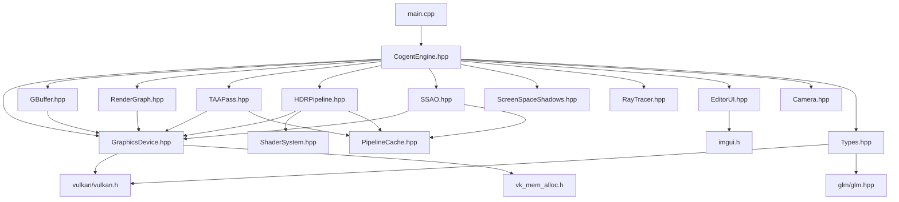

### 18.2 Runtime Dependency Order

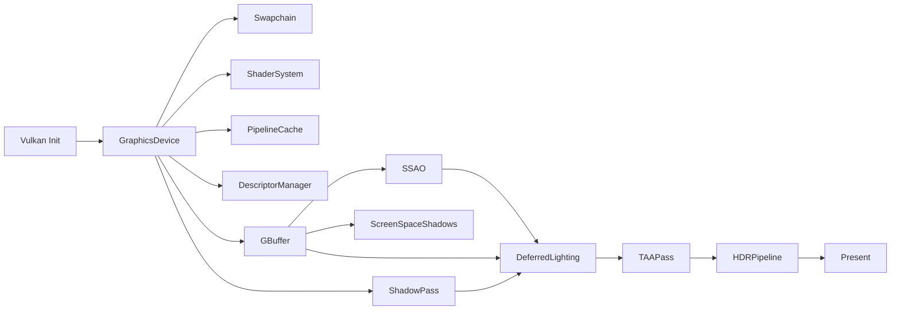

---

## 19. Advantages and Disadvantages

### 19.1 Deferred Rendering

| Aspect | Detail |
|--------|--------|
| **Advantage** | Decouples geometry from lighting → unlimited lights |
| **Advantage** | Single geometry pass → reduced draw calls |
| **Advantage** | Material data accessible in lighting pass for advanced PBR |
| **Disadvantage** | High VRAM cost (32 bytes/pixel G-Buffer) |
| **Disadvantage** | No native MSAA support (requires TAA or edge AA) |
| **Disadvantage** | Transparent objects require separate Forward pass |
| **Trade-off** | Chose deferred over forward+ for dense lighting scenarios |
| **Alternative** | Visibility Buffer rendering (deferred with single 32-bit ID buffer) — deferred to Phase 2 |
| **Rationale** | Deferred is proven, well-understood, and scales to hundreds of lights |

### 19.2 Render Graph

| Aspect | Detail |
|--------|--------|
| **Advantage** | Automatic barrier insertion eliminates manual synchronization bugs |
| **Advantage** | Modular — add/remove passes without modifying core rendering |
| **Advantage** | Enables future transient resource aliasing (memory savings) |
| **Disadvantage** | Runtime overhead of graph traversal (minimal) |
| **Disadvantage** | Debugging complexity — pass execution order non-obvious |
| **Trade-off** | Accepted small runtime cost for maintainability and correctness |
| **Alternative** | Hardcoded pass ordering — simpler but rigid and error-prone |
| **Rationale** | Industry standard (Frostbite, UE5) — proven scalable architecture |

### 19.3 Compute-Based Post Processing

| Aspect | Detail |
|--------|--------|
| **Advantage** | Async compute potential — overlap with graphics work |
| **Advantage** | No render pass overhead for screen-space effects |
| **Advantage** | Group shared memory for optimization (SSAO kernel, etc.) |
| **Disadvantage** | Requires explicit image barriers (no subpass dependencies) |
| **Trade-off** | Chose compute over fragment shaders for flexibility and performance |
| **Alternative** | Fragment shader post-process (simpler, but less optimal) |

### 19.4 Singleton Pattern (Logger, Profiler, JobSystem)

| Aspect | Detail |
|--------|--------|
| **Advantage** | Global access without parameter threading |
| **Advantage** | Guaranteed single instance |
| **Disadvantage** | Tight coupling to global state |
| **Disadvantage** | Harder to unit test (mock injection difficult) |
| **Trade-off** | Accepted for engine-wide services; game objects use composition |
| **Mitigation** | Limit singletons to infrastructure (Logger, Profiler, JobSystem) |

---

## 20. Risk

| Risk | Category | Severity | Probability |
|------|----------|----------|-------------|
| Vulkan driver bugs across vendors | Technical | High | Medium |
| G-Buffer VRAM pressure at 4K | Memory | High | High |
| Thread contention in job system | Performance | Medium | Low |
| Shader compilation stalls | Performance | Medium | Medium |
| Resource leak on hot-reload | Memory | Medium | Medium |
| Descriptor pool exhaustion | Technical | Medium | Low |

---

## 21. Mitigation

| Risk | Mitigation Strategy |
|------|-------------------|
| Vulkan driver bugs | Enable validation layers in dev; test on NVIDIA, AMD, Intel |
| G-Buffer VRAM | Packed formats (R10G10B10A2), reconstruction from depth |
| Thread contention | Lock-free queue, work-stealing scheduler |
| Shader compilation | Pipeline cache serialization, background compilation |
| Resource leaks | RAII wrappers, VMA statistics tracking |
| Descriptor exhaustion | Dynamic pool growth in DescriptorAllocator |

---

## 22. Future Improvement

- **C++20 Modules**: Replace `#include` with `import` for faster builds
- **Bindless Descriptors**: `VK_EXT_descriptor_indexing` for unlimited textures
- **Async Compute Queue**: Overlap compute and graphics work
- **Multi-Frame-in-Flight**: Double/triple buffering for GPU pipeline saturation
- **Hot Shader Reload**: Recompile shaders without restarting engine
- **Plugin Architecture**: Dynamic loading of engine modules
- **ECS (Entity Component System)**: Replace `GameObject` struct with data-oriented ECS
- **Scene Graph**: Hierarchical transform management with dirty flags

---

*End of Document — 02_ARCHITECTURE_DOCUMENT.md*  
*COGENT ENGINE © 2026 — All Rights Reserved*
