# 03 — SYSTEM DESIGN

## COGENT ENGINE — Detailed System Design Specification

**Version**: 1.0.0  
**Classification**: Internal — Engineering Bible  
**Last Updated**: 2026-07-30  
**Document Owner**: Engine Architecture Team  

---

## Table of Contents

1. [Tujuan (Purpose)](#1-tujuan-purpose)
2. [Scope](#2-scope)
3. [Dependency](#3-dependency)
4. [Requirement](#4-requirement)
5. [NMM — Memory Management System](#5-nmm--memory-management-system)
6. [CTS — Task Scheduler System](#6-cts--task-scheduler-system)
7. [Graphics Device System](#7-graphics-device-system)
8. [Descriptor Management System](#8-descriptor-management-system)
9. [Pipeline Cache System](#9-pipeline-cache-system)
10. [Shader System](#10-shader-system)
11. [Resource Management System](#11-resource-management-system)
12. [Asset Streaming System](#12-asset-streaming-system)
13. [Logger and Crash Reporter System](#13-logger-and-crash-reporter-system)
14. [Profiler System](#14-profiler-system)
15. [Camera System](#15-camera-system)
16. [Scene and GameObject System](#16-scene-and-gameobject-system)
17. [Editor UI System](#17-editor-ui-system)
18. [Interface Design](#18-interface-design)
19. [Folder Structure](#19-folder-structure)
20. [Risk](#20-risk)
21. [Mitigation](#21-mitigation)
22. [Future Improvement](#22-future-improvement)

---

## 1. Tujuan (Purpose)

This document provides detailed system-level design for every core subsystem in COGENT ENGINE. Each subsystem is documented with its internal architecture, state machines, data flows, interface contracts, and pseudocode implementations.

---

## 2. Scope

Covers all non-rendering core systems:
- NMM (Memory), CTS (Threading), Graphics Device, Descriptors, Pipelines, Shaders
- Resource Manager, Streamer, Logger, Profiler, Camera, Scene, Editor

---

## 3. Dependency

| System | Depends On |
|--------|-----------|
| NMM | None (foundation) |
| CTS | NMM (for job allocations) |
| GraphicsDevice | Vulkan SDK, VMA |
| DescriptorManager | GraphicsDevice |
| PipelineCache | GraphicsDevice, ShaderSystem |
| ShaderSystem | GraphicsDevice |
| ResourceManager | GraphicsDevice, CTS, Streamer |
| Streamer | CTS, Logger |
| Logger | OS APIs (Windows.h for crash dumps) |
| Profiler | Logger, GraphicsDevice (GPU timestamps) |
| Camera | GLM |
| Scene/GameObject | Types.hpp, GLM |
| EditorUI | ImGui, ImGuizmo, GraphicsDevice |

---

## 4. Requirement

All systems require C++17 and target Windows 10+ with MSVC 2022.

---

## 5. NMM — Memory Management System

### 5.1 Architecture

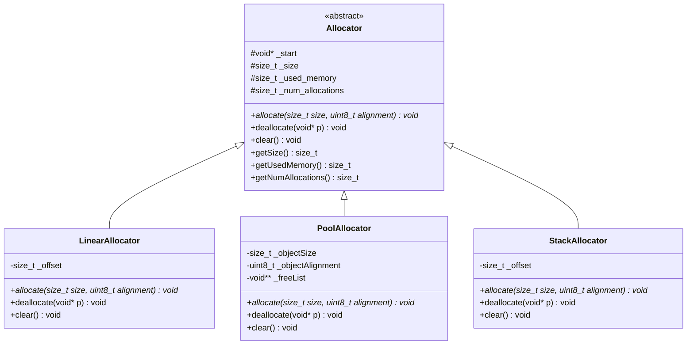
```mermaid
classDiagram
    class Allocator {
        <<abstract>>
        #void* _start
        #size_t _size
        #size_t _used_memory
        #size_t _num_allocations
        +allocate(size_t size, uint8_t alignment) void*
        +deallocate(void* p) void
        +clear() void
        +getSize() size_t
        +getUsedMemory() size_t
        +getNumAllocations() size_t
    }

    class LinearAllocator {
        -size_t _offset
        +allocate(size_t size, uint8_t alignment) void*
        +deallocate(void* p) void
        +clear() void
    }

    class PoolAllocator {
        -size_t _objectSize
        -uint8_t _objectAlignment
        -void** _freeList
        +allocate(size_t size, uint8_t alignment) void*
        +deallocate(void* p) void
        +clear() void
    }

    class StackAllocator {
        -size_t _offset
        +allocate(size_t size, uint8_t alignment) void*
        +deallocate(void* p) void
        +clear() void
    }

    Allocator <|-- LinearAllocator
    Allocator <|-- PoolAllocator
    Allocator <|-- StackAllocator
```

### 5.2 Data Flow

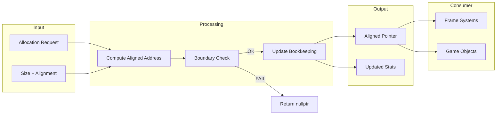
```mermaid
flowchart LR
    subgraph "Input"
        REQ[Allocation Request]
        SIZE[Size + Alignment]
    end

    subgraph "Processing"
        ALIGN[Compute Aligned Address]
        CHECK[Boundary Check]
        UPDATE[Update Bookkeeping]
    end

    subgraph "Output"
        PTR[Aligned Pointer]
        STATS[Updated Stats]
    end

    subgraph "Consumer"
        FRAME[Frame Systems]
        OBJECT[Game Objects]
    end

    REQ --> ALIGN
    SIZE --> ALIGN
    ALIGN --> CHECK
    CHECK -->|OK| UPDATE
    CHECK -->|FAIL| ERROR[Return nullptr]
    UPDATE --> PTR
    UPDATE --> STATS
    PTR --> FRAME
    PTR --> OBJECT
```

### 5.3 State Diagram — LinearAllocator

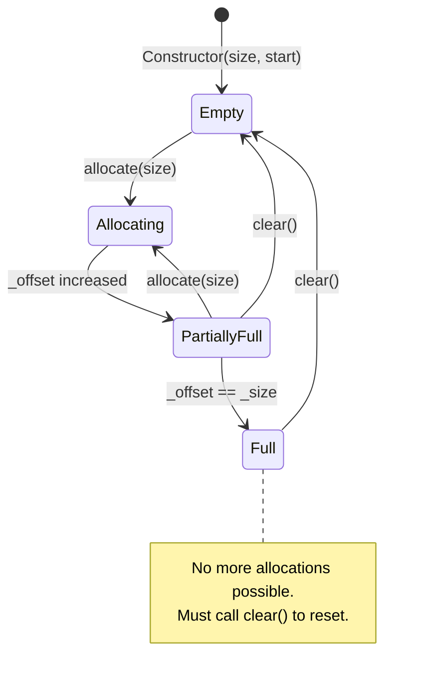
```mermaid
stateDiagram-v2
    [*] --> Empty: Constructor(size, start)
    Empty --> Allocating: allocate(size)
    Allocating --> PartiallyFull: _offset increased
    PartiallyFull --> Allocating: allocate(size)
    PartiallyFull --> Full: _offset == _size
    Full --> Empty: clear()
    PartiallyFull --> Empty: clear()

    note right of Full
        No more allocations possible.
        Must call clear() to reset.
    end note
```

### 5.4 State Diagram — PoolAllocator

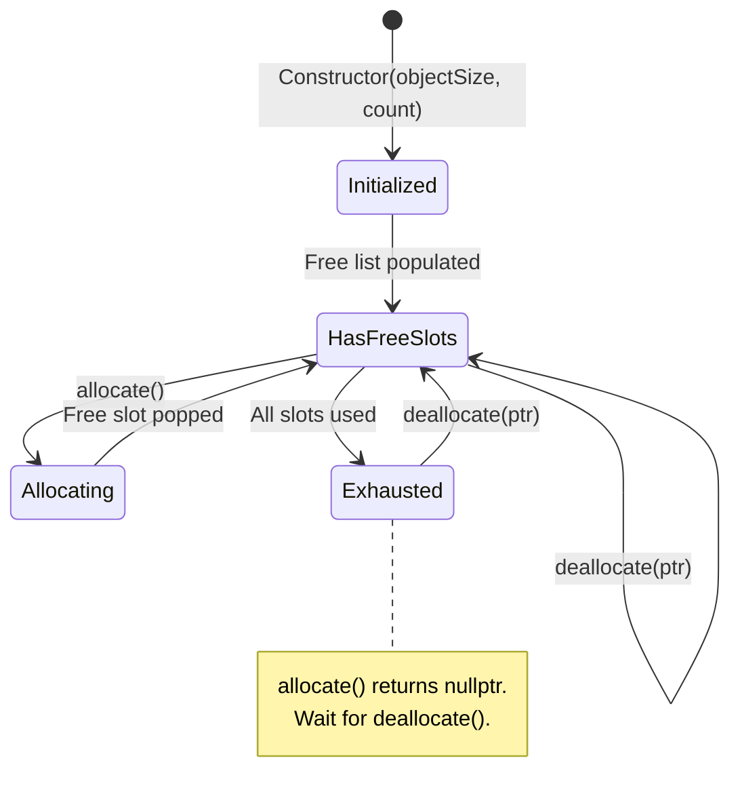
```mermaid
stateDiagram-v2
    [*] --> Initialized: Constructor(objectSize, count)
    Initialized --> HasFreeSlots: Free list populated
    HasFreeSlots --> Allocating: allocate()
    Allocating --> HasFreeSlots: Free slot popped
    HasFreeSlots --> Exhausted: All slots used
    Exhausted --> HasFreeSlots: deallocate(ptr)
    HasFreeSlots --> HasFreeSlots: deallocate(ptr)

    note right of Exhausted
        allocate() returns nullptr.
        Wait for deallocate().
    end note
```

### 5.5 Pseudocode

```
// --- LinearAllocator ---
class LinearAllocator extends Allocator:
    offset = 0

    function allocate(size, alignment):
        currentAddress = (uintptr_t)_start + offset
        alignedAddress = alignForward(currentAddress, alignment)
        padding = alignedAddress - currentAddress
        
        if offset + padding + size > _size:
            return nullptr  // Out of memory
        
        offset += padding + size
        _used_memory += padding + size
        _num_allocations++
        return (void*)alignedAddress

    function deallocate(p):
        // No-op: linear allocators don't support individual frees
        pass

    function clear():
        offset = 0
        _used_memory = 0
        _num_allocations = 0

// --- PoolAllocator ---
class PoolAllocator extends Allocator:
    objectSize: size_t
    freeList: void**

    constructor(objectSize, objectCount, alignment):
        totalSize = objectSize * objectCount
        rawMemory = malloc(totalSize)
        super(totalSize, rawMemory)
        
        // Build free list
        for i in range(objectCount - 1):
            slot = rawMemory + i * objectSize
            nextSlot = rawMemory + (i + 1) * objectSize
            *((void**)slot) = nextSlot
        lastSlot = rawMemory + (objectCount - 1) * objectSize
        *((void**)lastSlot) = nullptr
        freeList = (void**)rawMemory

    function allocate(size, alignment):
        if freeList == nullptr:
            return nullptr  // Pool exhausted
        
        ptr = freeList
        freeList = (void**)*freeList  // Pop from free list
        _used_memory += objectSize
        _num_allocations++
        return ptr

    function deallocate(p):
        *((void**)p) = freeList  // Push to free list head
        freeList = (void**)p
        _used_memory -= objectSize
        _num_allocations--
```

### 5.6 API Contract

```
Allocator::allocate(size, alignment) → void*
    Precondition: size > 0, alignment is power of 2
    Postcondition: Returns aligned pointer or nullptr
    Thread Safety: NOT thread-safe (use per-thread allocators)

Allocator::deallocate(ptr) → void
    Precondition: ptr was returned by allocate() on same allocator
    Postcondition: Memory reclaimed (Pool) or no-op (Linear)

Allocator::clear() → void
    Postcondition: All memory available, stats reset to zero
    Warning: All previously allocated pointers are INVALID after clear()
```

### 5.7 Advantages & Disadvantages

| Allocator | Advantages | Disadvantages | Best For |
|-----------|-----------|---------------|----------|
| Linear | O(1) alloc, zero fragmentation, bulk reset | No individual free | Per-frame scratch data |
| Pool | O(1) alloc & free, zero fragmentation | Fixed object size only | Game objects, components |
| Stack | O(1) alloc, LIFO free | Must free in reverse order | Nested scopes |

---

## 6. CTS — Task Scheduler System

### 6.1 Architecture

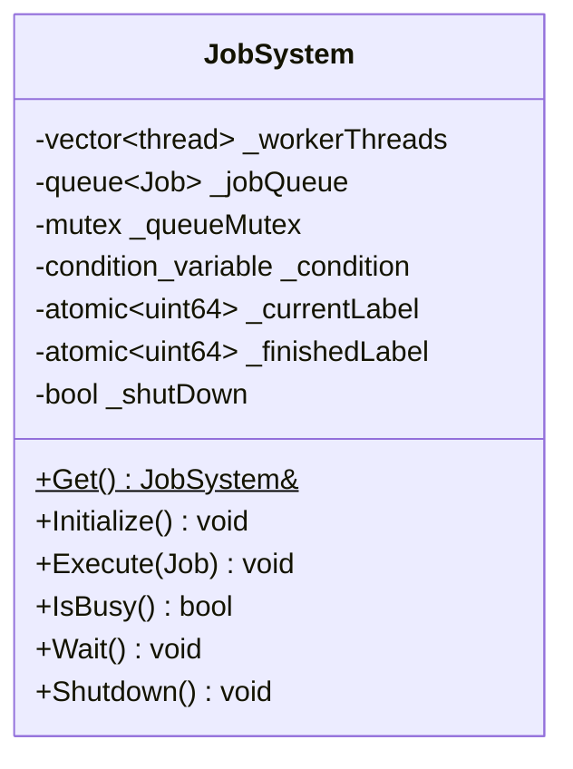
```mermaid
classDiagram
    class JobSystem {
        -vector~thread~ _workerThreads
        -queue~Job~ _jobQueue
        -mutex _queueMutex
        -condition_variable _condition
        -atomic~uint64~ _currentLabel
        -atomic~uint64~ _finishedLabel
        -bool _shutDown
        +Get() JobSystem&$
        +Initialize() void
        +Execute(Job) void
        +IsBusy() bool
        +Wait() void
        +Shutdown() void
    }
```

### 6.2 Data Flow

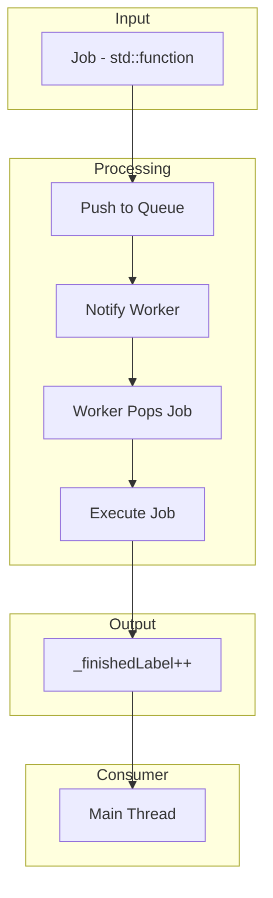
```mermaid
flowchart TD
    subgraph "Input"
        JOB[Job - std::function]
    end

    subgraph "Processing"
        ENQUEUE[Push to Queue]
        NOTIFY[Notify Worker]
        DEQUEUE[Worker Pops Job]
        EXEC[Execute Job]
    end

    subgraph "Output"
        COUNTER[_finishedLabel++]
    end

    subgraph "Consumer"
        MAIN[Main Thread]
    end

    JOB --> ENQUEUE
    ENQUEUE --> NOTIFY
    NOTIFY --> DEQUEUE
    DEQUEUE --> EXEC
    EXEC --> COUNTER
    COUNTER --> MAIN
```

### 6.3 Sequence Diagram

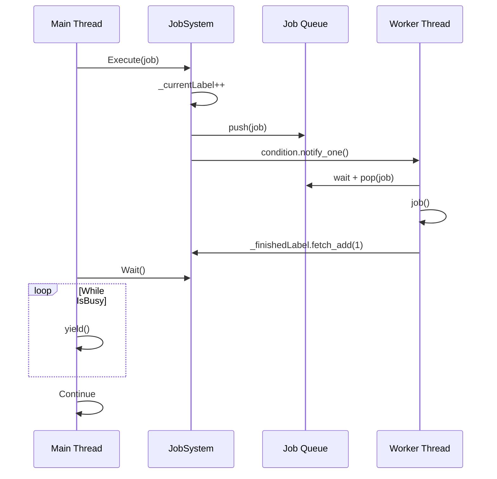
```mermaid
sequenceDiagram
    participant MT as Main Thread
    participant JS as JobSystem
    participant Q as Job Queue
    participant W as Worker Thread

    MT->>JS: Execute(job)
    JS->>JS: _currentLabel++
    JS->>Q: push(job)
    JS->>W: condition.notify_one()
    
    W->>Q: wait + pop(job)
    W->>W: job()
    W->>JS: _finishedLabel.fetch_add(1)
    
    MT->>JS: Wait()
    loop While IsBusy
        MT->>MT: yield()
    end
    MT->>MT: Continue
```

### 6.4 State Diagram

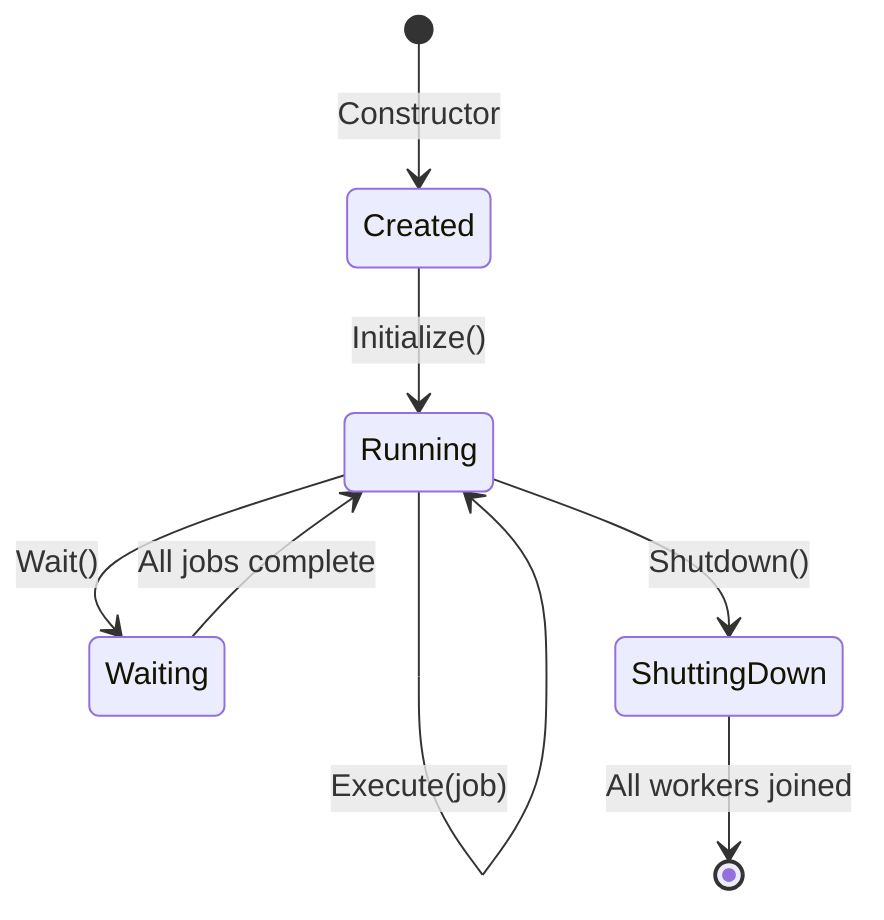
```mermaid
stateDiagram-v2
    [*] --> Created: Constructor
    Created --> Running: Initialize()
    Running --> Running: Execute(job)
    Running --> Waiting: Wait()
    Waiting --> Running: All jobs complete
    Running --> ShuttingDown: Shutdown()
    ShuttingDown --> [*]: All workers joined
```

### 6.5 Pseudocode

```
class JobSystem:
    // Singleton
    static function Get() -> JobSystem&:
        static instance = JobSystem()
        return instance

    function Initialize():
        numCores = hardware_concurrency()
        if numCores > 1: numCores--  // Reserve one for main thread
        _shutDown = false

        for i in range(numCores):
            _workerThreads.emplace_back(lambda:
                while true:
                    job = null
                    {
                        lock = unique_lock(_queueMutex)
                        _condition.wait(lock, () => _shutDown || !_jobQueue.empty())
                        
                        if _shutDown && _jobQueue.empty():
                            return
                        
                        job = _jobQueue.front()
                        _jobQueue.pop()
                    }
                    job()
                    _finishedLabel.fetch_add(1)
            )

    function Execute(job):
        _currentLabel++
        {
            lock_guard lock(_queueMutex)
            _jobQueue.push(job)
        }
        _condition.notify_one()

    function IsBusy() -> bool:
        return _finishedLabel.load() < _currentLabel

    function Wait():
        while IsBusy():
            this_thread::yield()
```

### 6.6 API Contract

```
JobSystem::Initialize() → void
    Precondition: Not already initialized
    Postcondition: N-1 worker threads running
    Thread Safety: Call from main thread only

JobSystem::Execute(job) → void
    Precondition: Initialize() called
    Postcondition: Job queued for execution
    Thread Safety: Safe to call from any thread

JobSystem::Wait() → void
    Precondition: Jobs have been submitted
    Postcondition: All submitted jobs completed
    Warning: Blocks calling thread (busy-wait with yield)
```

---

## 7. Graphics Device System

### 7.1 Architecture

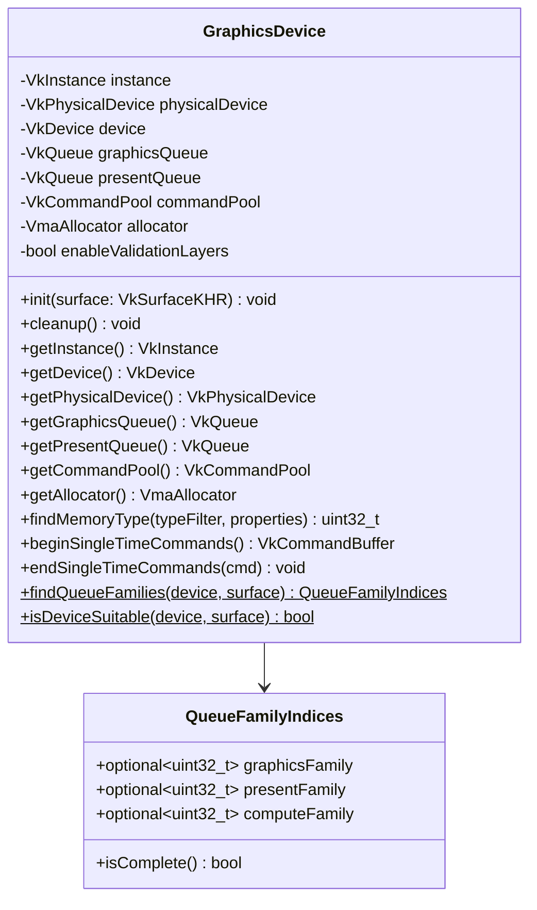
```mermaid
classDiagram
    class GraphicsDevice {
        -VkInstance instance
        -VkPhysicalDevice physicalDevice
        -VkDevice device
        -VkQueue graphicsQueue
        -VkQueue presentQueue
        -VkCommandPool commandPool
        -VmaAllocator allocator
        -bool enableValidationLayers
        +init(surface: VkSurfaceKHR) void
        +cleanup() void
        +getInstance() VkInstance
        +getDevice() VkDevice
        +getPhysicalDevice() VkPhysicalDevice
        +getGraphicsQueue() VkQueue
        +getPresentQueue() VkQueue
        +getCommandPool() VkCommandPool
        +getAllocator() VmaAllocator
        +findMemoryType(typeFilter, properties) uint32_t
        +beginSingleTimeCommands() VkCommandBuffer
        +endSingleTimeCommands(cmd) void
        +findQueueFamilies(device, surface) QueueFamilyIndices$
        +isDeviceSuitable(device, surface) bool$
    }

    class QueueFamilyIndices {
        +optional~uint32_t~ graphicsFamily
        +optional~uint32_t~ presentFamily
        +optional~uint32_t~ computeFamily
        +isComplete() bool
    }

    GraphicsDevice --> QueueFamilyIndices
```

### 7.2 Initialization Sequence

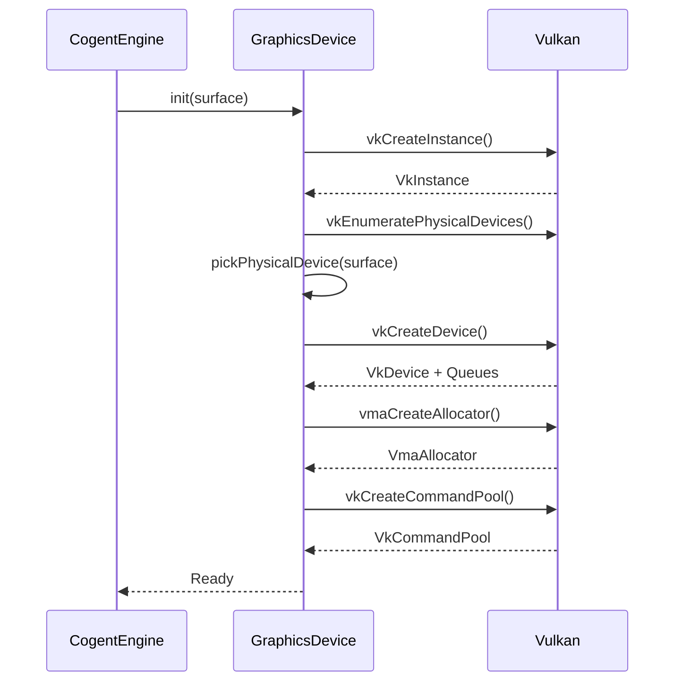
```mermaid
sequenceDiagram
    participant App as CogentEngine
    participant GD as GraphicsDevice
    participant VK as Vulkan

    App->>GD: init(surface)
    GD->>VK: vkCreateInstance()
    VK-->>GD: VkInstance
    GD->>VK: vkEnumeratePhysicalDevices()
    GD->>GD: pickPhysicalDevice(surface)
    GD->>VK: vkCreateDevice()
    VK-->>GD: VkDevice + Queues
    GD->>VK: vmaCreateAllocator()
    VK-->>GD: VmaAllocator
    GD->>VK: vkCreateCommandPool()
    VK-->>GD: VkCommandPool
    GD-->>App: Ready
```

### 7.3 State Diagram

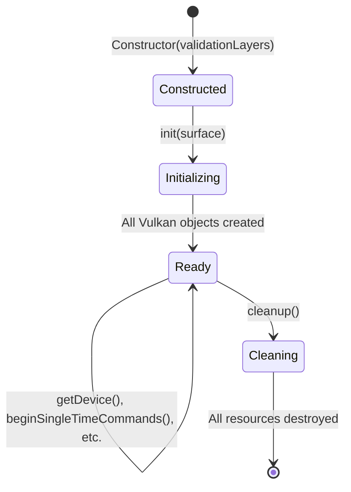
```mermaid
stateDiagram-v2
    [*] --> Constructed: Constructor(validationLayers)
    Constructed --> Initializing: init(surface)
    Initializing --> Ready: All Vulkan objects created
    Ready --> Ready: getDevice(), beginSingleTimeCommands(), etc.
    Ready --> Cleaning: cleanup()
    Cleaning --> [*]: All resources destroyed
```

### 7.4 Pseudocode

```
class GraphicsDevice:
    function init(surface):
        createInstance()
        pickPhysicalDevice(surface)
        createLogicalDevice(surface)
        createCommandPool()
    
    function createInstance():
        appInfo = VkApplicationInfo("COGENT ENGINE", VK_API_VERSION_1_3)
        extensions = getRequiredExtensions()
        
        if enableValidationLayers:
            layers = ["VK_LAYER_KHRONOS_validation"]
        
        createInfo = VkInstanceCreateInfo(appInfo, extensions, layers)
        vkCreateInstance(createInfo) -> instance

    function pickPhysicalDevice(surface):
        devices = vkEnumeratePhysicalDevices(instance)
        
        for device in devices:
            if isDeviceSuitable(device, surface):
                physicalDevice = device
                return
        
        throw "No suitable GPU found"

    function createLogicalDevice(surface):
        indices = findQueueFamilies(physicalDevice, surface)
        
        queueCreateInfos = createUniqueQueueCreateInfos(indices)
        deviceFeatures = VkPhysicalDeviceFeatures()
        
        createInfo = VkDeviceCreateInfo(queueCreateInfos, deviceFeatures, extensions)
        vkCreateDevice(physicalDevice, createInfo) -> device
        
        vkGetDeviceQueue(device, indices.graphicsFamily) -> graphicsQueue
        vkGetDeviceQueue(device, indices.presentFamily) -> presentQueue
        
        // VMA
        allocatorInfo = VmaAllocatorCreateInfo(instance, physicalDevice, device)
        vmaCreateAllocator(allocatorInfo) -> allocator
```

---

## 8. Descriptor Management System

### 8.1 Architecture

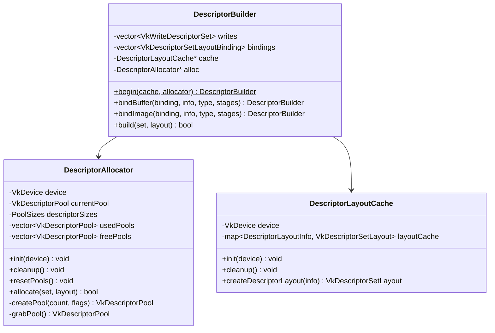
```mermaid
classDiagram
    class DescriptorAllocator {
        -VkDevice device
        -VkDescriptorPool currentPool
        -PoolSizes descriptorSizes
        -vector~VkDescriptorPool~ usedPools
        -vector~VkDescriptorPool~ freePools
        +init(device) void
        +cleanup() void
        +resetPools() void
        +allocate(set, layout) bool
        -createPool(count, flags) VkDescriptorPool
        -grabPool() VkDescriptorPool
    }

    class DescriptorLayoutCache {
        -VkDevice device
        -map~DescriptorLayoutInfo, VkDescriptorSetLayout~ layoutCache
        +init(device) void
        +cleanup() void
        +createDescriptorLayout(info) VkDescriptorSetLayout
    }

    class DescriptorBuilder {
        -vector~VkWriteDescriptorSet~ writes
        -vector~VkDescriptorSetLayoutBinding~ bindings
        -DescriptorLayoutCache* cache
        -DescriptorAllocator* alloc
        +begin(cache, allocator) DescriptorBuilder$
        +bindBuffer(binding, info, type, stages) DescriptorBuilder
        +bindImage(binding, info, type, stages) DescriptorBuilder
        +build(set, layout) bool
    }

    DescriptorBuilder --> DescriptorAllocator
    DescriptorBuilder --> DescriptorLayoutCache
```

### 8.2 Data Flow

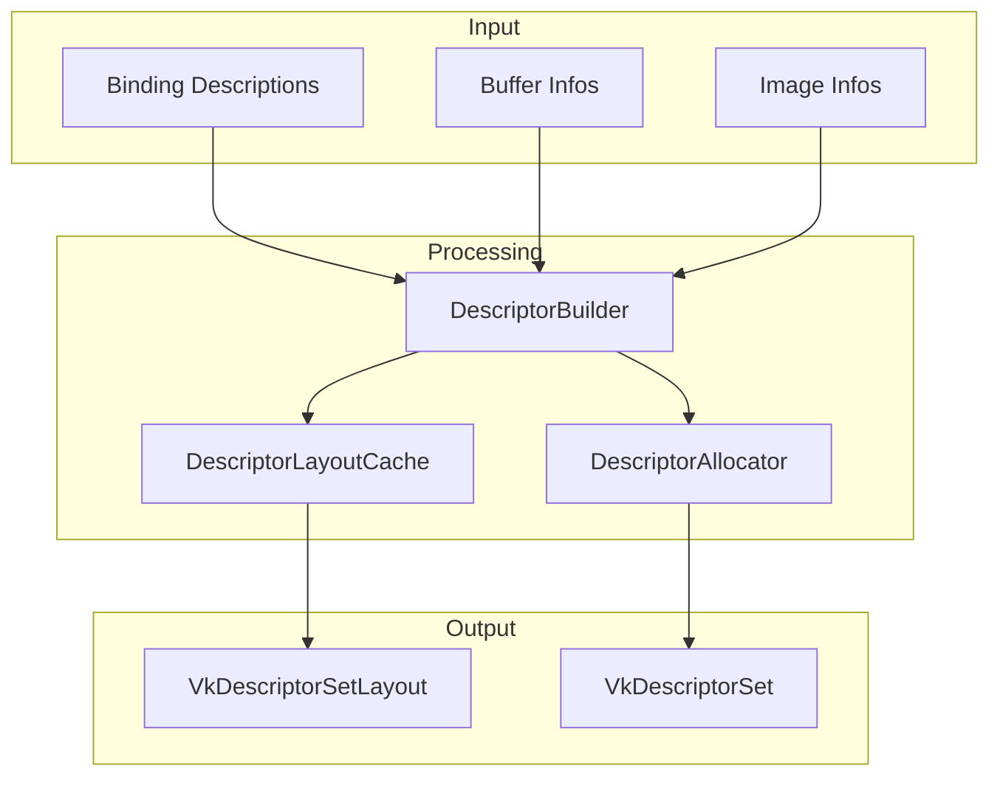
```mermaid
flowchart TD
    subgraph "Input"
        BINDINGS[Binding Descriptions]
        BUFFERS[Buffer Infos]
        IMAGES[Image Infos]
    end

    subgraph "Processing"
        BUILDER[DescriptorBuilder]
        CACHE[DescriptorLayoutCache]
        POOL[DescriptorAllocator]
    end

    subgraph "Output"
        LAYOUT[VkDescriptorSetLayout]
        SET[VkDescriptorSet]
    end

    BINDINGS --> BUILDER
    BUFFERS --> BUILDER
    IMAGES --> BUILDER
    BUILDER --> CACHE
    CACHE --> LAYOUT
    BUILDER --> POOL
    POOL --> SET
```

### 8.3 Sequence Diagram

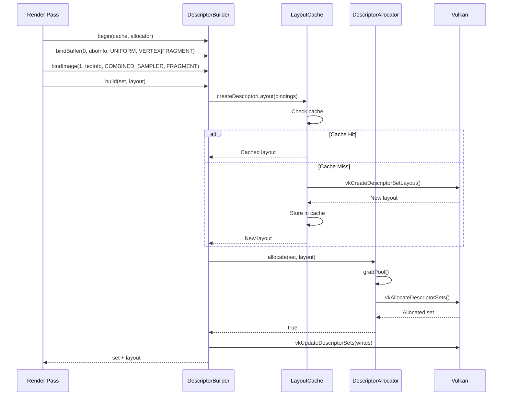
```mermaid
sequenceDiagram
    participant Client as Render Pass
    participant DB as DescriptorBuilder
    participant LC as LayoutCache
    participant DA as DescriptorAllocator
    participant VK as Vulkan

    Client->>DB: begin(cache, allocator)
    Client->>DB: bindBuffer(0, uboInfo, UNIFORM, VERTEX|FRAGMENT)
    Client->>DB: bindImage(1, texInfo, COMBINED_SAMPLER, FRAGMENT)
    Client->>DB: build(set, layout)
    
    DB->>LC: createDescriptorLayout(bindings)
    LC->>LC: Check cache
    alt Cache Hit
        LC-->>DB: Cached layout
    else Cache Miss
        LC->>VK: vkCreateDescriptorSetLayout()
        VK-->>LC: New layout
        LC->>LC: Store in cache
        LC-->>DB: New layout
    end
    
    DB->>DA: allocate(set, layout)
    DA->>DA: grabPool()
    DA->>VK: vkAllocateDescriptorSets()
    VK-->>DA: Allocated set
    DA-->>DB: true
    
    DB->>VK: vkUpdateDescriptorSets(writes)
    DB-->>Client: set + layout
```

### 8.4 Pseudocode

```
class DescriptorBuilder:
    static function begin(cache, allocator):
        builder = DescriptorBuilder()
        builder.cache = cache
        builder.alloc = allocator
        return builder

    function bindBuffer(binding, bufferInfo, type, stageFlags):
        layoutBinding = VkDescriptorSetLayoutBinding {
            binding, type, 1, stageFlags
        }
        bindings.push_back(layoutBinding)
        
        write = VkWriteDescriptorSet {
            binding, type, bufferInfo
        }
        writes.push_back(write)
        return this

    function build(set, layout):
        layoutInfo = VkDescriptorSetLayoutCreateInfo(bindings)
        layout = cache.createDescriptorLayout(&layoutInfo)
        
        success = alloc.allocate(&set, layout)
        if !success:
            return false
        
        for write in writes:
            write.dstSet = set
        
        vkUpdateDescriptorSets(device, writes)
        return true
```

---

## 9. Pipeline Cache System

### 9.1 Architecture

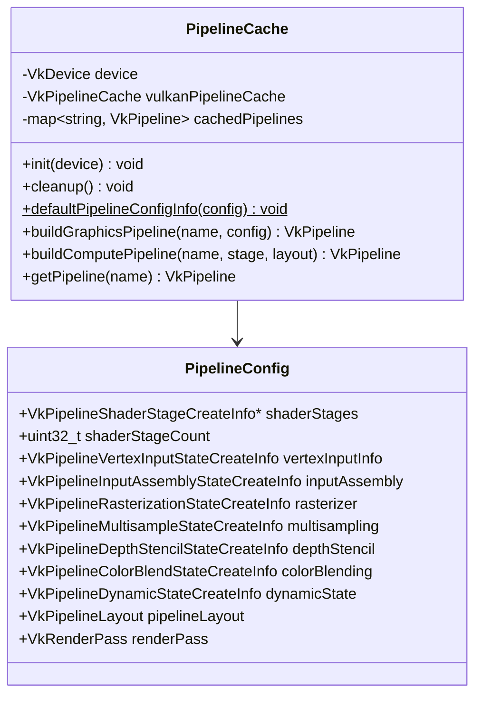
```mermaid
classDiagram
    class PipelineCache {
        -VkDevice device
        -VkPipelineCache vulkanPipelineCache
        -map~string, VkPipeline~ cachedPipelines
        +init(device) void
        +cleanup() void
        +defaultPipelineConfigInfo(config) void$
        +buildGraphicsPipeline(name, config) VkPipeline
        +buildComputePipeline(name, stage, layout) VkPipeline
        +getPipeline(name) VkPipeline
    }

    class PipelineConfig {
        +VkPipelineShaderStageCreateInfo* shaderStages
        +uint32_t shaderStageCount
        +VkPipelineVertexInputStateCreateInfo vertexInputInfo
        +VkPipelineInputAssemblyStateCreateInfo inputAssembly
        +VkPipelineRasterizationStateCreateInfo rasterizer
        +VkPipelineMultisampleStateCreateInfo multisampling
        +VkPipelineDepthStencilStateCreateInfo depthStencil
        +VkPipelineColorBlendStateCreateInfo colorBlending
        +VkPipelineDynamicStateCreateInfo dynamicState
        +VkPipelineLayout pipelineLayout
        +VkRenderPass renderPass
    }

    PipelineCache --> PipelineConfig
```

### 9.2 Flowchart

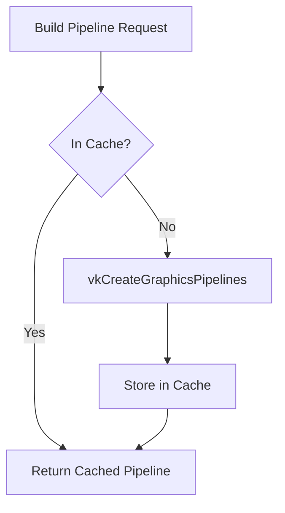
```mermaid
flowchart TD
    REQUEST[Build Pipeline Request] --> LOOKUP{In Cache?}
    LOOKUP -->|Yes| RETURN[Return Cached Pipeline]
    LOOKUP -->|No| CREATE[vkCreateGraphicsPipelines]
    CREATE --> STORE[Store in Cache]
    STORE --> RETURN
```

### 9.3 Pseudocode

```
class PipelineCache:
    function buildGraphicsPipeline(name, config):
        if cachedPipelines.contains(name):
            return cachedPipelines[name]
        
        createInfo = VkGraphicsPipelineCreateInfo {
            stageCount = config.shaderStageCount,
            pStages = config.shaderStages,
            pVertexInputState = &config.vertexInputInfo,
            pInputAssemblyState = &config.inputAssembly,
            pRasterizationState = &config.rasterizer,
            pMultisampleState = &config.multisampling,
            pDepthStencilState = &config.depthStencil,
            pColorBlendState = &config.colorBlending,
            pDynamicState = &config.dynamicState,
            layout = config.pipelineLayout,
            renderPass = config.renderPass
        }
        
        pipeline = vkCreateGraphicsPipelines(device, vulkanPipelineCache, createInfo)
        cachedPipelines[name] = pipeline
        return pipeline

    function buildComputePipeline(name, computeStage, layout):
        if cachedPipelines.contains(name):
            return cachedPipelines[name]
        
        createInfo = VkComputePipelineCreateInfo {
            stage = computeStage,
            layout = layout
        }
        
        pipeline = vkCreateComputePipelines(device, vulkanPipelineCache, createInfo)
        cachedPipelines[name] = pipeline
        return pipeline
```

---

## 10. Shader System

### 10.1 Architecture

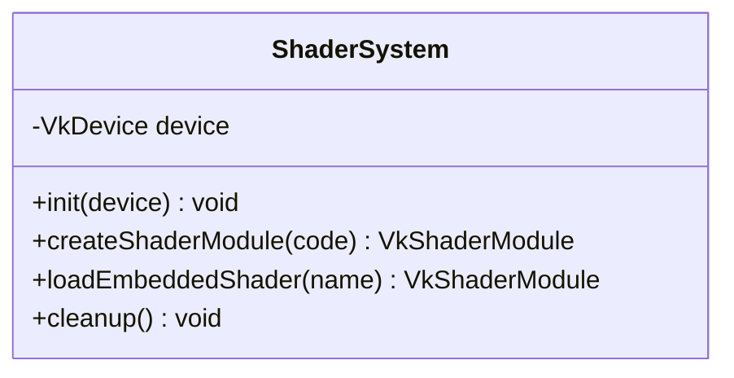
```mermaid
classDiagram
    class ShaderSystem {
        -VkDevice device
        +init(device) void
        +createShaderModule(code) VkShaderModule
        +loadEmbeddedShader(name) VkShaderModule
        +cleanup() void
    }
```

### 10.2 Data Flow

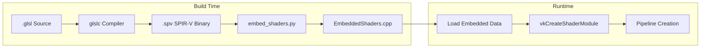
```mermaid
flowchart LR
    subgraph "Build Time"
        GLSL[.glsl Source] --> GLSLC[glslc Compiler]
        GLSLC --> SPV[.spv SPIR-V Binary]
        SPV --> EMBED[embed_shaders.py]
        EMBED --> CPP[EmbeddedShaders.cpp]
    end

    subgraph "Runtime"
        CPP --> LOAD[Load Embedded Data]
        LOAD --> CREATE_SM[vkCreateShaderModule]
        CREATE_SM --> PIPELINE[Pipeline Creation]
    end
```

### 10.3 Pseudocode

```
// embed_shaders.py (Build-time)
function embedShaders():
    for each .spv file in Shaders/:
        data = readBinary(spvFile)
        name = extractName(spvFile)  // e.g., "taa_comp"
        
        write to EmbeddedShaders.cpp:
            "const uint32_t {name}_data[] = { ... };"
            "const size_t {name}_size = sizeof({name}_data);"

// ShaderSystem (Runtime)
function loadEmbeddedShader(name):
    data = getEmbeddedData(name)
    size = getEmbeddedSize(name)
    
    moduleInfo = VkShaderModuleCreateInfo {
        codeSize = size,
        pCode = data
    }
    
    return vkCreateShaderModule(device, moduleInfo)
```

---

## 11. Resource Management System

### 11.1 Architecture

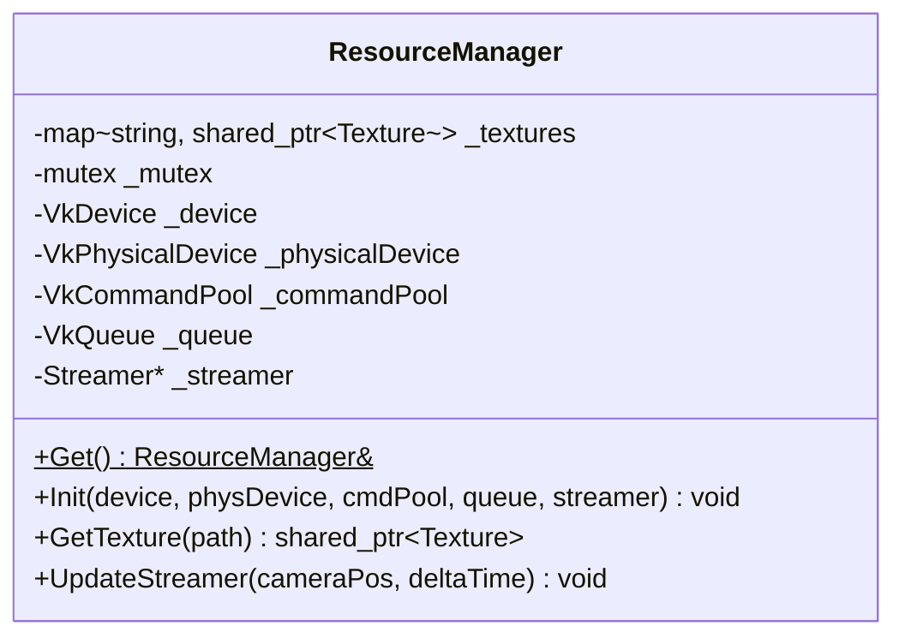
```mermaid
classDiagram
    class ResourceManager {
        -map~string, shared_ptr~Texture~~ _textures
        -mutex _mutex
        -VkDevice _device
        -VkPhysicalDevice _physicalDevice
        -VkCommandPool _commandPool
        -VkQueue _queue
        -Streamer* _streamer
        +Get() ResourceManager&$
        +Init(device, physDevice, cmdPool, queue, streamer) void
        +GetTexture(path) shared_ptr~Texture~
        +UpdateStreamer(cameraPos, deltaTime) void
    }
```

### 11.2 Data Flow

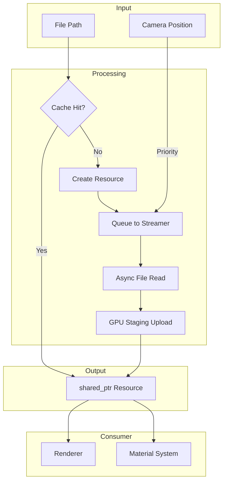
```mermaid
flowchart TD
    subgraph "Input"
        PATH[File Path]
        CAM_POS[Camera Position]
    end

    subgraph "Processing"
        CACHE_HIT{Cache Hit?}
        CREATE_RES[Create Resource]
        QUEUE_LOAD[Queue to Streamer]
        ASYNC_READ[Async File Read]
        GPU_UPLOAD[GPU Staging Upload]
    end

    subgraph "Output"
        RESOURCE[shared_ptr Resource]
    end

    subgraph "Consumer"
        RENDERER_C[Renderer]
        MATERIAL[Material System]
    end

    PATH --> CACHE_HIT
    CACHE_HIT -->|Yes| RESOURCE
    CACHE_HIT -->|No| CREATE_RES
    CREATE_RES --> QUEUE_LOAD
    QUEUE_LOAD --> ASYNC_READ
    ASYNC_READ --> GPU_UPLOAD
    GPU_UPLOAD --> RESOURCE
    RESOURCE --> RENDERER_C
    RESOURCE --> MATERIAL

    CAM_POS -->|Priority| QUEUE_LOAD
```

### 11.3 Sequence Diagram

```mermaid
sequenceDiagram
    participant Client as Renderer
    participant RM as ResourceManager
    participant Cache as Texture Cache
    participant Str as Streamer
    participant Worker as Worker Thread
    participant GPU as GPU

    Client->>RM: GetTexture("diffuse.png")
    RM->>Cache: Find("diffuse.png")
    alt Cache Hit
        Cache-->>RM: shared_ptr<Texture>
        RM-->>Client: Return cached
    else Cache Miss
        RM->>RM: Create Texture object
        RM->>Cache: Store(path, texture)
        RM->>Str: requestLoad(texture)
        Str->>Worker: Schedule async read
        Worker->>Worker: Read file from disk
        Worker->>GPU: Create staging buffer + copy
        Worker->>GPU: Layout transition
        Worker-->>Str: Load complete
        RM-->>Client: Return (loading in background)
    end
```

---

## 12. Asset Streaming System

### 12.1 Architecture

```mermaid
classDiagram
    class Streamer {
        -vector~StreamRequest~ _pendingRequests
        -VkDevice _device
        -VkPhysicalDevice _physicalDevice
        -VkCommandPool _commandPool
        -VkQueue _queue
        +registerResource(resource) void
        +requestLoad(resource) void
        +update(cameraPos, deltaTime) void
        -processQueue() void
        -calculatePriority(resource, cameraPos) float
    }

    class StreamRequest {
        +shared_ptr~IStreamable~ resource
        +float priority
        +StreamState state
    }

    class StreamState {
        <<enumeration>>
        PENDING
        LOADING
        LOADED
        UNLOADING
        ERROR
    }

    Streamer --> StreamRequest
    StreamRequest --> StreamState
```

### 12.2 State Diagram

```mermaid
stateDiagram-v2
    [*] --> REGISTERED: registerResource()
    REGISTERED --> PENDING: requestLoad()
    PENDING --> LOADING: Worker picks up job
    LOADING --> LOADED: File read + GPU upload complete
    LOADED --> IN_USE: Referenced by active frame
    IN_USE --> LOADED: Frame complete
    LOADED --> UNLOADING: Priority drops below threshold
    UNLOADING --> [*]: GPU resources freed
    
    LOADING --> ERROR: File not found / GPU failure
    ERROR --> PENDING: Retry
    ERROR --> [*]: Max retries exceeded
```

### 12.3 Pseudocode

```
class Streamer:
    function update(cameraPos, deltaTime):
        // Recalculate priorities
        for each request in _pendingRequests:
            request.priority = calculatePriority(request.resource, cameraPos)
        
        // Sort by priority (highest first)
        sort(_pendingRequests, by priority descending)
        
        // Process top N requests per frame
        maxLoadsPerFrame = 2
        loaded = 0
        
        for each request in _pendingRequests:
            if request.state == PENDING && loaded < maxLoadsPerFrame:
                request.state = LOADING
                JobSystem.Execute(() => loadResource(request))
                loaded++
    
    function calculatePriority(resource, cameraPos):
        distance = length(resource.position - cameraPos)
        return 1.0 / (distance + 1.0)  // Closer = higher priority
```

---

## 13. Logger and Crash Reporter System

### 13.1 Architecture

```mermaid
classDiagram
    class Logger {
        -ofstream _logFile
        -mutex _mutex
        -vector~function~ _callbacks
        +Get() Logger&$
        +Init(filename) void
        +Log(level, args...) void
        +AddCallback(callback) void
        -FormatMessage(level, msg) string
        -TopLevelExceptionHandler(pExceptionInfo) LONG$
        -GenerateDump(pExceptionInfo) void
    }

    class LogLevel {
        <<enumeration>>
        INFO
        WARN
        ERR
        FATAL
    }

    Logger --> LogLevel
```

### 13.2 Flowchart — Log Message Processing

```mermaid
flowchart TD
    LOG_CALL[LOG_INFO / WARN / ERROR / FATAL] --> LOCK[Acquire mutex]
    LOCK --> FORMAT[Format message with timestamp + level]
    FORMAT --> CONSOLE{Level >= ERROR?}
    CONSOLE -->|Yes| STDERR[Write to stderr]
    CONSOLE -->|No| STDOUT[Write to stdout]
    STDERR --> FILE[Write to log file]
    STDOUT --> FILE
    FILE --> FLUSH[Flush file buffer]
    FLUSH --> CALLBACKS[Invoke all registered callbacks]
    CALLBACKS --> FATAL_CHECK{Level == FATAL?}
    FATAL_CHECK -->|Yes| ABORT[abort()]
    FATAL_CHECK -->|No| RELEASE[Release mutex]
```

### 13.3 Crash Reporter Flowchart

```mermaid
flowchart TD
    EXCEPTION[Unhandled Exception] --> HANDLER[TopLevelExceptionHandler]
    HANDLER --> LOG_CRASH[Log FATAL with exception code]
    LOG_CRASH --> CREATE_DUMP[CreateFileA - crash.dmp]
    CREATE_DUMP --> WRITE_DUMP[MiniDumpWriteDump]
    WRITE_DUMP --> CONTINUE[EXCEPTION_CONTINUE_SEARCH]
```

---

## 14. Profiler System

### 14.1 Architecture

```mermaid
classDiagram
    class Profiler {
        -map~string, long long~ _results
        -mutex _mutex
        +Get() Profiler&$
        +BeginSession(name) void
        +EndSession() void
        +WriteProfile(result) void
        +GetResults() map
    }

    class InstrumentationTimer {
        -const char* _name
        -time_point _startTimepoint
        -bool _stopped
        +Stop() void
        +~InstrumentationTimer()
    }

    class GpuProfiler {
        -VkQueryPool queryPool
        -map~string, pair~uint32_t,uint32_t~~ queries
        +init(device, physDevice) void
        +beginQuery(cmd, name) void
        +endQuery(cmd, name) void
        +getResults() map~string, float~
        +cleanup() void
    }

    class ProfileResult {
        +string name
        +long long duration
    }

    Profiler --> ProfileResult
    Profiler <-- InstrumentationTimer
```

### 14.2 Data Flow

```mermaid
flowchart LR
    subgraph "CPU Profiling"
        SCOPE_START[PROFILE_SCOPE entry] --> TIMER[InstrumentationTimer created]
        TIMER --> SCOPE_END[Scope exit → destructor]
        SCOPE_END --> WRITE[WriteProfile to Profiler]
    end

    subgraph "GPU Profiling"
        BEGIN_Q[beginQuery] --> GPU_WORK[GPU Work]
        GPU_WORK --> END_Q[endQuery]
        END_Q --> READBACK[vkGetQueryPoolResults]
        READBACK --> CONVERT[Convert timestamps to ms]
    end

    WRITE --> RESULTS[Results Map]
    CONVERT --> RESULTS
    RESULTS --> UI_DISPLAY[EditorUI Profiler Panel]
```

### 14.3 Pseudocode

```
// CPU Profiling — RAII Timer
#define PROFILE_SCOPE(name) InstrumentationTimer timer##__LINE__(name)

class InstrumentationTimer:
    constructor(name):
        _name = name
        _startTimepoint = high_resolution_clock::now()
        _stopped = false
    
    destructor():
        if !_stopped: Stop()
    
    function Stop():
        endTime = high_resolution_clock::now()
        duration = (endTime - _startTimepoint) in microseconds
        Profiler.Get().WriteProfile({_name, duration})
        _stopped = true

// GPU Profiling — Timestamp Queries
class GpuProfiler:
    function beginQuery(cmd, name):
        queryIndex = nextQueryIndex++
        queries[name] = {queryIndex * 2, queryIndex * 2 + 1}
        vkCmdWriteTimestamp(cmd, TOP_OF_PIPE, queryPool, queryIndex * 2)
    
    function endQuery(cmd, name):
        pair = queries[name]
        vkCmdWriteTimestamp(cmd, BOTTOM_OF_PIPE, queryPool, pair.second)
    
    function getResults():
        vkGetQueryPoolResults(device, queryPool, ...)
        
        results = {}
        for name, pair in queries:
            diff = timestamps[pair.second] - timestamps[pair.first]
            ms = diff * timestampPeriod / 1e6
            results[name] = ms
        
        return results
```

---

## 15. Camera System

### 15.1 Architecture

```mermaid
classDiagram
    class Camera {
        +vec3 Position
        +vec3 Front
        +vec3 Up
        +vec3 Right
        +vec3 WorldUp
        +float Yaw
        +float Pitch
        +float MovementSpeed
        +float MouseSensitivity
        +float Zoom
        +Camera(position)
        +GetViewMatrix() mat4
        +GetProjectionMatrix(aspect, near, far) mat4
        +ProcessKeyboard(direction, deltaTime) void
        +ProcessMouseMovement(xoffset, yoffset) void
        +ProcessMouseScroll(yoffset) void
        -updateCameraVectors() void
    }

    class CameraDirection {
        <<enumeration>>
        FORWARD
        BACKWARD
        LEFT
        RIGHT
        UP
        DOWN
    }

    Camera --> CameraDirection
```

### 15.2 State Diagram

```mermaid
stateDiagram-v2
    [*] --> Idle: Constructor
    Idle --> Moving: ProcessKeyboard()
    Moving --> Idle: No input
    Idle --> Rotating: ProcessMouseMovement()
    Rotating --> Idle: No input
    Idle --> Zooming: ProcessMouseScroll()
    Zooming --> Idle: Scroll complete
    
    state Moving {
        [*] --> UpdatePosition
        UpdatePosition --> UpdateVectors: updateCameraVectors()
    }
    
    state Rotating {
        [*] --> UpdateAngles
        UpdateAngles --> ClampPitch: Clamp ±89°
        ClampPitch --> UpdateVectors: updateCameraVectors()
    }
```

---

## 16. Scene and GameObject System

### 16.1 Architecture

```mermaid
classDiagram
    class GameObject {
        +string name
        +mat4 model
        +mat4 prevModel
        +vec4 color
        +int id
        +int meshID
        +float metallic
        +float roughness
        +vec3 aabbMin
        +vec3 aabbMax
        +getPushConstant() ObjectPushConstant
        +updateModelMatrix(newModel) void
    }

    class ObjectPushConstant {
        +mat4 model
        +mat4 prevModel
        +vec4 color
        +int id
        +float metallic
        +float roughness
        +int padding
    }

    class Vertex {
        +vec3 pos
        +vec3 color
        +vec3 normal
        +vec2 texCoord
        +getBindingDescription() VkVertexInputBindingDescription$
        +getAttributeDescriptions() array~VkVertexInputAttributeDescription~$
    }

    class CameraUBO {
        +mat4 view
        +mat4 proj
        +mat4 prevView
        +mat4 prevProj
        +vec3 viewPos
        +float time
        +float deltaTime
        +vec3 lightDirection
        +vec3 lightColor
        +float lightIntensity
        +uvec4 gridDimensions
        +vec2 screenDimensions
        +float zNear
        +float zFar
    }

    GameObject --> ObjectPushConstant
```

### 16.2 Data Flow

```mermaid
flowchart TD
    subgraph "Input"
        TRANSFORM[Transform Changes]
        MATERIAL[Material Properties]
    end

    subgraph "Processing"
        UPDATE_M[updateModelMatrix]
        PUSH_C[getPushConstant]
    end

    subgraph "Output"
        PREV_M[prevModel stored]
        PC[ObjectPushConstant]
    end

    subgraph "Consumer"
        MOTION[Motion Vector Shader]
        GBUFFER_C[G-Buffer Fill]
        CULLING_C[Visibility Culling]
    end

    TRANSFORM --> UPDATE_M
    UPDATE_M --> PREV_M
    MATERIAL --> PUSH_C
    PUSH_C --> PC
    PC --> GBUFFER_C
    PREV_M --> MOTION
    PREV_M --> CULLING_C
```

---

## 17. Editor UI System

### 17.1 Architecture

```mermaid
classDiagram
    class EditorUI {
        -bool showHierarchy
        -bool showInspector
        -bool showConsole
        -bool showProfiler
        -bool showSceneView
        -vector~string~ consoleLogs
        -VkDescriptorSet sceneDescriptor
        +init(device, renderPass, cmdPool, queue) void
        +render(cmd) void
        +cleanup() void
        +setSceneTexture(descriptor) void
        -renderMenuBar() void
        -renderHierarchy(gameObjects) void
        -renderInspector(selectedObject) void
        -renderConsole() void
        -renderProfiler() void
        -renderSceneView() void
        -renderGizmo(selectedObject) void
    }
```

### 17.2 Flowchart — Editor Frame

```mermaid
flowchart TD
    BEGIN[ImGui::NewFrame] --> MENU[Render Menu Bar]
    MENU --> DOCK[Setup Docking Space]
    DOCK --> HIERARCHY[Render Hierarchy Panel]
    HIERARCHY --> INSPECTOR[Render Inspector Panel]
    INSPECTOR --> SCENE_VIEW[Render Scene Viewport]
    SCENE_VIEW --> CONSOLE_P[Render Console Panel]
    CONSOLE_P --> PROFILER_P[Render Profiler Panel]
    PROFILER_P --> GIZMO[Render Transform Gizmo]
    GIZMO --> END[ImGui::Render]
    END --> DRAW_CMD[ImGui_ImplVulkan_RenderDrawData]
```

---

## 18. Interface Design

### 18.1 System Interface Summary

| Interface | Method | Direction | Data |
|-----------|--------|-----------|------|
| `IAllocator` | `allocate(size, alignment)` | In | Size, alignment → Pointer |
| `IAllocator` | `deallocate(ptr)` | In | Pointer |
| `IAllocator` | `clear()` | In | (none) |
| `IStreamable` | `load()` | In | File path → GPU resource |
| `IStreamable` | `unload()` | In | GPU resource → freed |
| `IStreamable` | `getPriority(cameraPos)` | In | Camera → Priority float |
| `IRenderPass` | `execute(cmd, imageIndex)` | In | Command buffer |
| `Logger` | `Log(level, args...)` | In | Level + message |
| `Logger` | `AddCallback(fn)` | In | Callback function |
| `Profiler` | `WriteProfile(result)` | In | Name + duration |
| `JobSystem` | `Execute(job)` | In | Job function |
| `JobSystem` | `Wait()` | In | (blocks until done) |

---

## 19. Folder Structure

(See §15 in 02_ARCHITECTURE_DOCUMENT.md for complete folder structure.)

---

## 20. Risk

| System | Risk | Severity |
|--------|------|----------|
| NMM | Memory fragmentation in Pool allocator | Medium |
| NMM | Linear allocator overflow without warning | High |
| CTS | Deadlock if job waits on another job | High |
| CTS | Starvation of low-priority jobs | Medium |
| GraphicsDevice | Vulkan initialization failure on unsupported hardware | High |
| DescriptorManager | Pool exhaustion under high descriptor churn | Medium |
| ResourceManager | Race condition on resource cache | Medium |
| Streamer | I/O bottleneck blocking all workers | Medium |
| Logger | Log file grows unbounded | Low |
| Profiler | Timer resolution issues on some hardware | Low |

---

## 21. Mitigation

| Risk | Mitigation |
|------|------------|
| Memory fragmentation | Use per-frame linear allocators; Pool for fixed-size only |
| Linear overflow | Bounds checking with LOG_ERROR on allocation failure |
| Job deadlock | Design rule: jobs never wait on other jobs |
| Job starvation | Priority queue implementation (future) |
| Vulkan init failure | Graceful error message with hardware requirements |
| Descriptor exhaustion | Auto-growing pool in DescriptorAllocator |
| Resource race | std::mutex on all cache operations |
| I/O bottleneck | Limit async loads per frame (2 max) |
| Log file growth | Log rotation (future enhancement) |
| Timer resolution | Use `std::chrono::high_resolution_clock`, GPU timestamps |

---

## 22. Future Improvement

- **Stack Allocator**: LIFO allocation for nested scopes (Phase 0 enhancement)
- **Buddy Allocator**: Power-of-2 allocation with coalescing
- **Work Stealing**: Lock-free work-stealing queue for CTS
- **Priority Jobs**: High/Medium/Low job priority with separate queues
- **Async Compute Pool**: Separate command pool for async compute work
- **Shader Hot Reload**: Watch filesystem, recompile SPIR-V on change
- **Asset Database**: SQLite-backed asset index with metadata
- **Log Rotation**: Rotate logs at 100 MB, keep last 5 files
- **Remote Profiler**: TCP-based profiler client for external monitoring
- **ECS Migration**: Replace GameObject struct with Entity Component System

---

*End of Document — 03_SYSTEM_DESIGN.md*  
*COGENT ENGINE © 2026 — All Rights Reserved*
