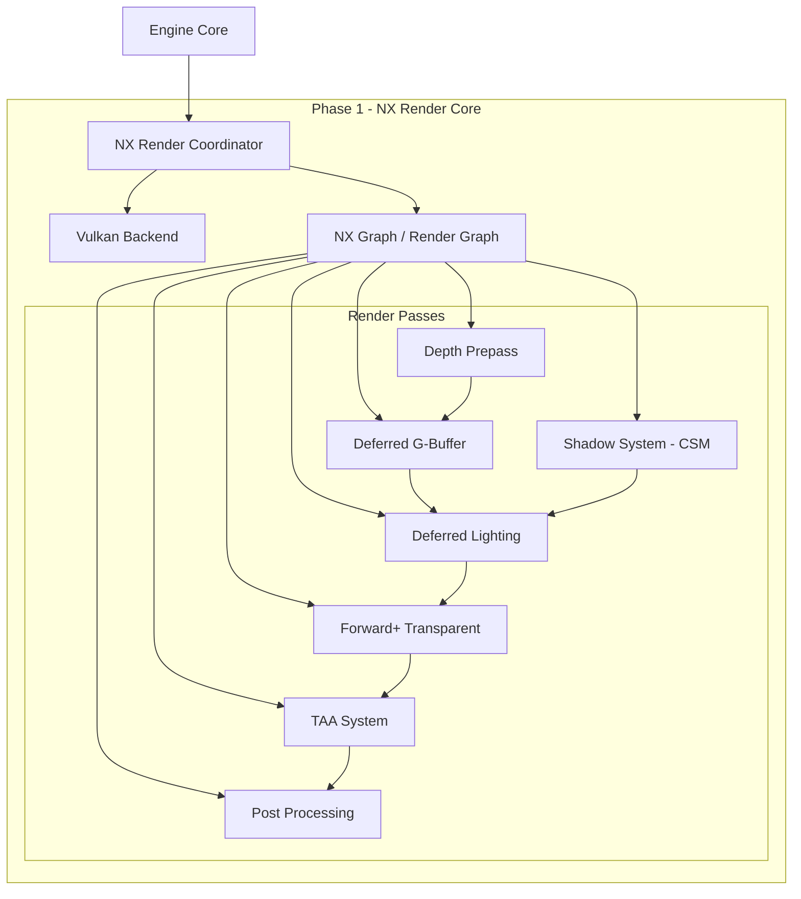
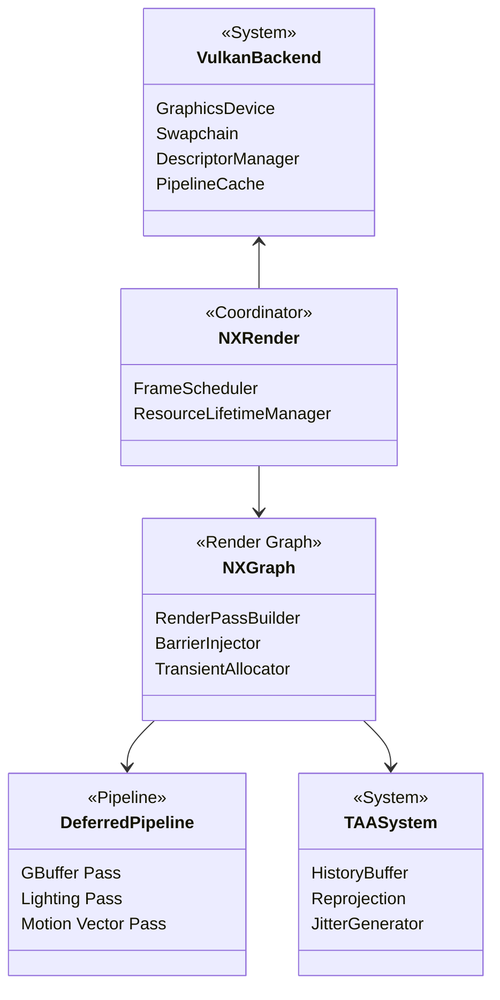
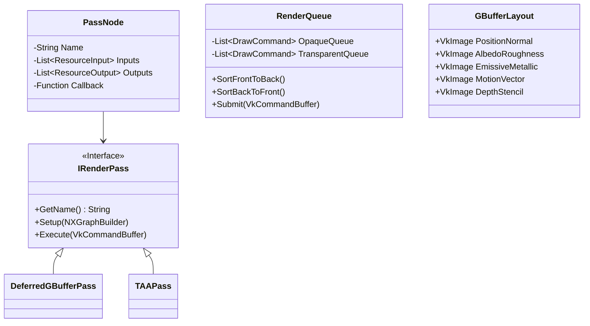
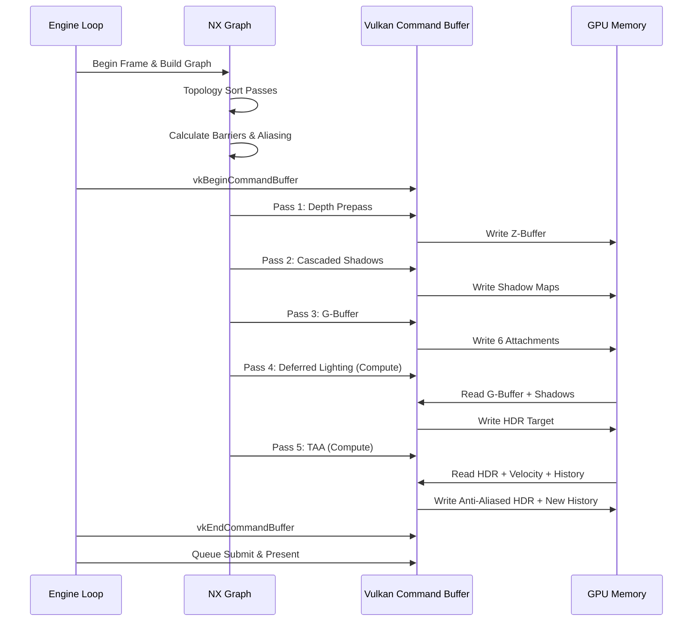

# PHASE 1: RENDERING CORE — IMPLEMENTATION PLAN

## Overview
Document: `04_RENDERING_PIPELINE.md`
Phase: Phase 1 — Rendering Core
Owner: Principal Rendering Engineer

---

# Objective
Membangun fondasi rendering utama (NX Render) berbasis Vulkan yang sepenuhnya scalable, data-driven menggunakan Render Graph (NX Graph), dan mendukung teknik rendering modern seperti Deferred Rendering, TAA, dan Motion Vectors sebagai dasar untuk fitur-fitur advanced di phase selanjutnya.

# Goals
- Implementasi penuh Vulkan Backend yang aman dan efisien.
- Implementasi NX Render sebagai koordinator utama rendering.
- Implementasi NX Graph (Render Graph) untuk manajemen barrier dan pass dependencies otomatis.
- Pipeline Deferred Rendering lengkap dengan 6-attachment G-Buffer.
- Forward+ rendering path untuk material transparan.
- Sistem Shadow Management (Cascaded Shadow Maps).
- Pembangkitan Motion Vector per-pixel untuk temporal effects.
- Depth Prepass terintegrasi untuk optimasi fragment shader.
- Temporal Anti-Aliasing (TAA) dengan history buffer reprojection.
- Automatic Resource Aliasing & GPU Memory Management.
- Manajemen Frame Lifecycle & Scheduling.

# Requirement

### Hardware
- GPU dengan dukungan Vulkan 1.3 (NVIDIA RTX 2000+, AMD RDNA2+, Intel Arc).
- Minimum 4GB VRAM, direkomendasikan 8GB VRAM.

### Software
- Windows 10/11 OS (Linux in future roadmap).
- Visual Studio 2022 (MSVC Toolchain).

### SDK
- Vulkan SDK 1.3.250+.
- Windows SDK.

### Library
- VMA (Vulkan Memory Allocator).
- GLFW (Window Management).
- GLM (Mathematics).

### Dependency
- **Phase 0 Foundation**: Membutuhkan NMM (Memory Allocator) untuk alokasi CPU, CTS untuk multithreading, Resource Manager untuk texture/mesh, Logger untuk error reporting.

---

# High Level Architecture



---

# Detailed Architecture



---

# Module Breakdown

1. **Vulkan Backend Module**: Mengatur koneksi langsung ke API Vulkan (`GraphicsDevice`, `Swapchain`).
2. **Resource Management Module**: Manajemen `VkBuffer`, `VkImage`, dan `VmaAllocation`.
3. **Descriptor Module**: `DescriptorManager`, `DescriptorBuilder` untuk dynamic set allocation.
4. **Pipeline Module**: `PipelineCache` untuk hashing dan penyimpanan `VkPipeline`.
5. **Graph Module**: `RenderGraph` node dan edge management, automatic layout transitions.
6. **Geometry Module**: `GBuffer` attachments, `DepthPrepass`.
7. **Lighting Module**: `DeferredLightingPass`, `LightCulling`, `ShadowPass`.
8. **Temporal Module**: `TAAPass`, Jitter generation, Motion vector resolve.

---

# Folder Structure

```
Renderer/
├── Core/
│   ├── GraphicsDevice.hpp
│   ├── Swapchain.hpp
│   └── FrameResource.hpp
├── Graph/
│   ├── NXGraph.hpp
│   ├── PassNode.hpp
│   └── BarrierManager.hpp
├── Pipelines/
│   ├── DeferredPipeline.hpp
│   ├── ForwardPlusPipeline.hpp
│   ├── ShadowPipeline.hpp
│   └── DepthPrepass.hpp
├── Systems/
│   ├── TAASystem.hpp
│   ├── MotionVectorSystem.hpp
│   └── LightManager.hpp
└── Types/
    ├── GBufferLayout.hpp
    └── RenderQueue.hpp
```

---

# Class Structure



---

# Data Structure

1. **G-Buffer Layout (Data-Packed)**:
   - `RT0 (RGBA16F)`: World Position XYZ, Material ID.
   - `RT1 (RGB10A2)`: World Normal XYZ, Reserved.
   - `RT2 (RGBA8)`: Albedo RGB, AO.
   - `RT3 (RGBA8)`: Metallic, Roughness, Emissive, Subsurface.
   - `RT4 (RG16F)`: Motion Vector X, Motion Vector Y.
   - `Depth (D32F)`: Hardware Depth.

2. **Frame Resource Data**:
   - Struktur data per-frame (In-Flight Frame Data) yang berisi Command Buffer, Uniform Buffer, dan Synchronization Primitives (Semaphores, Fences).

3. **Draw Command (Render Queue)**:
   - Sort Key (64-bit: Depth | Material ID | Pipeline ID).
   - Mesh Index, Instance Count, Transform Matrix.

---

# Pipeline

### Rendering Flow Pipeline



---

# Execution Order

1. **Setup Phase (CPU)**: Kumpulkan semua renderable objects, lakukan CPU frustum culling.
2. **Graph Compilation (CPU)**: Daftarkan semua resources, evaluasi dependensi pass, injeksi pipeline barriers.
3. **Shadow Pass (GPU)**: Render directional/point light shadow maps (CSM).
4. **Depth Prepass (GPU)**: Render geometry hanya kedalaman untuk HZB dan early-Z.
5. **G-Buffer Pass (GPU)**: Tulis data material ke Multiple Render Targets.
6. **Light Culling (GPU Compute)**: Assign lampu ke screen-space clusters.
7. **Deferred Lighting (GPU Compute)**: Kalkulasi PBR lighting menggunakan G-Buffer.
8. **Forward+ (GPU)**: Render objek transparan dengan akses ke light clusters.
9. **Motion & TAA (GPU Compute)**: Terapkan Jitter, reprojection, dan resolve anti-aliasing.
10. **Present (GPU)**: Tampilkan frame ke layar.

---

# Thread Model

- **Main Thread**: Window message pump, Vulkan Queue Submission, dan Presentation.
- **Render Thread (Optional/CTS Worker)**: Graph Compilation, Command Buffer Recording, Frustum Culling.
- **Worker Threads (CTS)**: Scene traversal, sort render queues, update uniform buffers.

---

# Memory Model

- **Persistent Allocation (VMA)**: G-Buffer, Swapchain images, Global Uniform Buffers (bertahan selama scene / resolusi tidak berubah).
- **Transient Allocation (VMA / NX Graph)**: Render target sementara untuk post-processing yang dialias pada memory location yang sama (Resource Aliasing).
- **Per-Frame Allocation (NMM Linear)**: Dynamic vertex data, Push Constants, command lists. Reset ke nol setiap akhir frame.

---

# Resource Lifetime

1. **Pipeline & Shaders**: Diinisialisasi saat loading engine, di-cache, dihancurkan saat exit.
2. **Swapchain & Render Targets**: Re-created saat event window resize.
3. **Descriptors**: Dialokasikan dari pool per-frame (Dynamic) atau pool statis (Material/Textures).
4. **History Buffers (TAA)**: Bertahan lintas frame (Ping-pong buffer), direset jika terjadi camera cut/teleport.

---

# GPU Synchronization

- **Image Memory Barriers**: Disuntikkan secara otomatis oleh NX Graph berdasarkan transisi input/output node.
  - *Contoh*: `COLOR_ATTACHMENT_OPTIMAL` (G-Buffer Write) -> `SHADER_READ_ONLY_OPTIMAL` (Lighting Compute Read).
- **Semaphores**:
  - `ImageAvailableSemaphore`: Menunggu present engine melepaskan image.
  - `RenderFinishedSemaphore`: Menunggu seluruh command buffer selesai dieksekusi sebelum presentasi.
- **Fences**: `InFlightFence` untuk memastikan CPU tidak menimpa Uniform Buffer yang sedang dibaca GPU di frame sebelumnya.

---

# CPU Synchronization

- NX Graph bersifat single-threaded saat tahap `Compile()`.
- CTS Job System melakukan `Wait()` sebelum tahap Command Recording jika ada job culling/sorting yang berjalan di background.
- Menggunakan `std::mutex` atau atomic index saat meminta dynamic descriptor sets secara konkuren dari Worker Threads.

---

# Error Handling

- **Vulkan Validation Layers**: Wajib aktif di mode Debug. Jika terjadi layer error, arahkan ke `Logger::Fatal`.
- **Swapchain Out Of Date**: Tangkap `VK_ERROR_OUT_OF_DATE_KHR`, lewati eksekusi render frame tersebut, dan picu event Recreate Swapchain.
- **Memory Exhaustion**: Tangkap error dari VMA, turunkan resolusi transient buffer otomatis, dan catat peringatan memori kritis.

---

# Logging

- Kategori Log: `[RENDERER]`, `[GRAPH]`, `[VULKAN]`.
- Output: Terminal dan `cogent_log.txt`.
- Data spesifik: Jumlah draw call per frame, durasi graph compilation, memori VRAM terpakai.

---

# Profiling

- **GPU Timestamps**: Disuntikkan di awal dan akhir setiap Node Pass di dalam NX Graph (menggunakan `vkCmdWriteTimestamp`).
- **CPU Profiling**: `PROFILE_SCOPE` pada fungsi `BuildGraph()`, `RecordCommandBuffer()`, dan `Submit()`.
- Data profiling dikirim ke Telemetry (Phase 9) untuk dianalisis oleh Optimizer AI.

---

# Debugging

- **Render Modes**: Toggle untuk menampilkan hanya Albedo, Normal, Wireframe, atau Depth.
- **Render Doc / NSight Integration**: Penamaan Vulkan objects (menggunakan `VK_EXT_debug_utils`) agar mudah dilacak di external debugger.
- **Graph Visualizer**: Ekspor topologi NX Graph ke file `.dot` (Graphviz) untuk verifikasi dependensi barrier.

---

# Testing Strategy

- **Unit Test**: Uji validitas urutan topologi (Cyclic Dependency check) pada NX Graph.
- **Integration Test**: Render triangle sederhana melewati seluruh pipeline (Deferred -> TAA -> Present).
- **Performance Test**: Benchmark 10,000 mesh instancing di resolusi 4K untuk memvalidasi limit bandwidth G-Buffer.
- **Memory Leak Test**: Pantau VMA stats selama resize swapchain berulang-ulang.

---

# Milestone

| ID | Milestone | Deskripsi |
|---|---|---|
| M1.1 | Vulkan Abstraction | Inisialisasi Device, Swapchain, Descriptor Manager stabil. |
| M1.2 | NX Graph MVP | Render graph mampu compile dan rekam command buffer. |
| M1.3 | Deferred Rendering | G-Buffer dan Compute Lighting menghasilkan gambar final. |
| M1.4 | TAA & Motion | Impelementasi motion vector dan temporal accumulation. |
| M1.5 | Integration & Optimization | Depth prepass aktif, memory aliasing berjalan. |

---

# Deliverable

- Dokumentasi kode dan API `NX Render` dan `NX Graph`.
- Implementasi penuh C++ Vulkan Backend yang terangkum dalam folder `Renderer/`.
- File shader GLSL/SPIR-V untuk Deferred, Shadow, dan TAA.

---

# Acceptance Criteria

- [ ] Engine dapat merender scene Sponza menggunakan Deferred Pipeline tanpa error validasi Vulkan.
- [ ] NX Graph berhasil mengatur layout transition (tidak ada Vulkan Validation Warning terkait layout).
- [ ] TAA berhasil menghilangkan aliasing pada pergerakan kamera lambat (tidak ada ghosting parah).
- [ ] Window resize ditangani dengan anggun (graceful recovery) tanpa crash.

---

# KPI

- **Frame Time Overhead (CPU)**: < 1.0 ms untuk NX Graph Compilation dan Command Recording.
- **G-Buffer Memory**: Maksimal 32 byte per pixel.
- **Draw Call Limit**: Mendukung eksekusi >5,000 draw calls di bawah 2.0 ms CPU time (single thread).
- **Vulkan Validation**: 0 Error, 0 Warning.

---
*End of Phase 1 Implementation Plan*
