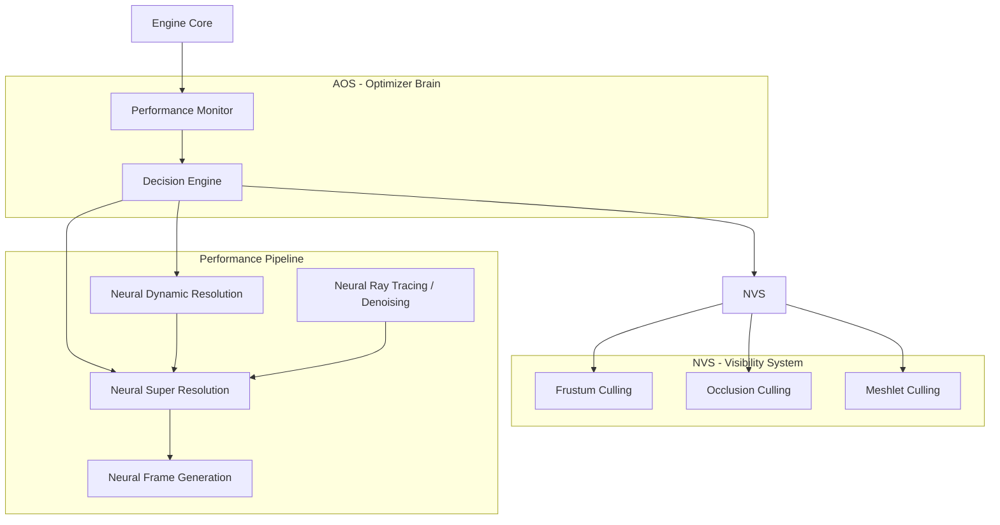
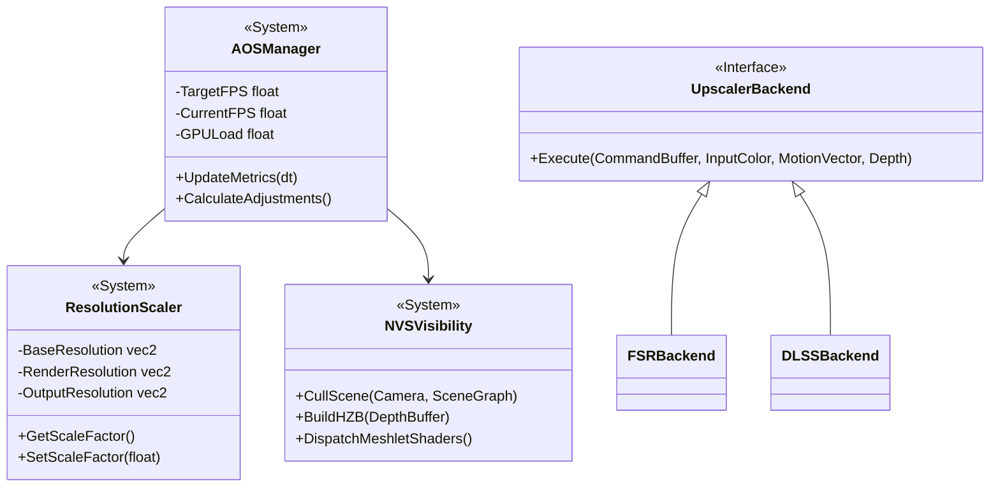
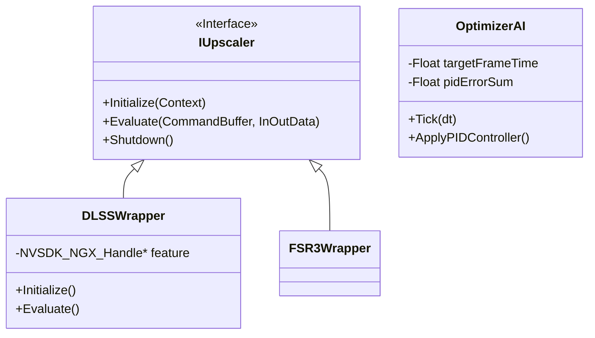
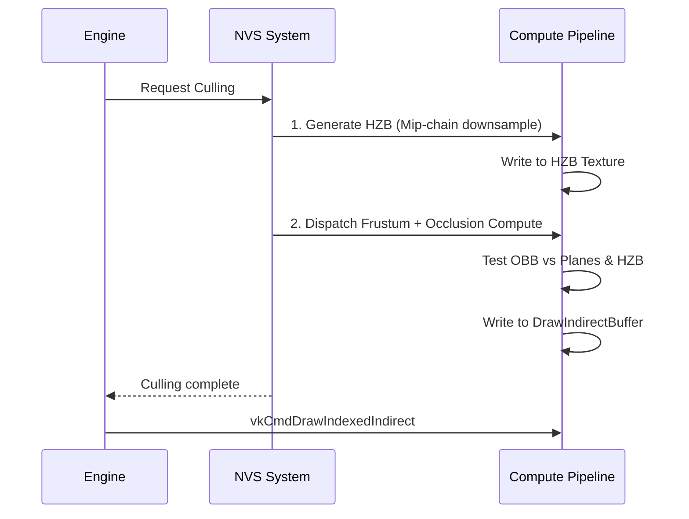

# PHASE 2: OPTIMIZATION PIPELINE — IMPLEMENTATION PLAN

## Overview
Document: `05_OPTIMIZATION_PIPELINE.md`
Phase: Phase 2 — Optimization Pipeline
Owner: Principal Engine Programmer

---

# Objective
Mengimplementasikan serangkaian pipeline optimasi tingkat lanjut (AOS, NVS, NDR, NSR, NFG, NRT) yang secara otomatis, dinamis, dan prediktif mampu menyeimbangkan kualitas visual dengan performa (framerate), memastikan pengalaman bermain yang mulus di berbagai rentang hardware.

# Goals
- **AOS (Automatic Optimization System)**: Sistem AI heuristic yang mengatur resolusi dan LOD secara real-time.
- **NVS (Non-Visible System)**: Implementasi Frustum Culling, Occlusion Culling (HZB), dan Meshlet Culling.
- **NDR (Neural Dynamic Resolution)**: Penyesuaian resolusi render internal (dynamic resolution scaling).
- **NSR (Neural Super Resolution)**: Upscaling pintar berbasis ML (alternatif/integrasi FSR/DLSS/XeSS).
- **NFG (Neural Frame Generation)**: Interpolasi atau ekstrapolasi frame untuk menggandakan framerate (alternatif/integrasi DLSS-G/FSR3).
- **NRT (Neural Ray Tracing)**: Optimasi denoiser ray tracing menggunakan pendekatan neural.

# Requirement

### Hardware
- GPU dengan hardware accelerated ray tracing (untuk NRT).
- Dedicated Tensor/Matrix cores (direkomendasikan untuk NSR dan NFG).

### Software
- Sama dengan Phase 1.

### SDK / Library
- AMD FSR 3 SDK (untuk baseline NSR & NFG sebelum ML kustom).
- NVIDIA DLSS Streamline SDK.
- Vulkan Ray Tracing extensions (`VK_KHR_ray_tracing_pipeline`, `VK_KHR_acceleration_structure`).

### Dependency
- **Phase 1 Rendering Core**: Bergantung pada G-Buffer, Depth Buffer, dan Motion Vectors yang dihasilkan dari NX Render.

---

# High Level Architecture



---

# Detailed Architecture



---

# Module Breakdown

1. **AOS Module**: Otak utama optimasi. Membaca telemetry FPS dan memutar "knobs" (LOD bias, resolution scale).
2. **NVS Module**: Manajemen compute shader untuk Hierarchical-Z Buffer generation dan frustum test di GPU.
3. **NDR Module**: Manajemen Render Target (G-Buffer) dinamis. Menyesuaikan Viewport dan Scissor saat runtime.
4. **NSR/NFG Module**: Wrapper cross-vendor (DLSS/FSR) untuk upscaling dan frame generation.
5. **NRT Module**: Wrapper untuk Vulkan Ray Tracing dan compute-based spatio-temporal denoiser.

---

# Folder Structure

```
Optimization/
├── AOS/
│   ├── OptimizerAI.hpp
│   └── PerformanceMonitor.hpp
├── NVS/
│   ├── VisibilityManager.hpp
│   ├── HZBGenerator.hpp
│   └── CullingCompute.hpp
├── NDR/
│   └── DynamicResolution.hpp
├── Upsampling/ (NSR & NFG)
│   ├── IUpscaler.hpp
│   ├── FSR3Wrapper.hpp
│   └── DLSSWrapper.hpp
└── RayTracing/ (NRT)
    ├── Denoiser.hpp
    └── BVHBuilder.hpp
```

---

# Class Structure



---

# Data Structure

1. **UpscaleInOutData**:
   - `InputColor` (Rendered HDR).
   - `InputDepth` (High-res atau Low-res dependent).
   - `InputMotionVectors` (Velocity buffer).
   - `OutputColor` (Upscaled HDR/LDR).
   - `JitterOffset` (Sub-pixel camera jitter X, Y).

2. **Culling Object Data (GPU)**:
   - `vec3 Center`, `float Radius`.
   - `uint32_t InstanceID`, `uint32_t VisibleFlag`.

3. **PID Controller State (AOS)**:
   - Proportional, Integral, Derivative constants.
   - Previous Frame Time Error.

---

# Pipeline

### NVS (Visibility) Pipeline



---

# Execution Order

1. **Frame Start**: AOS membaca frame time dari frame sebelumnya.
2. **PID Evaluation (AOS)**: Tentukan `ResolutionScale` baru.
3. **Graph Setup**: NX Render menyesuaikan ukuran G-Buffer (NDR) berdasarkan scale baru.
4. **Camera Setup**: Terapkan sub-pixel jitter untuk NSR.
5. **Visibility Culling (NVS)**: Compute shader mengkalkulasi objek mana yang di-render.
6. **Base Rendering**: Rendering biasa pada *internal resolution*.
7. **Upscaling (NSR)**: Resolve gambar *internal resolution* ke *display resolution* (Compute shader).
8. **Frame Gen (NFG)**: Sisipkan interpolated frame jika diperlukan, serahkan ke Swapchain.

---

# Thread Model

- **AOS Calculation**: Main thread, sangat ringan (PID math).
- **Visibility Setup (NVS)**: Render Thread. Menyiapkan buffer bounding box.
- **Culling Execution**: Sepenuhnya di GPU (Compute Shader).

---

# Memory Model

- **NSR History Buffers**: Resolusi tinggi (Display Res), persistent. Alokasi berat.
- **HZB Texture**: Resolusi rendah (power of two terdekat), persistent dengan mip-map (log2).
- **Indirect Draw Buffers**: Per-frame scratch buffer, dialokasikan ulang jika jumlah instance melebihi kapasitas.

---

# Resource Lifetime

- **DLSS/FSR Context**: Dibuat saat engine start, dihancurkan saat resolusi output/display berubah, atau saat quit.
- **HZB**: Di-*resize* setiap kali resolusi layar berubah, **bukan** saat internal render resolution (NDR) berubah (menghindari memory fragmentation).
- **Bounding Box Buffer**: Bertahan selama scene hidup, ukurannya menyesuaikan jumlah GameObject aktif.

---

# GPU Synchronization

- **Compute to Graphics Barrier**: Setelah NVS compute shader selesai, buffer `DrawIndirect` ditransisikan dari `SHADER_WRITE` ke `INDIRECT_COMMAND_READ`.
- **Render to Compute Barrier**: Setelah HDR Lighting selesai, output tekstur ditransisikan untuk dibaca oleh compute shader NSR.

---

# CPU Synchronization

- Karena Culling (NVS) terjadi di GPU, CPU (Main Thread) *tidak perlu* melakukan `vkQueueWaitIdle` untuk membaca hasil. CPU cukup melakukan perintah `vkCmdDrawIndirect` tanpa mempedulikan isi buffer (GPU-driven rendering).

---

# Error Handling

- **Upscaler Fallback**: Jika inisialisasi DLSS gagal (misal tidak menggunakan GPU NVIDIA), secara otomatis fallback ke FSR 3 atau bilinears upscaling biasa.
- **PID Instability (AOS)**: Dilengkapi dengan clamping (misal resolusi tidak boleh turun di bawah 50%) untuk mencegah blur berlebihan atau ping-ponging (naik-turun drastis antar frame).

---

# Logging

- Kategori Log: `[AOS]`, `[NVS]`, `[NSR]`.
- Output: Resolusi render aktif (misal `Internal Res: 1920x1080 -> Display Res: 3840x2160`).
- Peringatan jika frame drops mendadak sehingga PID AOS bereaksi keras.

---

# Profiling

- Ukur performa HZB Mip Generation (harus < 0.2 ms).
- Ukur waktu eksekusi pass upscaling (DLSS/FSR) di GPU.
- Chart grafik korelasi antara "AOS Resolution Scale" vs "Frame Time".

---

# Debugging

- **NVS Debug View**: Toggle untuk merender bounding box merah pada objek yang di-cull (Occluded) dan hijau pada objek yang terlihat.
- **Freeze Culling**: Membekukan frustum kamera culling saat ini (tetapi kamera tetap bisa bergerak) untuk memvisualisasikan bagaimana culling bekerja di belakang kamera.
- **AOS Override**: Mematikan AOS melalui console (`aos.disable`) untuk menetapkan resolusi manual.

---

# Testing Strategy

- **Stress Test**: Letakkan 100,000 objek di belakang tembok raksasa. HZB harus mampu memotong 99% draw call, menghasilkan frame time < 5ms.
- **AOS Stress Test**: Jalankan simulasi berat (physics explosion), pastikan AOS secara otomatis menurunkan resolusi secara gradual tanpa stutter parah, mempertahankan ~60 FPS.
- **NSR Visual Test**: Bandingkan secara manual kualitas temporal aliasing NSR saat kamera berputar kencang.

---

# Milestone

| ID | Milestone | Deskripsi |
|---|---|---|
| M2.1 | Culling Foundation | CPU frustum culling diubah menjadi GPU Compute culling (NVS awal). |
| M2.2 | HZB Occlusion | Implementasi GPU Depth downsample dan Occlusion test. |
| M2.3 | Upscaling Wrapper | Integrasi FSR3 SDK untuk NSR. |
| M2.4 | AOS Brain | Implementasi PID controller untuk NDR yang mengontrol FSR input. |
| M2.5 | Frame Gen (NFG) | Interpolasi frame menggunakan API FSR3/DLSS3. |

---

# Deliverable

- Modul `AOSManager` dan controller performa otomatis.
- Compute shaders untuk NVS (Frustum & Occlusion Culling).
- Modul integrasi SDK eksternal (`FSRWrapper`, `DLSSWrapper`).

---

# Acceptance Criteria

- [ ] GPU Driven Rendering berfungsi: Draw calls dikeluarkan murni melalui perintah `vkCmdDrawIndexedIndirect`.
- [ ] HZB Culling berhasil membuang minimal 50% vertex processing di scene tertutup.
- [ ] FSR3 terintegrasi tanpa color banding atau ghosting parah pada tepian objek bergerak.
- [ ] AOS mampu bereaksi terhadap FPS drop (dari 60 turun ke 30) dalam waktu kurang dari 10 frame (160ms) dengan menurunkan resolusi.

---

# KPI

- **GPU Culling Time (NVS)**: Total waktu Compute shader (HZB gen + Test) harus < 0.5 ms di GPU mainstream.
- **AOS Stabilisation Time**: Waktu untuk menemukan resolusi stabil setelah load scene < 1 detik.
- **Upscale Cost (NSR)**: Waktu eksekusi upscaling 1080p -> 4K tidak melebihi 1.5 ms.
- **NFG Generation Time**: Interpolated frame dibuat dalam waktu < 2.0 ms.

---
*End of Phase 2 Implementation Plan*
