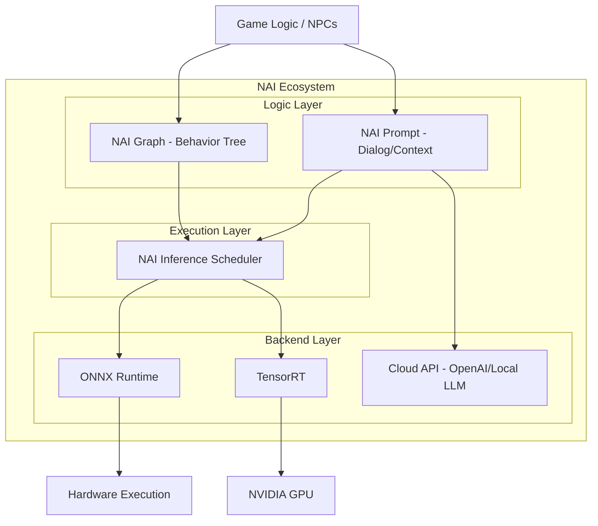
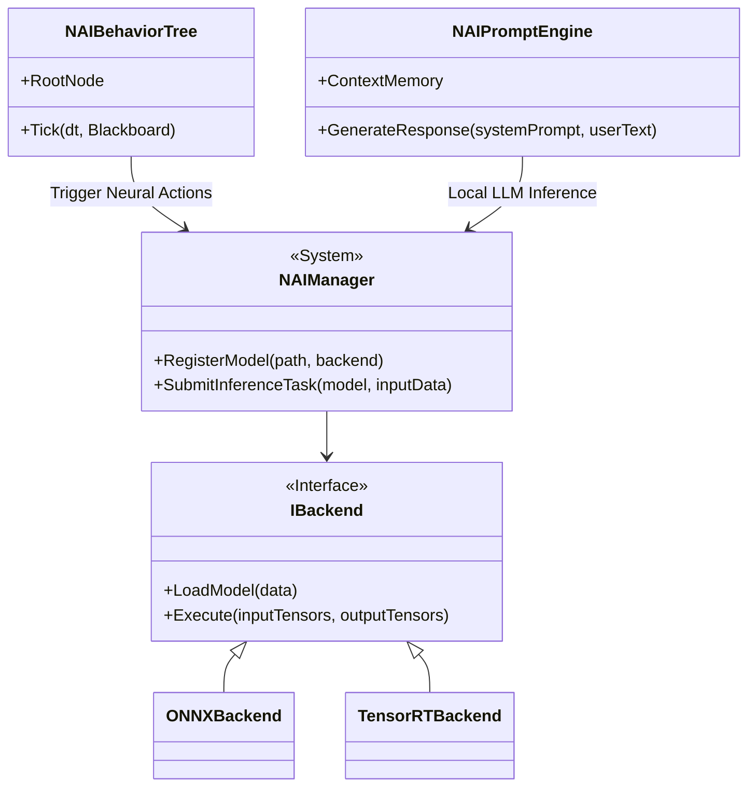
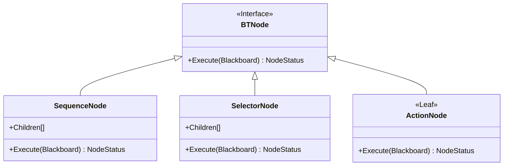
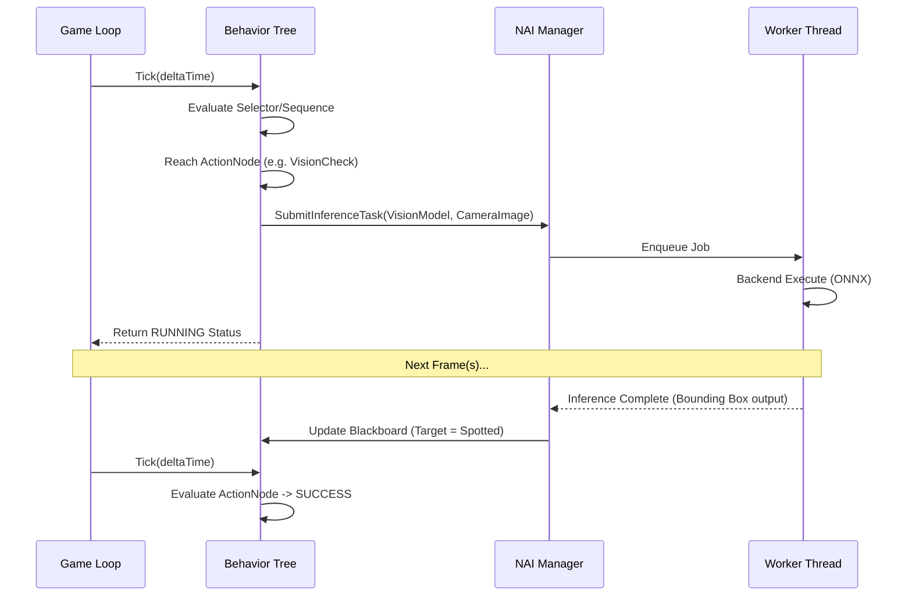

# PHASE 3: AI ECOSYSTEM — IMPLEMENTATION PLAN

## Overview
Document: `06_AI_SYSTEM.md`
Phase: Phase 3 — AI Ecosystem
Owner: AI System Architect

---

# Objective
Membangun infrastruktur kecerdasan buatan (NAI Ecosystem) yang terintegrasi penuh ke dalam engine, mendukung eksekusi model deep learning secara lokal (On-Device Inference), manajemen interaksi AI via prompt, dan arsitektur perilaku NPC tingkat lanjut (Graph-based AI) untuk menghadirkan dunia yang responsif dan cerdas.

# Goals
- **NAI Core (Neural AI)**: Modul eksekusi machine learning backend agnostik (TensorRT, ONNX Runtime).
- **NAI Inference**: Scheduler asinkron untuk menangani eksekusi model ML (CV, NLP, atau Reinforcement Learning) tanpa memblokir thread rendering.
- **NAI Prompt**: Sistem manajemen LLM prompt (Local atau Cloud API fallback) untuk dialog dinamis NPC.
- **NAI Graph**: Node-based Behavior Tree dan State Machine visual editor untuk logika NPC non-neural.
- Integrasi mulus antara sistem logika tradisional (Graph) dengan sistem neural (Inference & Prompt).

# Requirement

### Hardware
- Dukungan SIMD instruction (AVX2/AVX-512) pada CPU.
- Tensor Cores / Compute capability tinggi pada GPU (opsional, tetapi sangat direkomendasikan untuk inference).

### Software
- Windows 10/11 64-bit.

### SDK / Library
- ONNX Runtime (C++ API).
- NVIDIA TensorRT (untuk GPU NVIDIA).
- CUDA Toolkit (dependency untuk TensorRT).
- json (nlohmann/json untuk parsing response LLM).

### Dependency
- Membutuhkan CTS (Task Scheduler) untuk eksekusi inference di background thread.
- Membutuhkan Resource Manager untuk memuat pre-trained model file (`.onnx`, `.engine`).

---

# High Level Architecture



---

# Detailed Architecture



---

# Module Breakdown

1. **Manager Module (`NAIManager`)**: Sentral dari seluruh ekosistem NAI, menangani inisialisasi backend dan scheduling request.
2. **Backend Module**: Wrapper C++ murni untuk pustaka eksternal (ONNX, TensorRT).
3. **Graph Module (`NAIGraph`)**: Implementasi struktur pohon n-ary untuk Behavior Tree (Selector, Sequence, Decorator, Action).
4. **Prompt Module (`NAIPrompt`)**: Tokenizer teks sederhana, manajemen context history, dan REST client (jika fallback ke cloud API).
5. **Blackboard Module**: Struktur data key-value bersama yang digunakan oleh Graph dan Prompt untuk berbagi status dunia permainan.

---

# Folder Structure

```
AI/
├── Core/
│   ├── NAIManager.hpp
│   ├── IBackend.hpp
│   └── InferenceTask.hpp
├── Backends/
│   ├── ONNXBackend.hpp
│   └── TensorRTBackend.hpp
├── Graph/
│   ├── BehaviorTree.hpp
│   ├── Blackboard.hpp
│   └── GraphNodes.hpp
└── Prompt/
    ├── PromptEngine.hpp
    ├── ContextMemory.hpp
    └── RestClient.hpp
```

---

# Class Structure



---

# Data Structure

1. **Inference Tensor**: Data multidimensi agnostik (`std::vector<float>`, shape `[Batch, Channel, Height, Width]` atau `[Sequence]`).
2. **Blackboard**: `std::unordered_map<std::string, std::any>` untuk menyimpan persepsi NPC (misal: "IsPlayerSpotted: bool", "TargetDistance: float").
3. **Prompt Message**: Struktur struct `Role` ("system", "user", "assistant") dan `Content` (string).
4. **Graph Node Status**: Enum `SUCCESS`, `FAILURE`, `RUNNING`.

---

# Pipeline

### AI Graph Tick Pipeline



---

# Execution Order

1. **Update Percepsion**: Gather data sensorik (Vision, Sound) ke dalam Blackboard.
2. **Tick Behavior Tree**: Evaluasi pohon logika dari root ke node child.
3. **Dispatch Neural Tasks**: Jika node `Action` membutuhkan kalkulasi berat (pathfinding ML, object detection, LLM generation), kirim request ke `NAIManager`.
4. **Yield**: Node mengembalikan status `RUNNING`, game loop melanjutkan update objek lain atau merender grafis.
5. **Callback/Resolve**: Worker thread CTS menyelesaikan inferensi, memperbarui Blackboard.
6. **Resume Tick**: Frame berikutnya, Behavior Tree menyadari data sudah siap dan node berpindah ke `SUCCESS` atau `FAILURE`.

---

# Thread Model

- **Main Thread**: Mengeksekusi Behavior Tree `Tick()`, membaca state Blackboard.
- **Worker Threads (CTS)**: Menjalankan task inferensi AI (ONNX/TensorRT run) secara asinkron agar tidak menyebabkan frame stutter.
- **Network Thread**: (Untuk NAI Prompt Cloud) Menangani request HTTP asynchronous.

---

# Memory Model

- **Backend Memory (VRAM/RAM)**: Model neural (weights/biases) menetap di memori backend dan berukuran sangat besar (Persistent). Harus di-preload saat loading screen.
- **Tensor I/O Memory**: Alokasi transient / buffer pool menggunakan memory yang di-pin (`cudaMallocHost` atau memory pool C++) untuk mempercepat transfer CPU-GPU sebelum inferensi.
- **Blackboard Memory**: Dikelola per-NPC instance.

---

# Resource Lifetime

- **Model Neural**: Dimuat oleh Resource Manager saat level dimuat, dilepaskan saat level berganti (berhubungan dengan memory pressure yang tinggi).
- **Behavior Tree Instance**: Dibuat bersamaan dengan instansiasi Entity/NPC, dihancurkan saat NPC despawn/mati.
- **Context LLM**: Terbatas pada token window (misal max 4096 tokens). Jika melebihi batas, pesan terlama di-pop dari buffer memori (sliding window).

---

# GPU Synchronization

- Karena backend eksternal (CUDA/TensorRT) menggunakan stream-nya sendiri, Engine Vulkan tidak melakukan sinkronisasi langsung secara API. Sinkronisasi dilakukan di level CPU (Worker thread menunggu stream CUDA selesai via runtime event API dari TensorRT, baru kemudian me-notify Main Thread).

---

# CPU Synchronization

- `std::shared_mutex` pada **Blackboard** jika ada update dari Worker Thread (inferensi selesai) bersamaan dengan pembacaan oleh Main Thread (Behavior Tree).
- Lock-free queue atau `std::condition_variable` di CTS untuk komunikasi antara `NAIManager` dengan worker pool.

---

# Error Handling

- **Model Load Failure**: Mengembalikan error graceful. NPC yang bergantung pada model ini akan memutus jalur neural di Behavior Tree-nya dan fallback ke node logika hardcoded.
- **Backend Unsupported**: Jika TensorRT diminta tetapi GPU bukan NVIDIA, `NAIManager` me-fallback otomatis ke eksekusi ONNX (CPU atau DirectML).
- **LLM Rate Limit**: Jika cloud API LLM menolak request, Prompt Engine me-return respons generik ("I have nothing to say right now.") dan melakukan exponential backoff.

---

# Logging

- Kategori Log: `[NAI]`, `[ONNX]`, `[TRT]`.
- Output: Statistik waktu inferensi (ms), peringatan memori GPU dari backend, fallback trigger event.

---

# Profiling

- Waktu eksekusi murni di backend (misal: "ResNet-50 inference: 8.2ms").
- Waktu overhead transfer I/O CPU ke GPU tensor.
- Ukuran alokasi memori (Memory Footprint) dari ONNX/TRT.
- Latency LLM response (Time To First Token).

---

# Debugging

- **Behavior Tree Visualizer**: Di dalam Editor UI, node yang sedang dieksekusi akan berkedip hijau (`SUCCESS`), merah (`FAILURE`), atau kuning (`RUNNING`).
- **Blackboard Inspector**: Editor panel untuk melihat dan memodifikasi value pada Blackboard secara realtime.
- **Prompt Console**: Jendela khusus untuk memalsukan/menyuntikkan input teks dari user ke NPC tanpa harus trigger melalui game logic.

---

# Testing Strategy

- **Backend Test**: Masukkan tensor dengan data dummy (all 0s/1s) ke model, pastikan tidak crash dan output size sesuai struktur.
- **Stress Test Inference**: Spawning 100 NPC, semuanya meminta request pathfinding ML bersamaan. Pastikan CTS tidak memblokir render thread.
- **Tree Completeness Test**: Unit test memvalidasi bahwa tidak ada node gantung (dangling pointers) atau tree tanpa root di Behavior Tree builder.

---

# Milestone

| ID | Milestone | Deskripsi |
|---|---|---|
| M3.1 | Core NAI & ONNX | Setup struktur C++ untuk wrapper ONNX dan I/O Tensor. |
| M3.2 | Behavior Tree | Implementasi Graph Node system dan Blackboard. |
| M3.3 | Async Scheduler | CTS berhasil menangani task AI tanpa menyentuh main thread. |
| M3.4 | NAI Prompt | Sistem HTTP request ke API LLM lokal/cloud untuk dialog. |
| M3.5 | TensorRT Backend | (Opsional/High End) Implementasi wrapper eksekusi ultra-cepat NVIDIA. |

---

# Deliverable

- Module `NAIManager`, modul C++ untuk `BehaviorTree` dan `Blackboard`.
- Dua backend siap pakai: `ONNXBackend.cpp` dan `TensorRTBackend.cpp`.
- Dokumentasi template struktur prompt LLM untuk interaksi NPC.

---

# Acceptance Criteria

- [ ] Engine dapat memuat file `.onnx` tanpa crash.
- [ ] Proses inferensi neural (walaupun berat) tidak menyebabkan FPS drop di Main Render Loop.
- [ ] Behavior tree mampu mentransisikan state NPC dari `Patrol` ke `Attack` berdasar variabel Blackboard yang di-update asinkron oleh AI model.
- [ ] EditorUI menampilkan Tree graph dengan status visual node yang akurat (kuning saat menunggu hasil inferensi).

---

# KPI

- **Inference Impact**: FPS engine utama tidak boleh drop melebihi 2% saat modul NAI berjalan sibuk di background.
- **BT Overhead**: `Tick()` dari 1,000 behavior tree harus dieksekusi di CPU dalam waktu kurang dari 1.0 ms.
- **Backend Latency Overhead**: Wrapper C++ COGENT tidak boleh menambah overhead lebih dari 0.5ms di luar waktu proses murni library ONNX/TRT.

---
*End of Phase 3 Implementation Plan*
